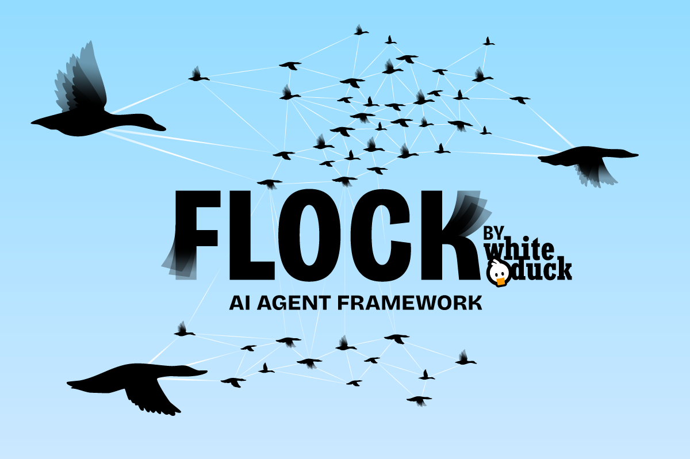

# Flock

### AI agent framework



| Traditional Agent Frameworks 🙃          |                        Flock 🐤🐧🐓🦆                         |
|------------------------------------------|--------------------------------------------------------------|
| 🤖 **Complex Prompt Engineering**         | 📝 **Declarative Agent Definitions**                         |
| • Lengthy, brittle prompts               | • Clear, concise input/output declarations                   |
| • Hard-to-tune and adapt                 | • No need for manual prompt engineering                      |
|                                          |                                                              |
| 💥 **Fragile Execution**                  | ⚡ **Robust & Scalable**                                      |
| • Single failure can break the system    | • Fault-tolerant with built-in retries and error handling      |
| • Difficult to monitor and recover       | • Automatic recovery via Temporal workflow integration         |
|                                          |                                                              |
| 🏗️ **Rigid Workflows**                    | 🔄 **Flexible Orchestration**                                |
| • Limited adaptability                   | • Dynamic agent chaining and hand-offs                       |
| • Hard to scale and parallelize          | • Modular, concurrent, and batch processing                   |
|                                          |                                                              |

## Overview

Flock is a framework for orchestrating LLM-powered agents. It leverages a **declarative approach** where you simply specify what each agent needs as input and what it produces as output—without having to write lengthy, brittle prompts. Under the hood, Flock transforms these declarations into robust workflows, using cutting-edge components such as Temporal and DSPy to handle fault tolerance, state management, and error recovery.

## Key Innovations

- **Declarative Agent System:**  
  Define agents by declaring their input/output interfaces (with type hints and human-readable descriptions) using a concise syntax.  
  Example syntax:
  ```python
  input = "query: str|The search query, context: dict|The full conversation context"
  output = "idea: str|The generated software project idea"
  ```
  The framework automatically extracts type and description details, builds precise prompts, and configures the underlying LLM.

- **Lifecycle Hooks:**  
  Each agent (via the new `FlockAgent` base class) supports lifecycle hooks such as `initialize()`, `terminate()`, and `on_error()`. This ensures that agents can perform setup, cleanup, and robust error handling—all without cluttering the main business logic.

- **Fault Tolerance & Temporal Integration:**  
  Flock is built with production readiness in mind. By integrating with Temporal, your agent workflows enjoy automatic retries, durable state management, and resilience against failures. This means that a single agent crash won't bring down your entire system.

- **Type Safety and Clear Contracts:**  
  Agents are implemented as Pydantic models. This provides automatic JSON serialization/deserialization, strong typing, and an explicit contract for inputs and outputs. Testing, validation, and integration become straightforward.

- **DSPy Integration:**  
  Flock leverages DSPy for managing LLM interactions. The framework constructs clean signature strings and updates field metadata so that DSPy can include detailed instructions and context for each agent call.

## Quick Start

Below is a simple example of how to create and run an agent with Flock:

```python
import asyncio
from flock.core.flock import Flock
from flock.core.agents.flock_agent import FlockAgent
from flock.core.tools import basic_tools

async def main():
    # Initialize Flock
    flock = Flock(model="openai/gpt-4o")

    # Create an agent with clear input/output declarations and optional tools.
    idea_agent = FlockAgent(
        name="idea_agent",
        input="query: str|The search query, context: dict|Additional context",
        output="a_fun_software_project_idea: str|The generated software project idea",
        tools=[basic_tools.web_search_tavily],
    )
    flock.add_agent(idea_agent)

    # Run the agent locally (with built-in debugging/logging)
    result = await flock.run_async(
        start_agent=idea_agent,
        input="build a revolutionary app",
        local_debug=True
    )
    print(result)

if __name__ == "__main__":
    asyncio.run(main())
```

## Advanced Usage

### Agents with Lifecycle Hooks

Customize behavior by overriding lifecycle methods:

- **initialize(inputs):** Set up resources, validate inputs, or log pre-run state.
- **terminate(inputs, result):** Clean up resources, log output, or perform post-run actions.
- **on_error(error, inputs):** Handle exceptions gracefully, log detailed error information, and trigger recovery logic.

### Agents with Tools

Agents can seamlessly integrate external tools for enhanced functionality:

```python
from flock.core.tools import basic_tools

research_agent = FlockAgent(
    name="research_agent",
    input="research_topic: str|Topic to investigate",
    output="research_result: str|The outcome of the research",
    tools=[basic_tools.web_search_tavily],
)
```

### Agent Chaining

Chain agents together to create complex workflows:

```python
# Define the first agent in the chain.
project_plan_agent = FlockAgent(
    name="project_plan_agent",
    input="project_idea: str|Initial project idea",
    output="plan_headings: list[str]|Headings for the project plan",
    tools=[basic_tools.web_search_tavily, basic_tools.code_eval],
)

# Define a second agent that builds on the output of the first.
content_agent = FlockAgent(
    name="content_agent",
    input="context: dict|Global context, project_plan_agent.plan_headings: list[str]|Plan headings",
    output="project_plan_content: str|Detailed content for the plan",
)

# Set up hand-off from the first agent to the second.
project_plan_agent.hand_off = content_agent
```

### Temporal Workflow Integration

Flock supports execution on Temporal, ensuring robust, fault-tolerant workflows:

- **Durability:** Persistent state management even in the case of failures.
- **Retries & Error Handling:** Automatic recovery via Temporal's built-in mechanisms.
- **Scalability:** Seamless orchestration of distributed agent workflows.

## Architecture

TODO: Insert charts

## Requirements

- Python 3.12+
- (Optional) Temporal server running locally for production-grade workflow features
- API keys for integrated services (e.g., Tavily for web search)

## Installation

```bash
pip install flock-core
```

if you want to use the integrated tools

```bash
pip install flock-core[tools]
```

and for the docling tools

```bash
pip install flock-core[all-tools]
```

## Development

### Setup

1. **Clone the Repository:**

   ```bash
   git clone https://github.com/yourusername/flock.git
   cd flock
   ```

2. **Create a Virtual Environment and sync all packages:**

   ```bash
   uv sync --all-groups --all-extras
   ```

3. **Install local version of flock:**

   ```bash
   uv build && uv pip install -e .
   ```


## Contributing

Contributions are welcome! Please submit Pull Requests and open issues on GitHub.

## License

This project is licensed under the terms of the LICENSE file included in the repository.

## Acknowledgments

- Built with [DSPy](https://github.com/stanfordnlp/dspy)
- Uses [Temporal](https://temporal.io/) for workflow management
- Integrates with [Tavily](https://tavily.com/) for web search capabilities
- Web interface built with FastHTML and MonsterUI

## Evolution & Future Direction

Flock was created to overcome the limitations of traditional agent frameworks. Key design goals include:

### Declarative Over Prompt Engineering

- **Simplify Agent Definitions:**  
  Focus on clear input/output contracts rather than long, complex prompts.
- **Model Agnostic:**  
  Change LLM backends without altering agent logic.
- **Improved Testability:**  
  Clear, structured interfaces facilitate unit testing and validation.

### Robust, Production-Grade Orchestration

- **Fault Tolerance:**  
  Leveraging Temporal for automatic retries, durable state, and robust error handling.
- **Scalability:**  
  Support for concurrent, batch, and distributed workflows.
- **Observability:**  
  Built-in logging and monitoring for real-time insights into workflow execution.

### Future Enhancements

- Expanded type system for richer agent interactions
- Enhanced tool ecosystem and custom integrations
- Advanced monitoring, debugging, and performance metrics
- Extended testing frameworks and validation tools

Join us in building the next generation of reliable, production-ready AI agent systems!
```
