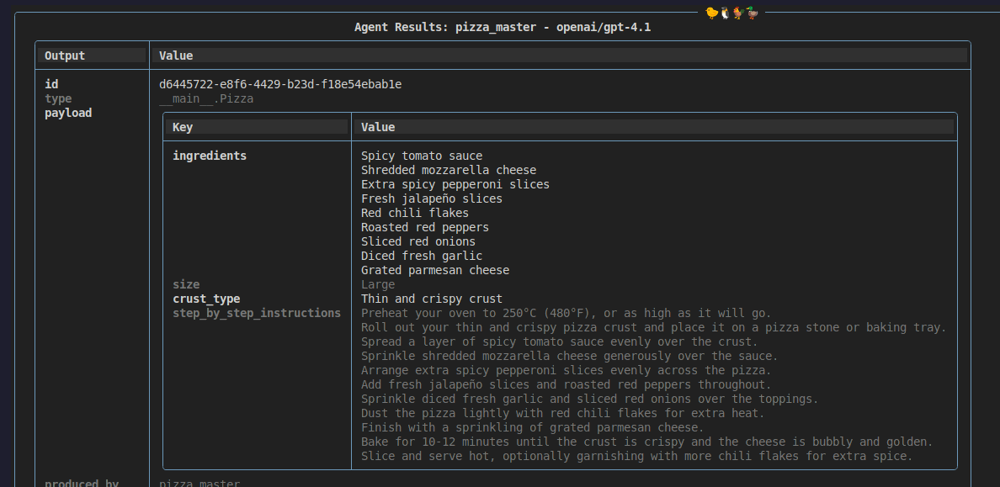
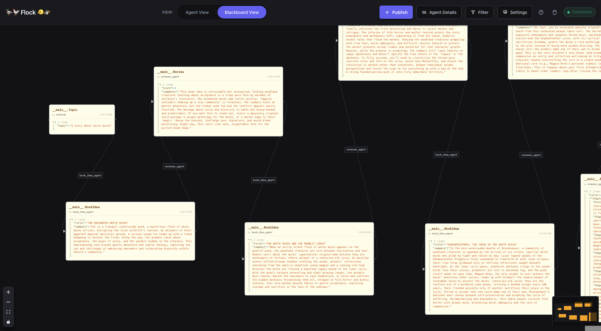

<p align="center">
  
</p>
<p align="center">
  <a href="https://pypi.org/project/flock-core/" target="_blank"></a>
  
  <a href="https://github.com/whiteducksoftware/flock/blob/master/LICENSE" target="_blank"></a>
  <a href="https://whiteduck.de" target="_blank"></a>
  <a href="https://www.linkedin.com/company/whiteduck" target="_blank"></a>
  <a href="https://bsky.app/profile/whiteduck-gmbh.bsky.social" target="_blank"></a>
</p>

---

# 🚀 Flock 0.5: Agent Systems Without the Graphs

> **What if agents collaborated like experts at a whiteboard—not like nodes in a rigid workflow?**

---

## The Problem You Know Too Well

🤯 **Prompt Hell**: Brittle 500-line prompts that break with every model update  
💥 **System Failures**: One bad LLM response crashes your entire workflow  
🧪 **Testing Nightmares**: "How do I unit test a prompt?" (You don't.)  
📏 **Measuring Quality**: "How do I know my prompts are optimal?" (You also don't.)  
📄 **Output Chaos**: Parsing unstructured LLM responses into reliable data  
⛓️ **Orchestration Limits**: Graph-based frameworks create rigid, tightly-coupled systems  
🚀 **Production Gap**: Jupyter notebooks don't scale to enterprise systems  
🔓 **No Security Model**: Every agent sees everything—no access controls  

**The tooling is fundamentally broken. It's time for a better approach.**

---

## The Flock Solution: Declarative + Blackboard Architecture

**What if you could skip the 'prompt engineering' step AND avoid rigid workflow graphs?**

Flock 0.5 combines **declarative AI workflows** with **blackboard architecture**—the pattern that powered groundbreaking AI systems since the 1970s (Hearsay-II speech recognition at CMU).

### ✅ Declarative at Heart

**No natural language prompts. No brittle instructions. Just type-safe contracts.**

```python
@flock_type
class MyDreamPizza(BaseModel):
    pizza_idea: str

@flock_type
class Pizza(BaseModel):
    ingredients: list[str]
    size: str
    crust_type: str
    step_by_step_instructions: list[str]

# Create orchestrator
flock = Flock("openai/gpt-4o")

# Define agent with ZERO natural language
pizza_master = (
    flock.agent("pizza_master")
    .consumes(MyDreamPizza)
    .publishes(Pizza)
)
```

**Hard-binding type contracts will even work with GPT-4729.**

<p align="center">
  
</p>

### ✅ Key Advantages

✅ **Declarative Contracts**: Define inputs/outputs with Pydantic models. Flock handles the LLM complexity.  
⚡ **Built-in Resilience**: Blackboard persists context—agents crash? They recover and resume.  
🧪 **Actually Testable**: Clear contracts make agents unit-testable like any other code  
🔐 **Zero-Trust Security**: 5 built-in visibility types (Public, Private, Tenant, Label-based, Time-delayed)  
🚀 **Dynamic Workflows**: Self-correcting loops, conditional routing, intelligent decision-making  
🔧 **Production-Ready**: Real-time dashboard, WebSocket streaming, 743 passing tests  
📊 **True Observability**: Agent View + Blackboard View with full data lineage  

---

## Why Graphs Fail (and Blackboards Win)

### The Problem with Graph-Based Frameworks

**LangGraph. CrewAI. AutoGen.** They all make the same fundamental mistake: **treating agent collaboration as a directed graph**.

```python
# ❌ The Graph-Based Way (LangGraph, CrewAI, etc.)
workflow.add_edge("agent_a", "agent_b")  # Tight coupling!
workflow.add_edge("agent_b", "agent_c")  # Predefined flow!

# What happens when you need to:
# - Add agent_d that consumes data from agent_a?
# - Run agent_b and agent_c in parallel?
# - Route conditionally based on agent_a's output quality?
# Answer: Rewrite the graph. Again. And again.
```

**Why graphs fail at scale:**

- 🔗 **Tight coupling**: Agents hardcode their successors
- 📐 **Rigid topology**: Adding an agent means rewiring the graph
- 🐌 **Sequential thinking**: Even independent agents wait in line
- 🧪 **Testing nightmare**: Can't test agents in isolation
- 🔓 **No security model**: Every agent sees everything
- 📈 **Doesn't scale**: 20+ agents = spaghetti graph
- 💀 **Single point of failure**: Orchestrator dies? Everything dies.
- 🧠 **God object anti-pattern**: One orchestrator needs domain knowledge of 20+ agents to route correctly
- 📦 **No context resilience**: Agent crashes? Context disappears. No recovery.

**This is workflow orchestration dressed up as "agent systems."**

---

### The Blackboard Alternative: How Experts Actually Collaborate

<p align="center">
  
</p>

Watch a team of specialists solve a complex problem:

1. **Radiologist** posts X-ray analysis on the whiteboard
2. **Lab tech** sees it, adds blood work results
3. **Diagnostician** waits for BOTH, then posts diagnosis
4. **Pharmacist** reacts to diagnosis, suggests treatment

**No one manages the workflow.** No directed graph. Just specialists reacting to relevant information appearing on a shared workspace.

**This is the blackboard pattern—proven since the 1970s (Hearsay-II speech recognition system at CMU).**

**Why this matters:**
- **Context IS the blackboard**: All state lives in one place, not scattered across agents
- **Crash resilience**: Agent dies? Blackboard persists. Restart agent, it picks up where it left off.
- **100% decoupled**: Agents don't know about each other. They only know data types.
- **Microservices lessons applied**: We learned in the 2000s that tight coupling kills scalability. Blackboards apply that wisdom to AI agents.

---

## 🎯 Flock 0.5: Blackboard-First Architecture

```python
from flock_flow.orchestrator import Flock
from flock_flow.registry import flock_type
from pydantic import BaseModel

# 1. Define typed artifacts (what goes on the blackboard)
@flock_type
class XRayAnalysis(BaseModel):
    finding: str
    confidence: float

@flock_type
class LabResults(BaseModel):
    markers: dict[str, float]

@flock_type
class Diagnosis(BaseModel):
    condition: str
    reasoning: str

# 2. Create orchestrator (the blackboard)
orchestrator = Flock("openai/gpt-4o")

# 3. Agents subscribe to what they care about (NO explicit workflow!)
radiologist = (
    orchestrator.agent("radiologist")
    .consumes(PatientScan)
    .publishes(XRayAnalysis)
)

lab_tech = (
    orchestrator.agent("lab_tech")
    .consumes(PatientScan)
    .publishes(LabResults)
)

diagnostician = (
    orchestrator.agent("diagnostician")
    .consumes(XRayAnalysis, LabResults)  # Waits for BOTH!
    .publishes(Diagnosis)
)

# 4. Publish input, agents react opportunistically
await orchestrator.publish(PatientScan(patient_id="12345", ...))
await orchestrator.run_until_idle()
```

**What just happened:**
- Radiologist and lab_tech ran **in parallel** (both consume PatientScan)
- Diagnostician **automatically waited** for both to finish
- **No workflow graph.** No `.add_edge()`. Just subscriptions.
- Add new agents? Just subscribe them. No rewiring.

**Resilience built-in:**
- Lab agent crashes? Blackboard still has XRayAnalysis. Restart lab agent, it processes the scan again.
- No "orchestrator god object" deciding which agent runs when—agents decide themselves based on what's on the blackboard.
- Context lives on the blackboard, not in memory. Agents are stateless and recoverable.

---

## 🔥 Why Blackboard Beats Graphs

| Dimension | Graph-Based (LangGraph, CrewAI) | Blackboard (Flock 0.5) |
|-----------|--------------------------------|------------------------|
| **Add new agent** | Rewrite graph, update edges | Just subscribe to types |
| **Parallel execution** | Manual (split nodes, join nodes) | Automatic (multiple consumers) |
| **Conditional routing** | Complex graph branches | `where=lambda x: x.score > 8` |
| **Testing** | Need full graph setup | Test agents in isolation |
| **Security** | Add-on (if exists) | Built-in (5 visibility types) |
| **Coupling** | Tight (agents know successors) | Loose (agents know types) |
| **Scalability** | O(n²) edges at 20+ agents | O(n) subscriptions |
| **Mental model** | "Draw the workflow" | "What data triggers this?" |
| **Context management** | Scattered across agents | **Blackboard IS the context** |
| **Resilience** | Agent crash = data loss | **Blackboard persists, agents recover** |
| **Orchestrator pattern** | **God object with domain knowledge** | **Agents decide autonomously** |
| **Single point of failure** | Orchestrator dies = everything dies | **Agents independent, blackboard survives** |
| **Architecture wisdom** | Ignores 20 years of microservices | **Applies decoupling lessons learned** |

---

## 💡 Core Concepts: Rethinking Agent Coordination

### 1. Typed Artifacts (Not Unstructured Messages)

**Graph frameworks:** Agents pass dictionaries or unstructured text.

```python
# ❌ LangGraph/CrewAI style
agent_a.output = {"result": "some text", "score": 8}  # What's the schema?
```

**Flock 0.5:** Every artifact is a validated Pydantic model.

```python
# ✅ Flock 0.5 style
@flock_type
class Review(BaseModel):
    text: str = Field(max_length=1000)
    score: int = Field(ge=1, le=10)
    confidence: float = Field(ge=0.0, le=1.0)

# Type errors caught at definition time, not runtime!
```

**Benefits:**
- ✅ **Debuggable**: Strong typing catches errors at development time
- ✅ **Measurable**: Validate outputs against explicit schemas
- ✅ **Migratable**: Type contracts survive model upgrades (GPT-4 → GPT-6)
- ✅ **Testable**: Mock inputs/outputs with concrete types

---

### 2. Subscriptions (Not Edges)

**Graph frameworks:** Explicit edges define flow.

```python
# ❌ LangGraph style
graph.add_edge("review_agent", "high_quality_handler")
graph.add_edge("review_agent", "low_quality_handler")  # How to route?
```

**Flock 0.5:** Declarative subscriptions define reactions.

```python
# ✅ Flock 0.5 style
high_quality = orchestrator.agent("high_quality").consumes(
    Review,
    where=lambda r: r.score > 8  # Conditional routing!
)

low_quality = orchestrator.agent("low_quality").consumes(
    Review,
    where=lambda r: r.score <= 8
)

# Both subscribe to Review, predicate determines who fires
```

---

### 3. Visibility Controls (Not Open Access)

**Graph frameworks:** Any agent can see any data.

**Flock 0.5:** Producer-controlled access to artifacts.

```python
# Multi-tenancy (customer data isolation)
agent.publishes(
    CustomerData,
    visibility=TenantVisibility(tenant_id="customer_123")
)

# Private (allowlist)
agent.publishes(
    SensitiveData,
    visibility=PrivateVisibility(agents={"compliance_agent"})
)

# Time-delayed (embargo periods)
artifact.visibility = AfterVisibility(
    ttl=timedelta(hours=24),
    then=PublicVisibility()
)

# Label-based RBAC
artifact.visibility = LabelledVisibility(
    required_labels={"clearance:secret"}
)
```

**Why this matters:** Financial services, healthcare, SaaS platforms NEED this for compliance.

---

### 4. Opportunistic Execution (Not Sequential Workflows)

**Graph frameworks:** Define start node, execute path.

```python
# ❌ LangGraph style
result = graph.invoke({"input": "..."}, config={"start": "node_a"})
# Executes: node_a → node_b → node_c (even if b and c are independent!)
```

**Flock 0.5:** Publish data, all matching agents fire (in parallel if independent).

```python
# ✅ Flock 0.5 style
await orchestrator.publish(Review(text="Great product!", score=9))

# Three agents all consume Review, run concurrently:
# - sentiment_analyzer
# - rating_validator
# - summary_generator

await orchestrator.run_until_idle()  # Waits for all agents
```

---

## 🔥 What You Get With Flock 0.5

### ✅ Production Safety Built-In

```python
# Prevent infinite feedback loops
agent = (
    orchestrator.agent("processor")
    .consumes(Document)
    .publishes(Document)  # Could trigger itself!
    .prevent_self_trigger(True)  # But won't! ✅
)

# Circuit breaker for runaway agents
orchestrator = Flock(max_agent_iterations=1000)  # Automatic failsafe

# Configuration validation
agent.best_of(150, ...)  # ⚠️ Warns: "best_of(150) is very high"
```

**Graph frameworks:** No built-in loop prevention. No circuit breakers. Silent failures.

---

### ✅ Real-Time Observability

```python
# One line to activate dashboard
await orchestrator.serve(dashboard=True)
```

**What you get:**
- 🎯 **Agent View**: Live graph of agents and message flows
- 📋 **Blackboard View**: Transformation edges showing data lineage
- 🎛️ **Control Panel**: Publish artifacts and invoke agents from UI
- 📊 **EventLog Module**: Searchable, sortable event history
- ⌨️ **Keyboard Shortcuts**: Full accessibility (Ctrl+/ for help)
- 🔍 **Auto-Filter**: Correlation ID tracking

**Graph frameworks:** Basic logging at best. No real-time visualization.

---

### ✅ Advanced Execution Strategies

```python
# Best-of-N execution (run agent 5x, pick best)
agent.best_of(5, score=lambda r: r.metrics["confidence"])

# Exclusive delivery (lease-based, exactly-once)
agent.consumes(Task, delivery="exclusive")

# Batch processing (accumulate 10 items before triggering)
agent.consumes(Event, batch=BatchSpec(size=10, timeout=timedelta(seconds=30)))

# Join operations (wait for multiple artifact types)
agent.consumes(Review, Rating, join=JoinSpec(within=timedelta(minutes=5)))
```

**Graph frameworks:** None of these patterns exist.

---

## ⚡ Quick Start

```bash
# Install
pip install flock-flow

# Set API key
export OPENAI_API_KEY="sk-..."
export DEFAULT_MODEL="openai/gpt-4o"
```

**Your First Blackboard System (60 seconds):**

```python
import asyncio
from pydantic import BaseModel, Field
from flock_flow.orchestrator import Flock
from flock_flow.registry import flock_type

# 1. Define typed artifacts
@flock_type
class Idea(BaseModel):
    topic: str
    genre: str

@flock_type
class Movie(BaseModel):
    title: str = Field(description="Title in CAPS")
    runtime: int = Field(ge=60, le=400)
    synopsis: str

@flock_type
class Tagline(BaseModel):
    line: str

# 2. Create orchestrator (the blackboard)
orchestrator = Flock("openai/gpt-4o")

# 3. Agents subscribe to types (NO workflow graph!)
movie = (
    orchestrator.agent("movie")
    .description("Generate a compelling movie concept.")
    .consumes(Idea)
    .publishes(Movie)
)

tagline = (
    orchestrator.agent("tagline")
    .description("Write a one-sentence marketing tagline.")
    .consumes(Movie)  # Auto-chains after movie!
    .publishes(Tagline)
)

# 4. Run with real-time dashboard
async def main():
    await orchestrator.serve(dashboard=True)

asyncio.run(main())
```

**Publish an artifact:**
```bash
curl -X POST http://localhost:8000/api/control/publish \
  -H "Content-Type: application/json" \
  -d '{"type_name": "Idea", "payload": {"topic": "AI cats", "genre": "comedy"}}'
```

**Watch it execute:**
1. `movie` agent consumes `Idea`, publishes `Movie`
2. `tagline` agent automatically reacts (subscribed to `Movie`)
3. Dashboard shows live execution with full lineage
4. No graph wiring. Just subscriptions.

---

## 🚀 Enterprise Use Cases

### Financial Services: Real-Time Risk Monitoring

```python
# 20+ agents monitoring different market signals
volatility = orchestrator.agent("volatility").consumes(
    MarketData,
    where=lambda m: m.volatility > 0.5
).publishes(VolatilityAlert)

sentiment = orchestrator.agent("sentiment").consumes(
    NewsArticle,
    text="market crash",
    min_p=0.9
).publishes(SentimentAlert)

# Execution agent waits for BOTH signals
execute = orchestrator.agent("execute").consumes(
    VolatilityAlert,
    SentimentAlert,
    join=JoinSpec(within=timedelta(minutes=5))
).publishes(TradeOrder)

# Complete audit trail for regulators ✅
# Multi-agent decision making ✅
# Real-time risk correlation ✅
```

---

### Healthcare: Multi-Modal Clinical Decision Support

```python
# Different specialists contribute to diagnosis
radiology.publishes(
    XRayAnalysis,
    visibility=PrivateVisibility(agents=["diagnosis_agent"])  # HIPAA!
)

lab.publishes(
    LabResults,
    visibility=TenantVisibility(tenant_id="patient_123")  # Multi-tenancy!
)

# Diagnostician waits for both inputs
diagnosis.consumes(XRayAnalysis, LabResults).publishes(
    Diagnosis,
    visibility=PrivateVisibility(agents=["physician", "pharmacist"])
)

# Built-in access controls ✅
# Full data lineage ✅
# Compliance-ready ✅
```

---

### E-Commerce: 50-Agent Personalization Engine

```python
# Parallel signal analysis (all run concurrently!)
for signal in ["browsing", "purchase", "reviews", "social", "email", ...]:
    orchestrator.agent(f"{signal}_analyzer").consumes(UserEvent).publishes(Signal)

# Recommendation engine consumes ALL signals (batched)
recommender = orchestrator.agent("recommender").consumes(
    Signal,
    batch=BatchSpec(size=50, timeout=timedelta(seconds=1))
).publishes(Recommendation)

# Add new signal? Just create agent, no graph rewiring ✅
# Scale to 100+ agents? Linear complexity ✅
```

---

## 🗺️ Roadmap

**✅ Phase 1: Core Framework (DONE - v0.1.20)**
- [x] Blackboard orchestrator with typed artifacts
- [x] Sequential + parallel execution
- [x] Visibility controls (5 types)
- [x] Real-time dashboard with WebSocket streaming
- [x] Safety features (circuit breaker, feedback prevention)
- [x] 743 tests, 77.65% coverage

**🚧 Phase 2: Advanced Features (Q1 2026)**
- [ ] **YAML/JSON Serialization** - Export/import full orchestrators
- [ ] **LLM-Powered Routing** - AI agent selection based on context
- [ ] **Batch API** - Process DataFrames/CSV files
- [ ] **Advanced Predicates** - Complex subscription logic
- [ ] **CLI Tool** - Management console

**🚀 Phase 3: Enterprise (Q2 2026)**
- [ ] Persistent blackboard (Redis/Postgres)
- [ ] Event log replay (Kafka)
- [ ] Distributed orchestration (multi-region)
- [ ] OAuth/SSO for dashboard
- [ ] Audit trail export (compliance)

**📅 Phase 4: Developer Experience (Q3 2026)**
- [ ] Migration tool (auto-convert from LangGraph/CrewAI)
- [ ] Template marketplace
- [ ] VS Code extension

---

## 📚 What's Built-In

✅ **LLM Provider Support** - LiteLLM (OpenAI, Anthropic, Azure, Google, etc.)
✅ **DSPy Integration** - Prompt optimization and structured outputs
✅ **MCP Protocol** - Model Context Protocol servers
✅ **Tool System** - Function calling with any LLM
✅ **Pydantic Models** - Type validation with Field constraints
✅ **Rich Output** - Beautiful console themes
✅ **FastAPI Service** - Production-grade HTTP API
✅ **Streaming** - Real-time LLM output
✅ **Async-First** - True concurrent execution

---

## 🔬 Production Quality

| Metric | Graph Frameworks | Flock 0.5 |
|--------|------------------|-----------|
| Test Coverage | Varies | **77.65%** (743 tests) |
| Critical Path Coverage | Unknown | **86-100%** |
| E2E Tests | Few | 6 comprehensive scenarios |
| Safety Features | None/Manual | Circuit breaker, feedback prevention |
| Real-time Monitoring | None/Basic | WebSocket streaming dashboard |
| Security | Add-on | 5 built-in visibility types |
| Documentation | Good | Excellent (AGENTS.md + examples) |

---

## 🤝 Contributing

We're building Flock 0.5 in the open! See [`AGENTS.md`](AGENTS.md) for development setup.

```bash
git clone https://github.com/whiteducksoftware/flock-flow.git
cd flock-flow
uv sync
uv run pytest  # 743 tests pass!
```

---

## 💬 Community & Support

- **GitHub Issues:** [Report bugs or request features](https://github.com/whiteducksoftware/flock-flow/issues)
- **Discussions:** [Ask questions or share ideas](https://github.com/whiteducksoftware/flock-flow/discussions)
- **Documentation:** [Full docs and examples](https://whiteducksoftware.github.io/flock/)
- **Email:** [support@whiteduck.de](mailto:support@whiteduck.de)

---

## 🌟 Why "0.5"?

We're calling this 0.5 to signal:

1. **It's production-ready** - 743 tests, enterprise features, dashboard
2. **It's still evolving** - Some advanced features coming in Q1/Q2 2026
3. **It's the future** - Blackboard architecture scales better than graphs

**1.0 will arrive** when we've added advanced routing, serialization, and enterprise persistence.

---

## 🔖 The Bottom Line

**Graph-based frameworks** treat agents like nodes in a workflow. Rigid. Sequential. Hard to scale.

**Flock 0.5** combines **declarative AI workflows** with **blackboard architecture**:
- ✅ No brittle prompts (type-safe contracts)
- ✅ No rigid graphs (opportunistic execution)
- ✅ No testing nightmares (unit-testable agents)
- ✅ No security gaps (5 visibility types)
- ✅ No production fears (743 tests, real-time monitoring)

**The future of AI agents isn't workflows—it's declarative blackboards.**

**Try it. You'll never go back to graphs.**

---

<div align="center">

**Built with ❤️ by white duck GmbH**

**"Agents are just microservices. Let's treat them that way."**

[⭐ Star us on GitHub](https://github.com/whiteducksoftware/flock-flow) | [📖 Read the Docs](https://whiteducksoftware.github.io/flock/) | [🚀 Try Examples](examples/)

</div>

---

## 📊 Framework Comparison

| | LangGraph | CrewAI | AutoGen | Flock 0.5 |
|-|-----------|---------|---------|-----------|
| **Pattern** | Directed Graph | Sequential Tasks | Chat-Based | Blackboard |
| **Coordination** | Explicit edges | Task context | Messages | Subscriptions |
| **Parallelism** | Manual (split/join) | None | None | Automatic |
| **Type Safety** | TypedDict | None | None | Pydantic |
| **Security** | None | None | None | 5 visibility types |
| **Conditional** | Route functions | Manual | Manual | `where=lambda` |
| **Testing** | Full graph | Full crew | Full group | Isolated agents |
| **Real-time UI** | None | None | None | WebSocket streaming |
| **Feedback Prevention** | Manual | Manual | Manual | Automatic |
| **Add Agent** | Rewrite graph | Rewrite tasks | Rewrite group | Just subscribe |
| **Learning Curve** | Medium | Easy | Easy | Medium |
| **Scalability** | 10-20 agents | 5-10 agents | 5-10 agents | 100+ agents |

---

**Last Updated:** October 6, 2025
**Version:** Flock 0.5.0 (Blackboard Edition) / flock-flow 0.1.20
**Status:** Production-Ready, Active Development

---

**"The blackboard pattern has been battle-tested for 50 years. Declarative contracts eliminate prompt hell. Together, they're the future of AI agents."**
