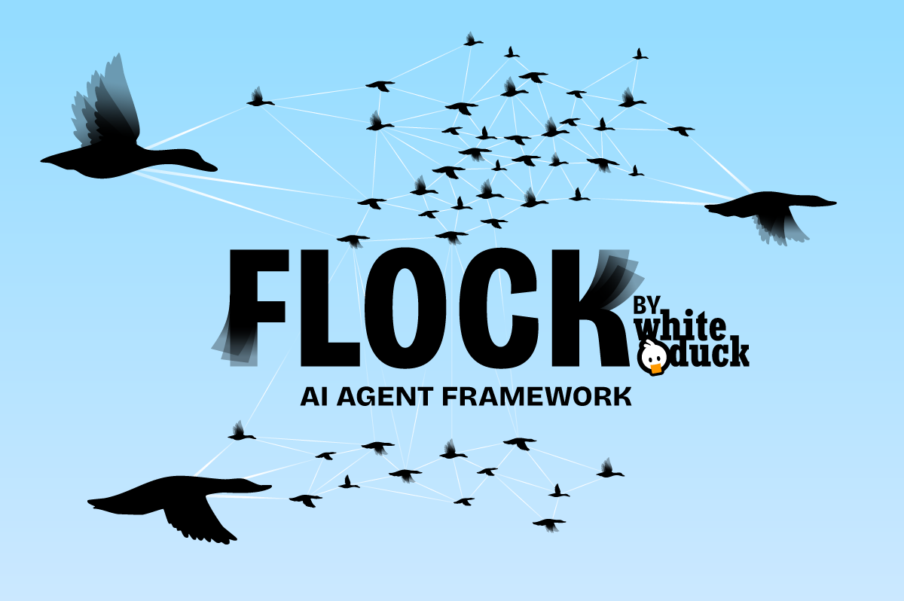
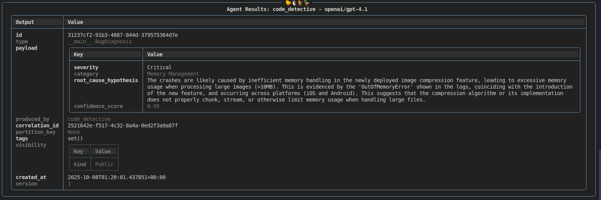
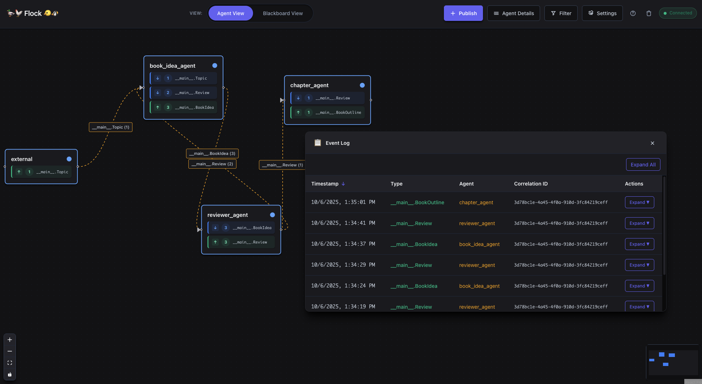

<p align="center">
  
</p>
<p align="center">
  <a href="https://whiteducksoftware.github.io/flock/" target="_blank"></a>
  <a href="https://pypi.org/project/flock-core/" target="_blank"></a>
  
  <a href="LICENSE" target="_blank"></a>
  <a href="https://whiteduck.de" target="_blank"></a>
  
  <a href="https://deepwiki.com/whiteducksoftware/flock"></a>
</p>

# 🐧 Flock

> **Stop engineering prompts. Start declaring contracts.**

Flock orchestrates AI agents on a **blackboard**. Each agent declares which typed artifacts it consumes and which it publishes, and workflows emerge from those subscriptions: there is no graph to wire and no 500-line prompt to maintain. Pydantic models are the contract, independent agents run in parallel on their own, and visibility controls, a real-time dashboard and OpenTelemetry tracing are built in.

**New:**

- ⚖️ **[Decision models](#decision-models):** route on calibrated decisions instead of generated text.
- ☁️ **[Microsoft Foundry](#microsoft-foundry-hosted-agents):** run a Flock application as a Foundry hosted agent.

**📖 [Documentation](https://whiteducksoftware.github.io/flock/)** · [Installation](https://whiteducksoftware.github.io/flock/getting-started/installation/) · [Guides](https://whiteducksoftware.github.io/flock/guides/) · [Examples](examples/) · [Changelog](https://whiteducksoftware.github.io/flock/about/changelog/)

## Contents

- [Quick start](#quick-start)
- [What's new](#whats-new): [decision models](#decision-models), [Microsoft Foundry](#microsoft-foundry-hosted-agents)
- [Why Flock](#why-flock)
- [Features](#features)
- [Observability](#observability)
- [Examples](#examples)
- [How Flock compares](#how-flock-compares)
- [Status and roadmap](#status-and-roadmap)
- [Contributing](#contributing)

---

## Quick start

```bash
pip install flock-core            # or: uv add flock-core
export OPENAI_API_KEY="sk-..."
export DEFAULT_MODEL="openai/gpt-4.1"
```

```python
import asyncio

from pydantic import BaseModel, Field

from flock import Flock, flock_type


@flock_type
class CodeSubmission(BaseModel):
    code: str
    language: str


@flock_type
class BugAnalysis(BaseModel):
    bugs_found: list[str]
    severity: str = Field(pattern="^(Critical|High|Medium|Low|None)$")


@flock_type
class SecurityAnalysis(BaseModel):
    vulnerabilities: list[str]
    risk_level: str = Field(pattern="^(Critical|High|Medium|Low|None)$")


@flock_type
class FinalReview(BaseModel):
    verdict: str = Field(pattern="^(Approve|Approve with Changes|Reject)$")
    action_items: list[str]


flock = Flock("openai/gpt-4.1")

# Agents subscribe to types; nobody wires them together
flock.agent("bug_detector").consumes(CodeSubmission).publishes(BugAnalysis)
flock.agent("security_auditor").consumes(CodeSubmission).publishes(SecurityAnalysis)
# AND gate: runs once both analyses are on the blackboard
flock.agent("reviewer").consumes(BugAnalysis, SecurityAnalysis).publishes(FinalReview)


async def main():
    await flock.publish(CodeSubmission(code="def add(a, b): return a - b", language="python"))
    await flock.run_until_idle()
    for review in await flock.store.get_by_type(FinalReview):
        print(review.verdict, review.action_items)


asyncio.run(main())
```

- The bug detector and the security auditor run **in parallel**; the reviewer **waits for both**.
- There is no prompt: the field names, types and constraints are the instructions.
- Pydantic validates every output, so downstream agents only ever see valid data.

Replace the body of `main()` with `await flock.serve(dashboard=True)` to watch the agents in the [dashboard](#observability) and publish artifacts from the browser.

---

## What's new

### Decision models

Many agent steps are decisions, not writing tasks: which team handles a ticket, is it urgent, which of 100 controls does a sentence implement. Flock asks **decision models** for them (Microsoft-Decision-1, OpenAI Decisions, TypeSafe Jev or a local Clef model). They answer a typed question with a calibrated probability for every option in one forward pass, without generating text. The decision is an artifact on the blackboard, and agents subscribe to its answers.

```python
from flock import Choice, Flock, YesNo

flock = Flock("openai/gpt-4.1", decision_model="azure/decision-1")


class Route(Choice):
    """Which team should handle this support ticket?"""

    billing = "Charges, invoices, refunds"
    tech = "Bugs, crashes, login problems"


class Urgent(YesNo):
    """Does the customer need an answer today?"""


flock.agent("triage").consumes(Ticket).decides(Route, Urgent, threshold=0.8)  # one request

# Subscribers receive the ticket itself; the decision is on ctx.decisions
flock.agent("billing").consumes(Route.billing).publishes(Reply)
flock.agent("supervisor").consumes(Route.UNSURE).publishes(Reply)      # below the threshold
flock.agent("pager").consumes(Route.tech, Urgent.yes).publishes(Page)  # AND about one ticket
```

| | |
|---|---|
| **Question types** | `Choice`, `YesNo`, `Scale` (ordered levels, `.or_higher`) and `Checklist` (one yes/no per item, e.g. 100 controls, one decision) |
| **Large catalogs** | Tournaments ask a choice with 1,000+ options in rounds; screening networks split a catalog across parallel nodes and rank the passes |
| **Uncertainty** | Every decision carries its probabilities; below the threshold it goes to `UNSURE`, its own branch |
| **Providers** | `azure/`, `openai/`, `jev/` and any local `/v1/systemone` server (`local/`); images via `flock.Image`; retries and a shared request budget for rate limits |
| **Dashboard** | Deciders with their options and counts, edges labelled by option, probability bars, checklist grids and tournament brackets |

Measured with Microsoft-Decision-1 on the repository's examples:

- **Routing:** 100 arXiv abstracts sorted into research fields at 169 ms per paper, against 598 ms for `gpt-4.1`; the decision model agreed with arXiv's category on 90 papers, `gpt-4.1` on 85.
- **Compliance:** 24 documents checked against 100 controls with one checklist decision each, about 600 ms per document, recall 1.00 at precision 0.75 against ground truth.

<p align="center">
  
</p>

📖 [Decision models guide](https://whiteducksoftware.github.io/flock/guides/decisions/) · [Examples](examples/15-decisions/)

### Microsoft Foundry hosted agents

`FlockApplication` runs one request as one isolated Flock workflow. It has a typed input, an explicit allowlist of public outputs, results streamed per artifact and exactly one terminal outcome (`succeeded`, `failed`, `cancelled` or `timed_out`). A queue worker, your own ASGI service or Microsoft Foundry can host it.

```python
from flock import Flock, FlockApplication
from flock.integrations.foundry import FoundryResponsesAdapter


def build_flock() -> Flock:  # a fresh blackboard per workflow
    flock = Flock("azure/gpt-4.1", no_output=True)
    flock.agent("triage").consumes(IncidentRequest).publishes(IncidentTriage)
    flock.agent("summarizer").consumes(IncidentTriage).publishes(IncidentSummary)
    return flock


application = FlockApplication(
    factory=build_flock,
    input_type=IncidentRequest,
    output_types=(IncidentSummary,),
    required_output_types=(IncidentSummary,),
)

host = FoundryResponsesAdapter(
    application,
    input_mapper=lambda turn: IncidentRequest(report=turn.text),
    output_mapper=lambda summary: summary.summary,
)
host.run()  # Foundry's Responses protocol on $PORT or 8088
```

- **Official host:** the adapter uses Microsoft's `azure-ai-agentserver-responses` host. Streaming, background mode, polling and cancellation map onto Flock workflows.
- **Identity:** each Foundry user becomes the workflow's principal, so visibility rules apply per user.
- **Lean install:** `pip install "flock-core[foundry]"`. Without the extra, no Azure package is installed or imported.
- **Deployable sample:** [`examples/14-foundry/incident-triage`](examples/14-foundry/incident-triage) follows the official Foundry layout and has been deployed and tested as a hosted agent.

📖 [Applications guide](https://whiteducksoftware.github.io/flock/guides/applications/) · [Foundry guide](https://whiteducksoftware.github.io/flock/guides/foundry/)

---

## Why Flock

### Contracts, not prompts

```python
# Instead of a prompt that explains the output format in 500 lines ...
@flock_type
class BugDiagnosis(BaseModel):
    severity: str = Field(pattern="^(Critical|High|Medium|Low)$")
    category: str = Field(description="Bug category")
    root_cause_hypothesis: str = Field(min_length=50)
    confidence_score: float = Field(ge=0.0, le=1.0)

# ... the schema is the instruction
flock.agent("diagnostician").consumes(BugReport).publishes(BugDiagnosis)
```

Schemas survive model upgrades, fail loudly at parse time instead of in production, and can be tested with concrete inputs and outputs.

### A blackboard, not a graph

```python
# Graph frameworks: every new agent means new edges
workflow.add_edge("radiologist", "diagnostician")
workflow.add_edge("lab_tech", "diagnostician")

# Flock: agents subscribe to types, and the workflow emerges
flock.agent("radiologist").consumes(Scan).publishes(XRayAnalysis)
flock.agent("lab_tech").consumes(Scan).publishes(LabResults)
flock.agent("diagnostician").consumes(XRayAnalysis, LabResults).publishes(Diagnosis)
flock.agent("perf").consumes(Scan).publishes(PerfAnalysis)  # added later, nothing rewired
```

Agents know data types, not each other. Independent agents run concurrently, an agent with several inputs waits for all of them, and adding an agent is one subscription. Blackboard systems have coordinated specialists since the 1970s (Hearsay-II, HASP/SIAP, BB1); Flock applies the pattern to LLM agents.

<p align="center">
  
</p>

---

## Features

### Subscriptions and logic gates

```python
flock.agent("diagnostician").consumes(XRayAnalysis, LabResults)          # AND: wait for both
flock.agent("alerts").consumes(SystemAlert).consumes(UserAlert)          # OR: either one
flock.agent("aggregator").consumes(Order, Order, Order)                  # three Orders
flock.agent("urgent").consumes(Diagnosis, where=lambda d: d.severity == "Critical")
flock.agent("payments").consumes(Transaction, batch=BatchSpec(size=25, timeout=timedelta(seconds=30)))
flock.agent("notify").consumes(
    Order, Shipment, join=JoinSpec(by=lambda x: x.order_id, within=timedelta(hours=24))
)
```

📖 [Predicates](https://whiteducksoftware.github.io/flock/guides/predicates/) · [Batching](https://whiteducksoftware.github.io/flock/guides/batch-processing/) · [Joins](https://whiteducksoftware.github.io/flock/guides/join-operations/)

### Fan-out publishing

One execution can publish many artifacts, including several types at once:

```python
flock.agent("ideas").consumes(Brief).publishes(Idea, fan_out=(5, 20), where=lambda i: i.score >= 8)
flock.agent("studio").consumes(Idea).publishes(Movie, MovieScript, MovieCampaign, fan_out=3)  # 9 artifacts, one call
```

📖 [Fan-out guide](https://whiteducksoftware.github.io/flock/guides/fan-out/)

### Semantic subscriptions

Route by meaning with local embeddings (`all-MiniLM-L6-v2` on ONNX via fastembed, no external API):

```python
# pip install "flock-core[semantic]"
flock.agent("security").consumes(Ticket, semantic_match="security vulnerability exploit").publishes(Alert)
flock.agent("billing").consumes(Ticket, semantic_match="payment charge refund", semantic_threshold=0.6)
```

Semantic subscriptions compare embeddings locally. [Decision models](#decision-models) give calibrated probabilities over a closed set of options. The [decision models guide](https://whiteducksoftware.github.io/flock/guides/decisions/#decision-models-or-semantic-subscriptions) explains when to use which.

📖 [Semantic subscriptions guide](https://whiteducksoftware.github.io/flock/guides/semantic-subscriptions/)

### Scheduling

```python
flock.agent("health").schedule(every=timedelta(seconds=30)).publishes(HealthStatus)
flock.agent("daily").schedule(at=time(hour=17)).publishes(DailyReport)
flock.agent("workdays").schedule(cron="0 9 * * 1-5").publishes(WorkdayReport)
flock.agent("errors").schedule(every=timedelta(minutes=5)).consumes(LogEntry, where=lambda e: e.level == "ERROR").publishes(ErrorReport)
```

Timer runs see `ctx.trigger_type == "timer"`, `ctx.timer_iteration` and `ctx.fire_time`.

📖 [Scheduling guide](https://whiteducksoftware.github.io/flock/guides/scheduling/)

### Visibility and context

Access control is part of the blackboard, not an add-on. It decides which agents an artifact triggers and which artifacts they see:

```python
agent.publishes(CustomerData, visibility=TenantVisibility(tenant_id="customer_123"))
agent.publishes(MedicalRecord, visibility=PrivateVisibility(agents={"physician", "nurse"}))
agent.publishes(IntelReport, visibility=LabelledVisibility(required_labels={"clearance:secret"}))
flock.agent("analyst").labels("clearance:secret").consumes(IntelReport)
```

Context providers shape what an agent sees beyond its trigger, for example only recent, correlated or tagged artifacts. Every provider extends `BaseContextProvider`, which applies visibility filtering, so a custom provider cannot leak what an agent may not read.

```python
from flock import FilterConfig
from flock.core.context_provider import FilteredContextProvider

flock = Flock("openai/gpt-4.1", context_provider=FilteredContextProvider(FilterConfig(tags={"urgent"})))
```

📖 [Visibility](https://whiteducksoftware.github.io/flock/guides/visibility/) · [Context providers](https://whiteducksoftware.github.io/flock/guides/context-providers/)

### Persistence

The blackboard is in memory by default. Two persistent stores come with Flock:

- **SQLite** keeps a full, queryable history: `Flock(..., store=SQLiteBlackboardStore(".flock/blackboard.db"))` from `flock.core.store`.
- **Dapr state stores** (Redis, PostgreSQL, Cosmos DB and others) let several Flock processes share one blackboard. Install it with `pip install "flock-core[dapr]"`.

📖 [Persistent blackboard](https://whiteducksoftware.github.io/flock/guides/persistent-blackboard/) · [Dapr state store](https://whiteducksoftware.github.io/flock/guides/dapr-state-store/)

### Components and safety

- **Agent components** hook into every step of an agent run: `on_pre_consume`, `on_pre_evaluate`, `on_post_evaluate` and more.
- **Orchestrator components** see the whole blackboard; scheduling and webhooks are built this way.
- **Server components** compose the HTTP API.
- **Engines** decide how an agent turns inputs into outputs: DSPy (the default), decision models or your own logic.
- **Built-in safeguards:**
  - a circuit breaker stops runaway cascades (1,000 iterations by default);
  - agents do not trigger themselves (`prevent_self_trigger`);
  - duplicate deliveries are filtered;
  - `.best_of(n, score=...)` picks the best of several runs.
- **Azure OpenAI with Entra ID:** `DSPyEngine(lm_kwargs={"azure_ad_token_provider": get_default_azure_token_provider()})`, with the `azure` extra.
- **MCP servers** are available as agent tools.

📖 [Agent components](https://whiteducksoftware.github.io/flock/guides/components/) · [Orchestrator components](https://whiteducksoftware.github.io/flock/guides/orchestrator-components/) · [DSPy engine and Azure](https://whiteducksoftware.github.io/flock/guides/dspy-engine/) · [Local models](https://whiteducksoftware.github.io/flock/guides/local-models/)

---

## Observability

`await flock.serve(dashboard=True)` starts the REST API and the dashboard on port 8344.

<p align="center">
  
</p>

- **Dashboard:**
  - an agent view and a blackboard view with live updates over WebSocket;
  - five auto-layouts;
  - filters by correlation id and time;
  - publish artifacts and run agents from the browser.
- **Trace viewer:** timeline, statistics, RED metrics, dependencies and configuration.
- **Tracing:** `FLOCK_AUTO_TRACE=true` and `FLOCK_TRACE_FILE=true` record every operation with its inputs and outputs as OpenTelemetry spans in `.flock/traces.duckdb`. Query them with SQL, or export them via OTLP.
- **REST API:**
  - `POST`/`GET /api/v1/artifacts`, `POST /api/v1/agents/{name}/run`, `GET /api/v1/correlations/{id}/status`, `/health` and `/metrics`;
  - OpenAPI docs at `/docs`.

📖 [Dashboard](https://whiteducksoftware.github.io/flock/guides/dashboard/) · [Tracing](https://whiteducksoftware.github.io/flock/guides/tracing/) · [REST API](https://whiteducksoftware.github.io/flock/guides/rest-api/)

---

## Examples

```bash
git clone https://github.com/whiteducksoftware/flock.git && cd flock
uv sync --all-extras
uv run python examples/01-getting-started/01_declarative_pizza.py
```

| Folder | What it shows |
|---|---|
| [`01-getting-started`](examples/01-getting-started/) | First agents, inputs and outputs, MCP, tracing, joins, batches, webhooks |
| [`02-patterns`](examples/02-patterns/) | Publishing (fan-out, multi-output), visibility, complex patterns |
| [`03-hackathon`](examples/03-hackathon/) | A progressive hands-on tutorial |
| [`04-misc`](examples/04-misc/) | Persistent blackboard, dashboard edge cases, a 100-agent scale test |
| [`05-engines`](examples/05-engines/) – [`07-orchestrator-components`](examples/07-orchestrator-components/) | Custom engines, agent components and orchestrator components |
| [`08-semantic`](examples/08-semantic/) | Semantic ticket routing and filtering |
| [`09-server-components`](examples/09-server-components/) | Every server component, and a full composition |
| [`10-scheduling`](examples/10-scheduling/) | Interval, daily, one-time and cron timers |
| [`12-dapr`](examples/12-dapr/) | Dapr state stores (in-memory, PostgreSQL, encrypted Redis) |
| [`13-applications`](examples/13-applications/) | `FlockApplication` behind a worker and a Starlette SSE endpoint |
| [`14-foundry`](examples/14-foundry/) | A deployable Microsoft Foundry hosted agent |
| [`15-decisions`](examples/15-decisions/) | Decision models: triage, arXiv race, image sorting, question types, checklists, tournaments |

---

## How Flock compares

| | Graph-based | Chat-based | Flock (blackboard) |
|---|---|---|---|
| **Coordination** | Hand-wired edges | Message passing | Type subscriptions |
| **Parallelism** | Manual split/join | Mostly sequential | Automatic |
| **Outputs** | Varies | Text messages | Validated Pydantic models |
| **Adding an agent** | Rewire the graph | Update the flow | One subscription |
| **Routing** | Code or an LLM's text | The conversation | Types, predicates, semantic matches and calibrated decisions |
| **Access control** | DIY | DIY | Built-in visibility |
| **Testing** | The whole graph | The whole group | Each agent in isolation |

**Flock fits when** you want typed outputs, parallel agents without wiring, routing you can test, and access control and tracing from the start.

**Look elsewhere when** your workflow is a strictly sequential script, when you need a large ecosystem of ready-made integrations, or when your team is invested in another framework. Flock's community is smaller than those of the big graph and chat frameworks.

---

## Status and roadmap

Flock 0.5 is the current release line (`flock-core` on PyPI), with about 2,800 tests. The core is stable:

- the blackboard with typed contracts, subscriptions and visibility;
- the dashboard and tracing;
- the SQLite and Dapr stores;
- decision models;
- application hosting, including Microsoft Foundry.

The work toward 1.0 is tracked in [issues labelled `[1.0]`](https://github.com/whiteducksoftware/flock/issues?q=is%3Aissue+is%3Aopen+%5B1.0%5D):

- bounded admission and concurrency, and execution budgets;
- run history that survives restarts, and run cancellation;
- authenticated dashboard and WebSocket access;
- explanations for why a subscription did not trigger;
- agent skills.

[ROADMAP.md](ROADMAP.md) is being updated to match ([#451](https://github.com/whiteducksoftware/flock/issues/451)).

## Contributing

Flock is developed in the open. Please read the [contributing guide](https://whiteducksoftware.github.io/flock/about/contributing/) first.

- AI coding agents (and humans who like checklists) should start with [AGENTS.md](AGENTS.md).
- The [architecture overview](docs/architecture.md), [error handling](docs/patterns/error_handling.md) and [async patterns](docs/patterns/async_patterns.md) describe the conventions the code follows.
- Tests must pass and code is formatted with Ruff (`uv run poe test`, `uv run poe lint`).

## License

MIT, see [LICENSE](LICENSE). Built with ❤️ by [white duck GmbH](https://whiteduck.de).
