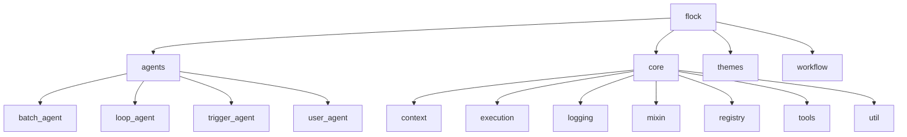
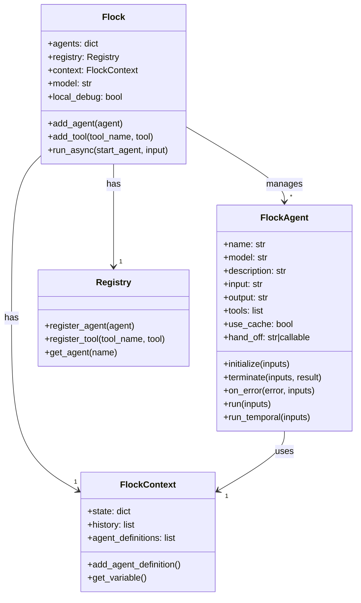
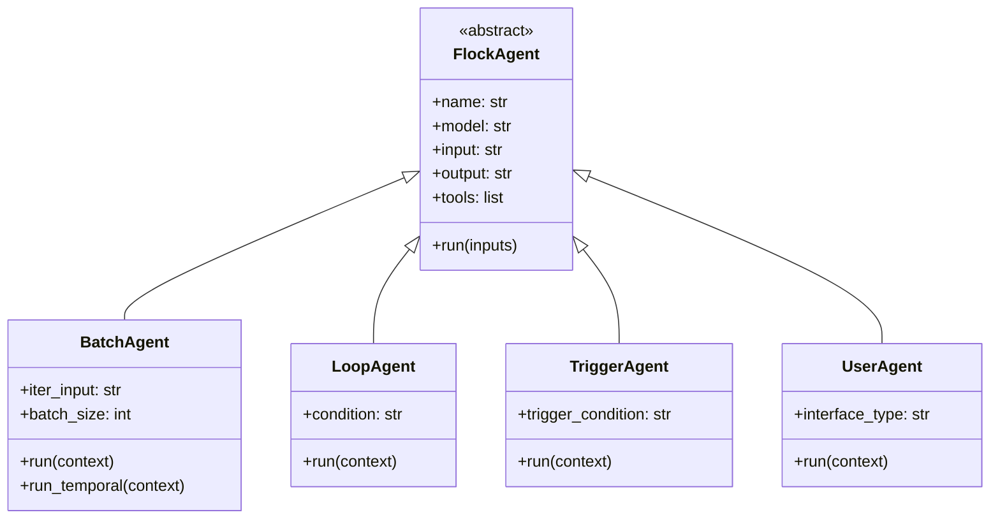
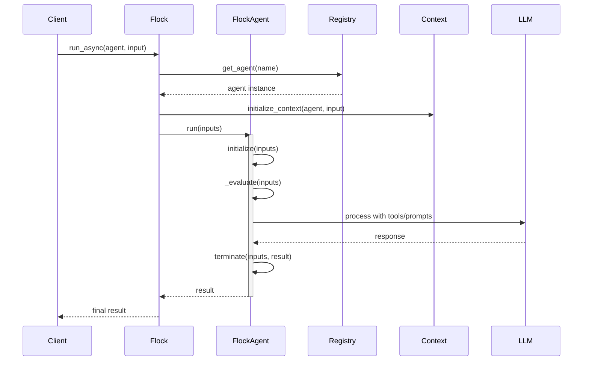
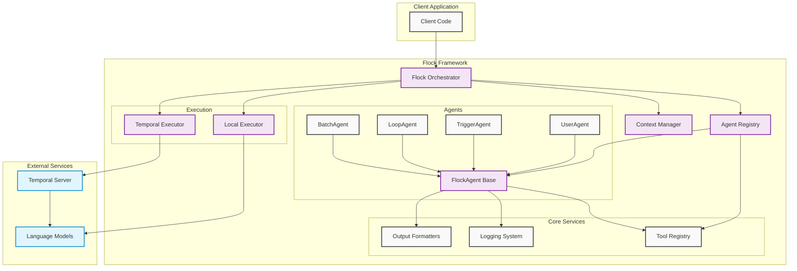

# Flock Architecture

## Package Structure

## Core Components

## Agent Types

## Execution Flow

This architecture documentation shows the key components and relationships in the Flock framework:

1. **Package Structure**: Shows the main modules and their organization
2. **Core Components**: Illustrates the relationships between the main classes
3. **Agent Types**: Shows the inheritance hierarchy of different agent types
4. **Execution Flow**: Demonstrates the sequence of operations during agent execution

## Component Relations

Key architectural features:

- **Declarative Design**: Agents are defined by their inputs/outputs rather than explicit prompts
- **Modular Structure**: Clear separation between core components, agents, and workflow
- **Extensible**: Support for custom agents, tools, and execution environments
- **Production Ready**: Built-in support for both local debugging and Temporal workflow execution
