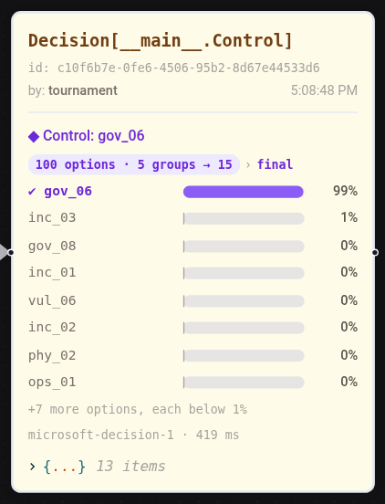
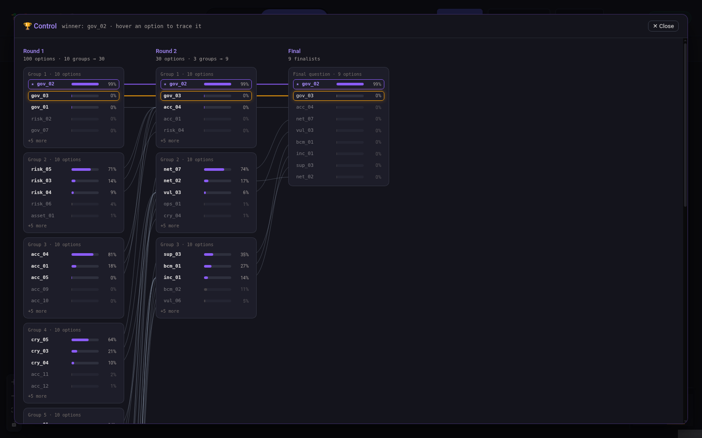
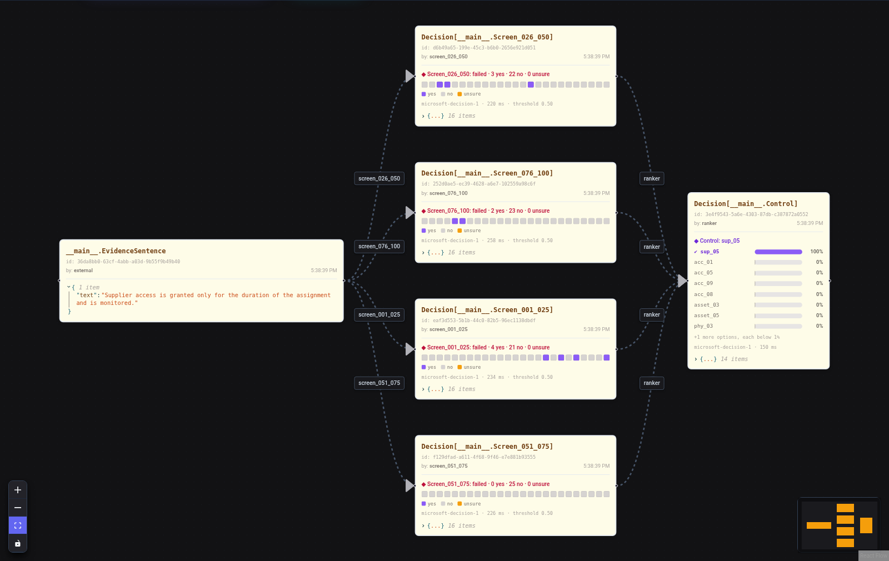
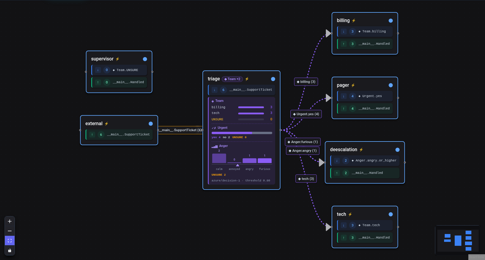
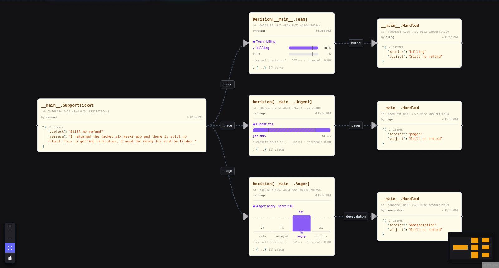
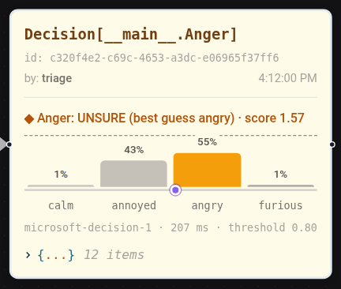
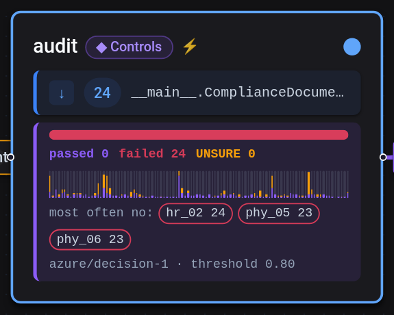
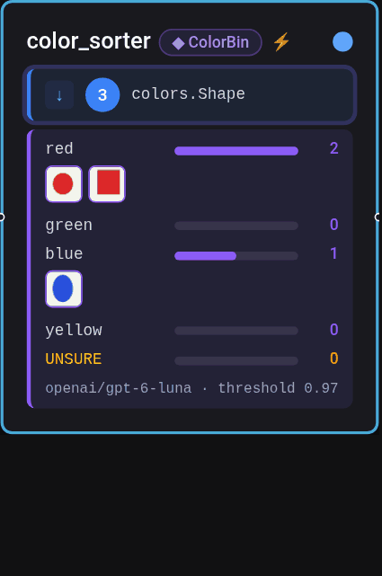
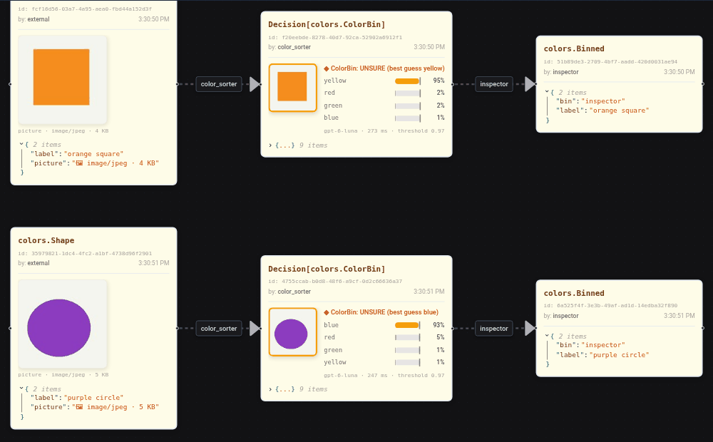

---
tags:
  - decisions
  - subscriptions
  - routing
description: Route workflows with decision models - Choice, YesNo, Scale and Checklist questions, .decides() and answer subscriptions
---

# Decision Models

A **decision model** reads a state plus typed questions (one of N options, yes/no, an ordered scale, a checklist) and returns a calibrated probability for every answer, in one forward pass and without generating text. Examples are TypeSafe Jev, Cloudflare Clef (open weights) and Microsoft-Decision-1. For routing, classification and gating they are one to two orders of magnitude cheaper and faster than an LLM call.

In Flock a decision is a **shared fact on the blackboard**: one agent decides once and publishes the decision. Other agents subscribe to an **option** of that decision.

```python
from pydantic import BaseModel

from flock import Choice, Flock, flock_type


@flock_type
class Ticket(BaseModel):
    subject: str
    body: str


@flock_type
class Reply(BaseModel):
    team: str
    reply: str


class Route(Choice):
    """Which team should handle this support ticket?"""

    billing = "Charges, invoices, refunds"
    shipping = "Delivery, tracking, returns"
    tech = "Bugs, crashes, login problems"


flock = Flock("openai/gpt-4.1")

triage = (
    flock.agent("triage")
    .consumes(Ticket)
    .decides(Route, model="azure/decision-1", threshold=0.8)
)

flock.agent("billing").consumes(Route.billing).publishes(Reply)
flock.agent("tech").consumes(Route.tech).publishes(Reply)
flock.agent("supervisor").consumes(Route.UNSURE).publishes(Reply)
```

## Question types

A question class is the question and its answers; its **docstring** is the question sent to the model. The three kinds map to the native question types of the decision APIs:

| Class | Answers | systemone | OpenAI Decisions | Subscription handles |
|---|---|---|---|---|
| `Choice` | one of 2-255 options | `choice` | `choice` | `Route.billing`, `Route.UNSURE`, `Route.ANY` |
| `YesNo` | `yes` or `no` | `noul` | `predicate` | `Urgent.yes`, `Urgent.no`, `Urgent.UNSURE`, `Urgent.ANY` |
| `Scale` | 2-10 ordered levels | `score` | `score` | `Anger.angry`, `Anger.angry.or_higher`, `Anger.annoyed.or_lower`, `Anger.UNSURE`, `Anger.ANY` |
| `Checklist` | yes/no per item, any number of items, one decision | `noul` per item | `predicate` per item | `Controls.passed`, `Controls.failed`, `Controls.mfa`, `Controls.mfa.no`, `Controls.mfa.UNSURE`, `Controls.UNSURE`, `Controls.ANY` |

`UNSURE` and `ANY` are reserved names, and so are `passed` and `failed` in a Checklist.

### Choice

- Every **string attribute** is an option. Its value describes the option and is sent as the option's criteria. Good descriptions matter as much as good prompts.
- Options are static. A Choice needs at least two options. Decision models accept at most 255 options per question; a larger Choice is asked as a [tournament](#tournaments-for-large-choices).
- `Choice.from_options("Route", {"billing": "...", "tech": "..."}, question="...")` builds a Choice from data, for example a catalog loaded at startup.

### YesNo

```python
from flock import YesNo


class Urgent(YesNo):
    """Does the customer need an answer today?"""


class Refund(YesNo):
    """Does the customer ask for a refund?"""

    yes = "They want money back"   # optional: what each answer means
    no = "No refund request"
```

The model returns the probability of yes; the decision carries `probabilities = {"yes": p, "no": 1 - p}`. systemone models receive the descriptions as `noul` criteria. OpenAI predicates take no descriptions, so Flock appends them to the instructions. A YesNo accepts no other attributes.

Ask a yes/no question as `YesNo` rather than as a two-option `Choice`: the native yes/no head of a decision model and its choice head can disagree on the same item.

### Scale

```python
from flock import Scale


class Anger(Scale):
    """How angry is the customer?"""

    calm = "Calm and polite"            # lowest level first
    annoyed = "Annoyed but civil"
    angry = "Angry, complaining strongly"
    furious = "Furious, threatening to leave"
```

A Scale has 2-10 levels in declaration order, lowest first. The decision carries the probability per level, the most probable level as `choice` and the probability-weighted `score`: 0 is the lowest level, 3 the highest here, and 2.2 lies between `angry` and `furious`.

- `Anger.angry` triggers when the most probable level is `angry` (and clears the threshold).
- `Anger.angry.or_higher` triggers when `score >= 2`, `Anger.annoyed.or_lower` when `score <= 1`. These compare the score and ignore the threshold: a decision split between `angry` (0.55) and `furious` (0.45) is `UNSURE` as a level, but its score of 2.45 is clearly "angry or higher".

### Checklist

A Checklist asks the same yes/no question for every item and publishes **one** decision with an answer per item. It is made for checking an artifact against a catalog: a document against security controls, a contract against required clauses, a release against a definition of done.

```python
from flock import Checklist


class Controls(Checklist):
    """Does the document show that this control is implemented?"""

    mfa = "Multi-factor authentication is required for remote access"
    backup = "Backups are performed daily"
    restore_test = "Restores from backup are tested"


# or from a catalog; ids need not be identifiers ("ORP.1.A1" works, via getattr)
Controls = Checklist.from_items(
    "Controls",
    {control["id"]: control["text"] for control in catalog},
    question="Does the document show that this control is implemented?",
)
```

Every item becomes a yes/no question whose instructions are the docstring plus the item text. With `threshold=0.8` an item is `yes` at a probability of yes of at least 0.8, `no` at 0.2 or below, and `UNSURE` in between. The decision carries:

- `results`: `yes`, `no` or `UNSURE` per item; `probabilities`: the probability of yes per item;
- `choice`, the outcome: `failed` as soon as one item is `no`, `UNSURE` if no item is `no` but some are unsure, `passed` if every item is `yes`;
- `refused_items`: items the model refused (their result is `UNSURE`).

Subscribe to the outcome (`Controls.failed`), to one item (`Controls.restore_test.no`), or put a `where=` predicate on the decision: `.consumes(Controls.ANY, where=lambda d: "UNSURE" in d.results.values())` routes every document with unsure items to a review, also when the outcome is already `failed`.

Use a Checklist, not a `Choice`, when several items can apply at once. A Choice asks which **one** option applies and spreads the probability over all options: with a policy text that satisfies 11 of 20 controls, Microsoft-Decision-1 put 0.40 on the best control and no option cleared a threshold of 0.8.

Many items are cheap, because the artifact is sent once as the state and each item is a question about it:

| Questions in one request (Microsoft-Decision-1) | Latency |
|---|---|
| 1 | 167 ms |
| 20 | 253 ms |
| 100 | 560 ms |

`.decides(..., questions_per_request=100)` (the default) splits larger checklists into requests of at most that many questions and sends them concurrently. On the example data below (24 documents, 100 controls each, threshold 0.8), Microsoft-Decision-1 found every implemented control (recall 1.00) at a precision of 0.75, about 600 ms per document. Many of the extra "yes" answers are arguable, such as a procedure document counted as documentation of operating procedures.

## Deciding: `.decides()`

```python
.decides(
    Route, Urgent, Anger,       # one or more question classes, asked in one request
    model="azure/decision-1",   # or a DecisionProvider; default: Flock(decision_model=...)
    threshold=0.8,              # optional, for every question; below it a decision is UNSURE
    instructions=None,          # optional, single question only; overrides the docstring
    visibility=None,            # optional; overrides visibility inheritance
    questions_per_request=100,  # optional; larger sets are split into concurrent requests
    tournament=None,            # optional; Tournament(...) asks one large Choice in rounds
    options=None,               # optional; callable(ctx) -> option names asked this time
)
```

`.decides()` sets the agent's engine to a `DecisionEngine` and makes the agent publish one `Decision.of(<question>)` per question. Utilities, guards and tracing work as for any other agent. It cannot be combined with `.with_engines()`, and batch subscriptions are not supported.

The model sees the agent's inputs as its state, one line per input: `Ticket: {"subject": "...", "body": "..."}`.

### Several questions in one call

With several questions the model answers all of them in **one request**, in one pass over the state, and every execution publishes one decision per question about the same subject. Each question routes on its own:

```python
triage = flock.agent("triage").consumes(Ticket).decides(Route, Urgent, Anger)

flock.agent("billing").consumes(Route.billing).publishes(Reply)
flock.agent("pager").consumes(Urgent.yes).publishes(Page)
flock.agent("deescalation").consumes(Anger.angry.or_higher).publishes(Reply)
```

A ticket that is about billing, urgent and furious runs all three agents, each with the ticket as input. The question classes of one decider need distinct class names.

### The decision artifact

Each decision is a `Decision.of(<question>)` artifact, for example `Decision.of(Route)`:

| Field | Meaning |
|---|---|
| `question` | Name of the question class |
| `kind` | `choice`, `yesno` or `scale` |
| `choice` | The selected option, or `UNSURE` when its probability is below `threshold` or the model refused |
| `best_guess` | The model's pick, also when unsure; `None` when the model refused |
| `probabilities` | Probability per option (per level for a Scale, `yes`/`no` for a YesNo) |
| `score` | Scale only: the probability-weighted level, 0 = lowest |
| `refused` | The model refused to answer this question |
| `results`, `refused_items` | Checklist only: answer per item, items the model refused |
| `rounds` | Tournament only: candidates, groups, refused groups, survivors and the top candidates of every group per round |
| `candidates` | The options the decision was asked about when `options=` restricted them |
| `confidence` | Confidence as reported by the model |
| `threshold` | The threshold that applied |
| `subject_ids` | Ids of the artifacts the decision is about |
| `model` | The model that answered (as reported by the provider) |
| `latency_ms` | Round trip of the decision request (shared by all questions of the request) |

### Tournaments for large choices

Some decisions pick one option out of a large catalog: mapping a paragraph to the requirement it implements, with well over 1,000 requirements in the BSI IT-Grundschutz-Kompendium. A tournament asks such a Choice in rounds:

```python
from flock import Choice, Tournament

Requirement = Choice.from_options("Requirement", catalog, question="Which requirement does this paragraph implement?")

flock.agent("mapper").consumes(Paragraph).decides(
    Requirement, tournament=Tournament(group_size=20, keep=3), threshold=0.6
)
```

1. The options are split into groups of `group_size`; every group is one choice question, and all groups of a round go out together (in requests of at most `questions_per_request` questions).
2. The `keep` most probable options of each group survive. The tournament keeps a top-k per group instead of applying a threshold, because probabilities are normalized within each group and cannot be compared across groups.
3. Rounds repeat until the survivors fit into one final question. Its answer is the decision: probabilities over the finalists, threshold and `UNSURE` as usual, subscriptions and handles unchanged.

The decision's `rounds` lists every round's candidates, groups, `group_size`, `refused_groups` and survivors, and per group (`group_results`) its size and its top candidates with their probabilities: the survivors plus the two strongest eliminated options. OpenAI's Decisions API refuses a group in which no option fits; such a group keeps no survivors. A Choice with more than 255 options must be asked as a tournament, and `.decides()` without `tournament=` rejects it.

A tournament costs one round trip per round, and an option that drops out early cannot win. On the example below (25 evidence sentences, 100 controls, Microsoft-Decision-1), both fit:

| Decider | Right | Median latency | Requests |
|---|---|---|---|
| one choice over all 100 controls | 25/25 | 180 ms | 1 |
| tournament, groups of 20, keep 3 | 25/25 | 419 ms | 2 |

Use a single choice whenever the options fit into one question, and a tournament or a [screening network](#decision-networks) when they do not.

<p align="center">
  
</p>

**⤢ bracket** on a tournament decision opens the whole tournament: one column per round and the final, group boxes with their top candidates, lines from every survivor to its place in the next round, and the winner's path highlighted. Hovering an option traces its path through all rounds:

<p align="center">
  
</p>

## Routing: choice subscriptions

```python
flock.agent("billing").consumes(Route.billing)    # one option
flock.agent("supervisor").consumes(Route.UNSURE)   # decisions below the threshold
flock.agent("logger").consumes(Route.ANY)          # every decision
flock.agent("orders").consumes(Route.billing).consumes(Route.shipping)  # OR
```

A choice subscription triggers on matching decisions but **delivers the decision's subject**: the `billing` agent receives the `Ticket`, so its engine signature is `Ticket -> Reply`, exactly as if it consumed `Ticket` directly. The decision is on the context:

```python
class BillingEngine(EngineComponent):
    async def evaluate(self, agent, ctx, inputs, output_group):
        ticket = inputs.first_as(Ticket)
        routed_with = ctx.decision.probabilities["billing"]
        ...
```

Consumption is recorded on the decision artifact, so lineage and the dashboard show `triage → billing`.

To work with the decision itself (for an audit log, for example), consume its type like any other artifact:

```python
flock.agent("auditor").consumes(Decision.of(Route)).publishes(AuditEntry)
```

Handles cannot be mixed with plain types in one `.consumes()` call; several handles mean AND (see [Decision networks](#decision-networks)). `where=` predicates on a choice subscription receive the decision.

## Decision networks

Decisions compose: several handles in one `.consumes()` mean **AND about the same subject**, and `.decides(..., options=...)` asks about a subset of a question's options chosen at runtime. Together they build networks of deciders.

### AND across questions and deciders

```python
# Both questions of one decider
flock.agent("urgent_billing").consumes(Route.billing, Urgent.yes).publishes(Page)

# Decisions of separate deciders about the same ticket
flock.agent("review").consumes(Route.ANY, Sentiment.ANY, Risk.ANY).publishes(Review)
```

The agent runs once a matching decision for every handle has arrived about the same subject. It receives the subject once, and `ctx.decisions` holds all the decisions. Internally this is a join on the decisions' `subject_ids` with a 10-minute window; pass `join=JoinSpec(...)` to change it. Handles of the same question cannot be combined (there is one decision per subject), and handles cannot be mixed with plain types.

### Options at runtime

```python
def passes(ctx):
    return [item for d in ctx.decisions for item, result in d.results.items() if result == "yes"]

flock.agent("ranker").consumes(...).decides(Control, options=passes)
```

`options=` restricts a single Choice or Checklist to some of its options for each execution. The callable receives the context and returns option names. The decision type, its handles and routing stay as declared, and the decision records the `candidates` in declared order.

- Names that are not options of the question fail the execution.
- No candidates give an `UNSURE` decision without a request.
- A single candidate wins without a request.

### A screening network

Separate screen nodes each check a slice of a catalog in parallel. A ranker waits for all screens of a document, receives the document itself and ranks the controls that passed:

```
                  ┌── screen_001_025 ──┐
EvidenceSentence ─┼── screen_026_050 ──┼──> ranker ──> Decision[Control]
                  ├── screen_051_075 ──┤
                  └── screen_076_100 ──┘
```

```python
SCREENS = [
    Checklist.from_items(f"Screen_{s + 1:03d}_{s + 25:03d}",
                         {c["id"]: c["text"] for c in catalog[s : s + 25]},
                         question="Does this statement show that this control is implemented?")
    for s in range(0, 100, 25)
]
for screen in SCREENS:
    flock.agent(screen.__name__.lower()).consumes(EvidenceSentence).decides(screen, threshold=0.5)

flock.agent("ranker").consumes(*(s.ANY for s in SCREENS)).decides(Control, options=passes)
```

Screens are yes/no checklists rather than choices. A choice spreads its probability over its own slice, so an unrelated screen would still pass some option; yes/no answers are comparable across screens, which a threshold needs. Every screen is its own node, with its own model, threshold and scaling, and the dashboard shows each step:

<p align="center">
  
</p>

<p align="center">
  
</p>

### Choosing one of many options: three ways

[`06_control_mapping_tournament.py`](https://github.com/whiteducksoftware/flock/blob/main/examples/15-decisions/06_control_mapping_tournament.py) runs all three on the same 10 evidence sentences and 100 controls (Microsoft-Decision-1):

| Way | Right | Median latency | Requests per sentence | When to use it |
|---|---|---|---|---|
| One choice | 10/10 | 182 ms | 1 | The options fit into one question (up to 255) |
| Tournament in one node | 10/10 | 388 ms | 2 | A large catalog, as one decision with a bracket |
| Screening network | 10/10 | 441 ms | 5 | Separate steps, each with its own model, threshold and scaling; screens that are useful on their own |

The network's latency is its slowest screen plus the ranker. The right control was among the network's passes for every sentence, with a median of 5 passes per sentence.

## Thresholds and the UNSURE branch

With `threshold=0.8` the decision is firm only when the chosen option's probability is at least 0.8. Otherwise `choice` is `UNSURE` and only `Route.UNSURE` subscribers run, typically an LLM agent or a human-in-the-loop step. This is a confidence-gated cascade: keep the confident verdicts, escalate the rest.

A **refused** question (OpenAI's Decisions API can refuse a question and still answer the others) becomes a decision with `choice=UNSURE`, `refused=True`, `best_guess=None` and no probabilities, so it lands in the `UNSURE` branch instead of failing the execution.

Calibration is per task, not global. Pick each decider's threshold on that decider's own data. Recorded decisions (persistent store, traces) make it cheap to replay inputs against another model before switching.

## Visibility

A decision inherits the visibility of its subject, so routing never widens who can read data. Agents that may not see the ticket do not see its decision either and are not triggered. If a decider consumes several inputs with different visibilities, it fails instead of guessing; pass `visibility=` to `.decides()` to choose the decision's readership explicitly.

## Dashboard

A decider node shows every question it asks, drawn by kind: option bars for a `Choice`, one bar split into yes, no and `UNSURE` for a `YesNo`, and a histogram of the levels in order for a `Scale`, with a marker at the mean weighted score. Edges carry the answer, qualified for yes/no and scale questions (`Urgent.yes`, `Anger.angry`):

<p align="center">
  
</p>

In the Blackboard View each decision shows its answer the same way. A yes/no decision is one bar from yes (left) to no (right); the hatched zone between the two threshold markers is where neither answer is firm. A scale decision shows its levels in order, the threshold as a dashed line and the weighted score as a dot on the axis:

<p align="center">
  
</p>

<p align="center">
  
</p>

A checklist decider shows its outcomes, a strip with one column per item (the share of `yes` in violet and of unsure answers in amber across all decisions) and the items answered "no" most often. A checklist decision shows one cell per item:

<p align="center">
  
  &nbsp;&nbsp;
  
</p>

## Images

Decision models that accept images can decide about pictures. Put the picture into the artifact as a `flock.Image` field:

```python
from flock import Choice, Flock, Image, flock_type


@flock_type
class ProductPhoto(BaseModel):
    sku: str
    photo: Image


class Condition(Choice):
    """Is the product in the photo damaged?"""

    intact = "No visible damage"
    damaged = "Cracks, dents, tears or broken parts"


flock.agent("inspector").consumes(ProductPhoto).decides(Condition, model="openai/gpt-6-luna")

await flock.publish(ProductPhoto(sku="A-17", photo=Image.from_file("a17.jpg")))
```

- `Image` holds the picture as a base64 `data:image/...` URL, so it round-trips through stores, the REST API and the dashboard. Only inline data is accepted: Flock never fetches an image from a URL or a file path named in an artifact.
- `Image.from_file()`, `Image.from_bytes()` and `Image.from_pil()` scale the picture down to `max_side` (default 1024 px) and re-encode it as JPEG (PNG when it has transparency). Re-encoding drops EXIF metadata such as GPS positions. Smaller images are faster: a local Clef model took 1.3 s for a 108 KB photo and 11 s for 1 MB.
- The decider sends every `Image` in its inputs (also nested, in order) to the model; the text state shows `<image 1>`, `<image 2>`, ... in their place.
- A text-only provider refuses image inputs with a clear error instead of dropping the images.

| Provider | Images |
|---|---|
| `openai/<model>` | yes (`input_image` parts) |
| `local/<name>` | yes, if the served model has vision support (top-level `images`, raw base64) |
| `azure/<deployment>` (Microsoft-Decision-1) | no |
| `jev/<model>` | no |

In the dashboard, a decider's options show lanes with thumbnails of the latest images sorted into each option, and a decision artifact shows the decided image next to its probabilities. Image fields render as thumbnails instead of base64 text.

<p align="center">
  
</p>

In the Blackboard View every image artifact shows its thumbnail, and each decision shows the image it decided on, its probabilities and the threshold:

<p align="center">
  
</p>

## Providers

| Model string | Protocol | Configuration |
|---|---|---|
| `jev/<model>` | `POST /v1/systemone` | `JEV_API_KEY` (`JEV_API_BASE` overrides the endpoint) |
| `local/<name>` | `POST /v1/systemone` | `DECISION_API_BASE`, default `http://127.0.0.1:8080` |
| `azure/<deployment>` | `POST /v1/systemone` on Azure AI Foundry (Microsoft-Decision-1) | `AZURE_API_BASE`, `AZURE_API_KEY`; `AZURE_DECISION` overrides the path (default `/providers/microsoft/v1/systemone`) or sets a full URL; `azure/` alone uses `AZURE_DECISION_DEPLOYMENT` |
| `openai/<model>` | `POST /v1/decisions` | `OPENAI_API_KEY` |

Set the decision model once for the whole flock instead of on every decider:

```python
flock = Flock("openai/gpt-4.1", decision_model="azure/decision-1")

flock.agent("triage").consumes(Ticket).decides(Route)               # azure/decision-1
flock.agent("audit").consumes(Document).decides(Controls)           # azure/decision-1
flock.agent("painter").consumes(Swatch).decides(Color, model="openai/gpt-6-luna")  # explicit wins
```

The order is `model=` on `.decides()`, then `Flock(decision_model=...)` (a model string or a `DecisionProvider`), then the `DEFAULT_DECISION_MODEL` environment variable.

The live tests (`FLOCK_LIVE_DECISIONS=1 uv run pytest tests/decisions/test_live_providers.py`) run against `azure/decision-1` by default and add the other providers when their configuration is present.

### Local models

Any server that speaks `POST /v1/systemone` works with `local/`. llama.cpp's server runs Clef GGUF files with the decision head:

```bash
llama serve -m Clef-Flash-Q8_0.gguf -b 4096 -ub 4096 -ngl 99
```

The model evaluates the whole prompt in one batch, so `-b` and `-ub` must cover the longest request.

### Rate limits

Hosted decision models limit the requests per period. The Microsoft-Decision-1 deployment used by the examples, for example, allows 100 requests per minute. Two mechanisms keep deciders within such limits:

- **Retries.** A request answered with HTTP 429 (rate limited) or 503 (overloaded) is sent again, up to 7 times.
    - The response's advice is the shortest wait: `retry-after-ms`, `Retry-After` or `x-ratelimit-reset-requests`, which hold seconds on Azure and durations such as `6m0s` on OpenAI.
    - On top comes a backoff that doubles from 0.5–1 s, with jitter. Azure advises the time until its next free request, often under half a second. A burst of rejected requests that all came back after exactly that would be rejected together again.
    - No single wait exceeds 60 s. The shortest waits add up to just over a minute, one full rate-limit window.
    - Each retry logs a warning, and `max_retries=` on the provider classes changes the count.
- **A request budget.** `decision_rate_limit` spaces out requests before the limit is reached:

    ```python
    flock = Flock(decision_model="azure/decision-1", decision_rate_limit="100/min")
    ```

    Each decision model gets at most this many request starts per period (`"N/s"`, `"N/min"` or `"N/h"`). The budget is shared by every decider of the flock that uses the model, whichever way the model was set. Requests over the budget wait for a free slot in arrival order, and retries count against it. Without `decision_rate_limit`, requests go out at once.

The budget covers one flock. When other clients share the deployment, the retries absorb their share of the limit. Waiting time is part of a decision's `latency_ms`.

### Errors

Provider failures (unreachable server, HTTP errors, answers with unknown options) fail the decider's execution and publish a `WorkflowError`, as does an HTTP 429 or 503 that persists through all retries. Error messages name the provider and the HTTP status only, never the response body, because a body can echo the decided data.

## Testing

`FakeDecider` answers with fixed probabilities or with a function of the state and records every request:

```python
from flock.decisions import FakeDecider

decider = FakeDecider({"billing": 0.9, "shipping": 0.05, "tech": 0.05})
flock.agent("triage").consumes(Ticket).decides(Route, model=decider)

await flock.publish(ticket)
await flock.run_until_idle()

state, question = decider.calls[0]
```

For a decider with several questions, give the probabilities per question name. `refuse=` makes it refuse questions; `decider.requests` holds every request with all its questions:

```python
decider = FakeDecider(
    {
        "Route": {"billing": 0.9, "tech": 0.1},
        "Urgent": {"yes": 0.8, "no": 0.2},
        "Anger": {"calm": 0.1, "annoyed": 0.2, "angry": 0.6, "furious": 0.1},
    },
    refuse={"Urgent"},  # optional
)
```

For a checklist, map its name to the probability of yes per item (or to a function of the state returning that); refuse single items as `"Controls.restore_test"`:

```python
decider = FakeDecider({"Controls": {"mfa": 0.97, "backup": 0.95, "restore_test": 0.1}})
```

## Decision models or semantic subscriptions?

Both route artifacts by meaning, at different costs and guarantees:

| | Semantic subscriptions (`semantic_match=`) | Decision models (`.decides()`) |
|---|---|---|
| How | Embedding similarity of the artifact text to a query, per subscriber | One model call per artifact answers a question with a probability per option |
| Runs | Locally (`all-MiniLM-L6-v2`), no API | Hosted (`azure/`, `openai/`, `jev/`) or a local server (`local/`) |
| Output | A similarity score per subscriber, not shared | A `Decision` artifact on the blackboard: probabilities, confidence, audit trail |
| Mutually exclusive branches | No: several subscribers can match one artifact | Yes: exactly one option, or `UNSURE` |
| Good for | Cheap relevance filters, "is this about X?" | Routing and classification you want to audit, threshold and replay |

## What decision models are good at

They judge well when the answer can be read off the supplied state: routing, intent and topic classification, policy checks against given text. They are weak at reference-free judgments of taste or quality, where their confidence stops predicting their errors. They give no reasons, so let an LLM explain the low-confidence and failing cases. A decision model should not be the only gate that allows a risky action; let it deny or escalate, and let allowlists or people allow.

## Example

[`examples/15-decisions/01_ticket_triage.py`](https://github.com/whiteducksoftware/flock/blob/main/examples/15-decisions/01_ticket_triage.py) routes support tickets with Microsoft-Decision-1 (or any other provider) and sends ambiguous tickets to a supervisor. [`02_arxiv_race.py`](https://github.com/whiteducksoftware/flock/blob/main/examples/15-decisions/02_arxiv_race.py) races an LLM against the available decision models on 100 arXiv abstracts. [`03_color_sorter.py`](https://github.com/whiteducksoftware/flock/blob/main/examples/15-decisions/03_color_sorter.py) sorts generated shapes into color bins from their images. [`04_question_types.py`](https://github.com/whiteducksoftware/flock/blob/main/examples/15-decisions/04_question_types.py) asks a choice, a yes/no and a scale question about every ticket in one request. [`05_compliance_checklist.py`](https://github.com/whiteducksoftware/flock/blob/main/examples/15-decisions/05_compliance_checklist.py) checks 24 fictional security documents against 100 controls and compares the answers with ground truth. [`06_control_mapping_tournament.py`](https://github.com/whiteducksoftware/flock/blob/main/examples/15-decisions/06_control_mapping_tournament.py) maps evidence sentences to one of the 100 controls in three ways: a single choice, a tournament and a screening network.
