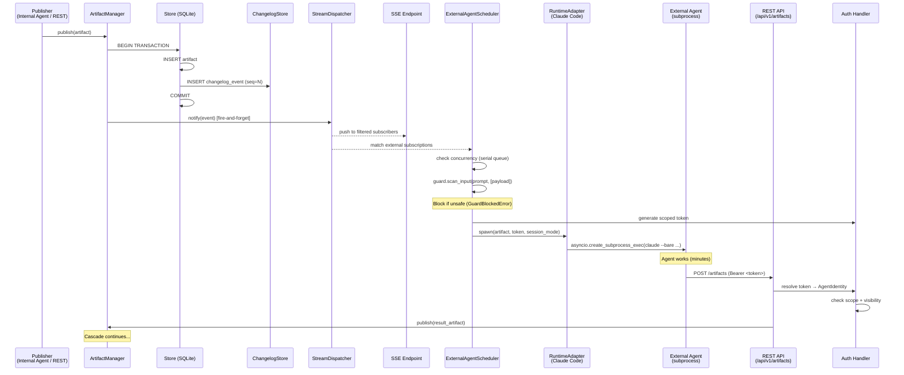

# feat: Meta-Orchestrator — Changelog Stream + External Agent Runtime

## Overview

Extend Flock from orchestrating internal LLM-call agents to orchestrating **external autonomous coding agents** (Claude Code, Codex, GitHub Copilot) using the same blackboard pattern. This plan covers the first two pieces of the 7-piece meta-orchestrator vision: a **changelog stream** (persistent event log with push/pull delivery) and an **external agent runtime** (protocol + adapters + auth + dashboard integration).

External agents become first-class blackboard participants: they subscribe to typed artifacts, get woken by changelog events, do their work, and publish results back via the REST API.

## Problem Frame

Flock's blackboard currently triggers internal agents via an in-process scheduler. External autonomous coding agents cannot participate because: (1) no push mechanism — the blackboard is pull-based, (2) no agent lifecycle management — Flock cannot spawn/resume external processes, (3) no return path — external agents have no authenticated way to publish artifacts back. (See origin: `docs/brainstorms/2026-04-07-meta-orchestrator-requirements.md`)

## Requirements Trace

**Changelog Stream:**
- R1. Ordered events with monotonic sequence numbers (gap-tolerant)
- R2. Events persisted durably (SQLite)
- R3. SSE + WebSocket push endpoints, filterable by type/agent/correlation/visibility
- R4. Cursor pull API (`GET /events?after=<seq>&limit=N`)
- R5. Configurable retention policy (age, count). Default: 7 days
- R6. Unified foundation for ALL agent triggering

**External Agent Runtime:**
- R7. `ExternalAgentRuntime` protocol — spawn/resume/communicate
- R8. Two session modes in v1: new, resume. Append deferred (no concrete IPC mechanism for any adapter).
- R9. Session mode per subscription, not per agent
- R10. Two adapters in v1: Claude Code (primary), Codex (validates generality). Copilot deferred to follow-up.

**Return Path & Auth:**
- R11. REST return path via existing `POST /api/v1/artifacts`
- R12. Scoped API tokens tied to `AgentIdentity`
- R13. Existing visibility system applies identically
- R14. Token management (create, revoke, list) — programmatic
- R14a. Auth is a distinct sub-deliverable

**Integration:**
- R15. `ExternalAgentScheduler` — fire-and-forget + REST return
- R16. Existing features (fan-out, batch, join, semantic, scheduling) work at artifact protocol level
- R17. Dashboard shows external agent status

**Success Criteria:**
- SC1. Claude Code agent woken by artifact → work → publish result → downstream cascade
- SC2. OpenClaw PR review workflow runs through blackboard
- SC3. Claude Code adapter passes integration tests (new + resume modes). Codex adapter validates protocol generality. Copilot adapter deferred to follow-up.
- SC4. Changelog event emission adds less than 5ms p99 latency to artifact publish under expected load (50 concurrent events/sec). Higher throughput (1000+ events/sec) achievable via micro-batching if needed.
- SC5. Unauthorized agent rejected (wrong token/scope → 403)
- SC6. Internal cascades visible via SSE + cursor API

## Scope Boundaries

- **In scope:** Changelog stream, ExternalAgentRuntime protocol, two adapters (Claude Code primary, Codex validates generality), API token auth, REST return path, dashboard integration
- **Out of scope:** Capability manifests, artifact lineage, MCP server, subscription-as-discovery, human-as-agent, federated blackboards, Kafka backend, cost tracking, filesystem bridge
- **Explicitly deferred:** Copilot adapter (unstable JSON output, limited resume), Gemini CLI and Aider adapters, cross-machine coordination, agent-to-agent direct messaging, per-type retention policies, FastAPI upgrade to 0.135+ (for native SSE), append session mode (no concrete IPC mechanism for any adapter)

## Context & Research

### Relevant Code and Patterns

- **Primary seam:** `src/flock/orchestrator/artifact_manager.py` — `persist_and_schedule()` is where every blackboard state change flows. Changelog event emission hooks in here.
- **Scheduler pattern:** `src/flock/orchestrator/scheduler.py` — `AgentScheduler.schedule_artifact()` iterates agents, checks visibility + subscription match, runs component hooks, creates `asyncio.Task`. The `ExternalAgentScheduler` follows this pattern but dispatches to adapters instead of engine evaluation.
- **Event emission:** `src/flock/orchestrator/event_emitter.py` — `EventEmitter` holds optional `WebSocketManager` reference, emits Pydantic events via `broadcast()`. Fire-and-forget via `asyncio.create_task()` is mandatory (see deadlock lesson below).
- **WebSocket:** `src/flock/api/websocket.py` — `WebSocketManager` singleton, broadcasts typed events, 500ms per-client timeout, removes slow clients. The changelog stream should NOT share this manager (different consumer profile, filtering requirements).
- **Auth extension point:** `src/flock/components/server/auth/auth_component.py` — `AuthenticationComponent` with handler registry (`register_handler(name, handler)`), regex route matching, path exclusions. Token auth registers here.
- **Store layer:** `src/flock/core/store.py` — `BlackboardStore` protocol, `InMemoryBlackboardStore`, `SQLiteBlackboardStore`. Schema at `src/flock/storage/sqlite/schema_manager.py` (version 3). Writes serialized via `_write_lock`.
- **Server components:** `src/flock/components/server/` — `ServerComponent` base with `configure()`, `register_routes()`, `on_startup_async()`, `on_shutdown_async()`. Priority ordering (0-5 core, 6-10 security, 11-50 business). Each testable in isolation.
- **Visibility/identity:** `src/flock/core/visibility.py` — `AgentIdentity(name, labels, tenant_id)`, five visibility types with `allows(identity) -> bool`. Token → AgentIdentity → visibility check + type scope = two-layer auth.
- **OpenClaw prior art:** `src/flock/integrations/openclaw/` — External agent integration via Engine pattern. Useful for: per-label session locks, retry with backoff, error taxonomy. NOT the execution model (Engine.evaluate() vs fire-and-forget spawn).
- **REST API:** `src/flock/api/service.py` — `POST /api/v1/artifacts` (async publish), `POST /api/v1/artifacts/sync` (sync), filtering, idempotency keys. No auth today (confirmed gap).
- **Agent registration:** `src/flock/core/agent.py` — `AgentBuilder` fluent API with `.consumes()` / `.publishes()`. Agents stored in `Flock._agents`.
- **Guard framework:** `src/flock/components/agent/guard.py` — `GuardComponent` abstract base class that scans agent inputs (`on_pre_evaluate`) and outputs (`on_post_evaluate`) for unsafe content. `AzurePromptShieldComponent` (`src/flock/components/agent/azure_prompt_shield.py`) detects prompt injection and jailbreak attacks via Azure Content Safety API. Directly applicable to scanning artifact payloads before they become external agent prompts.

### Institutional Learnings

- **WebSocket deadlock (CRITICAL):** Never `await` a WebSocket broadcast inside an event-producing loop. Use fire-and-forget with `asyncio.create_task()` + `done_callback(tasks.discard)`. The `_persist_and_schedule` hot path MUST NOT block on changelog broadcast. (Source: `docs/bugfixes/websocket-streaming-deadlock-fix.md`)
- **Build event model before storage:** Stabilize ChangelogEvent semantics (type enum, sequence, correlation, filtering shape) as a Pydantic model first. Test in-memory. Then wire SQLite persistence as a separate step. (Source: QMD learnings)
- **Schema migration guards:** Use `CREATE TABLE IF NOT EXISTS` for new tables, `PRAGMA table_info` + conditional `ALTER TABLE` for modifications. Default new fields so old records remain readable. (Source: QMD learnings)
- **Append-only is ground truth:** The changelog is append-only, never rewritten. Summaries and filtered views are derived. Retention deletes old events but never modifies them. (Source: QMD insights)
- **Codex sessions are stateless by default:** Each `codex exec` creates a fresh session. Resume requires explicit session ID capture from output. (Source: QMD learnings)

### External References

- **SSE on FastAPI 0.121:** Native `EventSourceResponse` requires FastAPI 0.135+. Use `sse-starlette` (production-grade, W3C compliant) or raw `StreamingResponse` with `text/event-stream`. Per-client `asyncio.Queue(maxsize=N)` with broadcast dispatcher for filtered streams.
- **Async subprocess:** `asyncio.create_subprocess_exec` (never `_shell`). Pass payloads via stdin pipe (not shell interpolation). Always `communicate()` (not manual read/write — deadlocks). Track processes in set, SIGTERM on shutdown, `await proc.wait()` after kill.
- **Token auth:** SHA-256 with salt (not bcrypt — high-entropy tokens don't benefit from slow hashing). `secrets.token_urlsafe(32)` for generation. `secrets.compare_digest()` for comparison. Prefix-indexed lookup for per-token salts. Store prefix (first 8 chars) for identification, never the raw token.

## Key Technical Decisions

- **Single transaction for atomicity (R2, R6):** Artifact INSERT + changelog event INSERT in one SQLite `conn.commit()`. For in-memory store, same lock with atomic counter increment. This prevents silent event loss on crash between the two writes. Alternatives rejected: (a) AFTER INSERT trigger on `artifacts` — triggers cannot construct the full `ChangelogEvent` model (event_type enum, payload_summary), cannot serve `artifact_consumed` or `agent_snapshot_updated` events, in-memory store has no trigger equivalent; (b) store wrapper/decorator — needs raw connection access to share the transaction, breaking the `BlackboardStore` abstraction, marginal benefit over a protocol signature change. This decision changes the `BlackboardStore.publish()` protocol signature; base class defaults (`raise NotImplementedError`) preserve backward compatibility for downstream implementations. (See origin: Outstanding Questions, most load-bearing decision)
- **Separate changelog stream from dashboard WebSocket:** The dashboard WebSocket (`/plugin/ws`) has known fragility (deadlock history, streaming freeze bugs). The changelog stream is a different consumer profile (high-throughput, per-client filtering, cursor-based). Use a separate `ChangelogStreamComponent` with its own SSE endpoint and WebSocket path (`/ws/changelog`). Alternative rejected: single WebSocket with topic-based routing (client sends `{subscribe: ["changelog", "dashboard"]}`) — avoids resource duplication but requires refactoring the fragile `WebSocketManager` singleton. The fragility risk of touching that singleton outweighs the resource duplication cost. Dashboard clients needing both agent lifecycle and changelog events must open two WebSocket connections. (See origin: R3)
- **`sse-starlette` for SSE delivery:** FastAPI 0.121 lacks native SSE. `sse-starlette` is production-grade and W3C compliant. FastAPI upgrade to 0.135+ deferred — out of scope.
- **Per-subscription session policy stored on subscription (R9):** The `Subscription` model gets a `session_mode: Literal["new", "resume"] | None` field. `None` means internal agent (no session management). Append deferred.
- **ExternalAgentScheduler as OrchestratorComponent (R15):** Follows the `TimerComponent` pattern — background task that matches changelog events to external subscriptions, spawns via adapter, manages shutdown cleanup.
- **Token auth as handler on existing AuthenticationComponent (R14a):** Register a `bearer_token` handler that resolves tokens to `AgentIdentity`. No new middleware — use the existing infrastructure.
- **SHA-256 with per-token salt for token storage (R12):** High-entropy tokens don't benefit from bcrypt's slow hashing. Per-token salt (not application-wide pepper) eliminates single-point-of-failure: a pepper compromise + database access = all tokens compromised simultaneously, while per-token salt limits blast radius to one token per salt recovered. The prefix-indexed lookup (first 8 chars) already provides O(1) candidate narrowing, so per-token salt adds negligible overhead (1-2 SHA-256 calls per verification).
- **Serial concurrency per external agent:** Default to one-at-a-time execution per agent name with a queue. Configurable to `parallel` or `coalesce` per agent. Prevents session corruption from concurrent spawns.
- **Resume fallback to `new` mode:** When a `resume` session's prior session is gone (expired, garbage-collected), fall back to `new` mode and emit a warning event to the changelog.
- **Cascade depth counter (server-side):** Track cascade depth per `correlation_id` server-side in `ArtifactManager.persist_and_schedule()`, NOT via client-provided artifact metadata (which external agents could omit to bypass the limit). Increment on every publish carrying an existing correlation_id from an external agent. Fail-safe at depth 10 (configurable). Prevents unbounded A→B→A loops across idle cycles.
- **Prompts via stdin, never CLI `-p` argument:** All runtime adapters pass artifact payloads to external agents via `stdin=PIPE` / `proc.communicate(input=prompt_bytes)`, never as a `-p` CLI argument. Prevents CLI flag injection from crafted artifact payloads.
- **Serialize-once for StreamDispatcher:** Events are serialized to JSON once via `model_dump_json()` and the string reference is enqueued into all subscriber queues. Per-consumer serialization would create O(N*E) overhead that collapses beyond 10 consumers at high throughput.
- **WebSocket changelog auth via connection handshake:** The existing `AuthenticationMiddleware` passes through non-HTTP scopes (`scope["type"] != "http"`), so WebSocket connections bypass auth entirely. The `ChangelogStreamComponent` WebSocket handler must implement its own token check: token in query parameter or first message frame, validated before subscribing to events. SSE endpoints use standard HTTP auth (they are HTTP scope).
- **Auth required when external agents are active:** When `ExternalAgentScheduler` is registered (external agents exist), `AuthenticationComponent` with `bearer_token` handler MUST also be configured. The scheduler's `on_initialize` validates this precondition and fails fast with a clear error if auth is not enabled. `TokenManagementComponent` also refuses to start without an active auth handler. This prevents the dangerous state of generating/managing tokens that are never validated.
- **External agent sandboxing (production requirement):** All adapters spawn processes with maximum permissions (`--dangerously-skip-permissions`, `--full-auto`, `--allow-all-tools`). This means a malicious artifact payload becomes an arbitrary-code-execution vector on the host. Mitigations: (1) production deployments MUST run external agents in isolated environments (container, VM, or dedicated user with restricted filesystem), (2) prefer `--allowedTools` whitelist over blanket permission skip where adapter supports it, (3) validate `working_dir` against an allowlist, (4) use `GuardComponent` (now in codebase — `src/flock/components/agent/guard.py`) to scan artifact payloads before they become external agent prompts. The `AzurePromptShieldComponent` (`src/flock/components/agent/azure_prompt_shield.py`) is a concrete guard that detects prompt injection and jailbreak attacks — attach it to external agents to scan incoming artifact payloads via `scan_input(text, documents)` before spawning. This is an application-level mitigation complementing the deployment-level isolation.
- **Standardized env vars:** `FLOCK_API_TOKEN` and `FLOCK_API_URL` injected into all spawned agent processes. Adapters add agent-specific env vars (e.g., `ANTHROPIC_API_KEY`).
- **Cursor API metadata:** Response includes `oldest_available_seq` and `latest_seq` alongside events, so consumers can distinguish "no new events" from "events deleted by retention."

## Open Questions

### Resolved During Planning

- **SQLite schema for event log (R2):** Separate `changelog_events` table with `INTEGER PRIMARY KEY AUTOINCREMENT`. Schema version 4 migration. Follows existing table-per-concern pattern.
- **CLI invocation semantics (R8):** Claude Code: `claude --bare -p <prompt> --output-format json --resume <id> --dangerously-skip-permissions`. Codex: `codex exec --json --full-auto -C <cwd>` / `codex exec resume <id>`. Copilot: `copilot -p <prompt> -s --allow-all-tools --no-ask-user`.
- **Crash/timeout handling (R10):** Runtime protocol includes monitoring. Scheduler wraps spawns in monitored tasks with configurable timeout (default 30min). On failure: emit error event + update dashboard + publish error artifact.
- **Retention policy granularity (R5):** Global retention (age + count) in v1. Per-type retention deferred.
- **Integration with hot path (R6):** Single transaction. Artifact + event in one commit. Async dispatch to stream consumers via fire-and-forget `create_task`.
- **Token revocation mid-execution:** Revocation is immediate. Agent's REST publish fails with 401. Error logged, error event emitted. Operator must re-issue token and re-trigger if needed.
- **Shutdown with running external agents:** Track spawned PIDs. SIGTERM with configurable grace period (default 30s), then SIGKILL. Persist "pending external work" state for restart awareness.
- **SSE backpressure:** Same policy as WebSocket — bounded `asyncio.Queue(maxsize=256)` per client, drop oldest on full, timeout on send, disconnect. Consumer catches up via cursor API.
- **SSE Last-Event-ID:** SSE endpoint honors `Last-Event-ID` header and resumes from that sequence number. Falls back to latest-only if beyond retention window.

### Deferred to Implementation

- **Exact `asyncio.Queue` maxsize tuning:** Start with 256, measure under load during SC4 testing. May need per-consumer-type defaults.
- **Copilot JSON output reliability:** Research indicates `--output-format json` was recently added but may not be stable. May need plaintext parsing fallback in the adapter.
- **Append session mode:** Deferred entirely. No concrete IPC mechanism exists for injecting payloads into running CLI sessions. Will revisit when a real use case and working mechanism emerge.
- **Micro-batching for SC4:** If individual INSERT+COMMIT per event proves insufficient under benchmark, accumulate writes in a 5ms/10-operation micro-batch before committing. Investigate if SC4 benchmark results fall below 80% of target.

## High-Level Technical Design

> *This illustrates the intended approach and is directional guidance for review, not implementation specification. The implementing agent should treat it as context, not code to reproduce.*



**Changelog event flow — three delivery mechanisms from one source:**

```
                                ┌─── SSE endpoint (filtered push, per-client queue)
                                │
ChangelogEvent ──► StreamDispatcher ──► WebSocket /ws/changelog (filtered push)
                                │
                                └─── ExternalAgentScheduler (subscription matching → spawn)

                    Cursor API: GET /events?after=<seq> (pull, independent of push)
```

## Implementation Units

### Phase 1: Changelog Stream

- [ ] **Unit 1: ChangelogEvent model + store protocol**

**Goal:** Define the changelog event data model and extend the `BlackboardStore` protocol with changelog operations.

**Requirements:** R1, R2

**Dependencies:** None

**Files:**
- Create: `src/flock/models/changelog.py`
- Modify: `src/flock/core/store.py`
- Test: `tests/test_changelog_event.py`

**Approach:**
- Define `ChangelogEvent` Pydantic model: `seq` (int), `event_type` (enum: artifact_published, artifact_consumed, agent_snapshot_updated), `artifact_id` (UUID | None), `artifact_type` (str), `produced_by` (str), `correlation_id` (str | None), `visibility` (Visibility), `timestamp` (datetime), `payload_summary` (dict — lightweight, not full artifact payload)
- Define `ChangelogEventType` enum
- Extend `BlackboardStore` protocol with: `append_changelog_event(event) -> int` (returns assigned seq), `query_changelog(after_seq, limit, filters) -> ChangelogQueryResult`, `get_changelog_bounds() -> (oldest_seq, latest_seq)`, `prune_changelog(before_seq | before_time) -> int` (returns deleted count)
- Define `ChangelogFilter` model: `artifact_types`, `produced_by`, `correlation_id`, `agent_identity` (for visibility filtering)
- Define `ChangelogQueryResult` model: `events`, `oldest_available_seq`, `latest_seq`

**Patterns to follow:**
- `src/flock/core/artifacts.py` for Pydantic model conventions (UUID fields, datetime with UTC, Field defaults)
- `src/flock/core/store.py` for protocol method signatures

**Test scenarios:**
- Happy path: Create ChangelogEvent with all fields, verify serialization round-trip
- Happy path: ChangelogEventType enum covers all three event types
- Happy path: ChangelogFilter with type filter matches correctly
- Happy path: ChangelogQueryResult includes bounds metadata
- Edge case: ChangelogEvent with None optional fields serializes cleanly
- Edge case: ChangelogFilter with empty filter set matches all events

**Verification:**
- ChangelogEvent model can be instantiated, serialized to dict/JSON, and deserialized
- BlackboardStore base class updated with new method signatures (mypy passes)

---

- [ ] **Unit 2: Store implementations + atomic persist**

**Goal:** Implement changelog persistence in both SQLite and in-memory stores, wire atomic event emission into `ArtifactManager.persist_and_schedule()`.

**Requirements:** R1, R2, R6

**Dependencies:** Unit 1

**Files:**
- Modify: `src/flock/storage/sqlite/schema_manager.py`
- Modify: `src/flock/storage/sqlite/` (SQLite store implementation)
- Modify: `src/flock/core/store.py` (InMemoryBlackboardStore)
- Modify: `src/flock/orchestrator/artifact_manager.py`
- Test: `tests/test_changelog_store.py`

**Approach:**
- SQLite schema v4: Add `changelog_events` table with columns matching the model. `seq INTEGER PRIMARY KEY AUTOINCREMENT`, indexes on `event_type`, `artifact_type+seq`, `produced_by+seq`, `correlation_id`. `CREATE TABLE IF NOT EXISTS` for idempotent creation.
- SQLite implementation: `append_changelog_event` inserts in the same transaction as `publish()`. Modify `publish()` to accept an optional event and commit both atomically. `query_changelog` uses parameterized SQL with cursor-based pagination.
- In-memory implementation: Atomic counter (`itertools.count()` or simple int under existing lock). Append to `collections.deque` for bounded storage. Filter with list comprehension.
- **SQLite autocommit caveat:** The existing connection uses `isolation_level=None` (autocommit mode). Each `execute()` is implicitly committed. To achieve atomicity, wrap artifact INSERT + changelog INSERT in an explicit `BEGIN`/`COMMIT` pair, or change `isolation_level` to `DEFERRED`. Ensure `_write_lock` is held for the entire transaction.
- Wire into `ArtifactManager.persist_and_schedule()`: After `store.publish(artifact)` becomes `store.publish(artifact, changelog_event)` — single atomic operation. The event is constructed from the artifact being published. The `persist()` method (schedule_immediately=False path) also emits changelog events — R6 means ALL blackboard state changes, not just scheduled ones.

**Patterns to follow:**
- `src/flock/storage/sqlite/schema_manager.py` for migration pattern (version bump, `CREATE TABLE IF NOT EXISTS`)
- `src/flock/orchestrator/artifact_manager.py` for the existing persist flow
- Parametrize store tests with `@pytest.fixture(params=["memory", "sqlite"])` per existing convention

**Test scenarios:**
- Happy path: Publish artifact → changelog event persisted with correct seq, type, artifact_id
- Happy path: Sequential publishes produce monotonically increasing sequence numbers
- Happy path: `query_changelog(after_seq=5, limit=10)` returns events 6-15 in order
- Happy path: `query_changelog` with type filter returns only matching events
- Happy path: `query_changelog` with visibility filter respects AgentIdentity permissions
- Happy path: `get_changelog_bounds()` returns correct oldest/latest seq
- Happy path: `prune_changelog(before_seq=100)` deletes events 1-99 and returns count
- Edge case: Publish with SQLite crash between artifact and event → both or neither persisted (atomicity)
- Edge case: Concurrent publishes under `_write_lock` produce no duplicate sequence numbers
- Edge case: Query changelog on empty store returns empty result with bounds (0, 0)
- Edge case: Schema v3 database opens after v4 migration (backward compatibility)
- Edge case: In-memory store bounds after pruning reflect new oldest
- Integration: `persist_and_schedule` produces both a stored artifact AND a changelog event in one call

**Verification:**
- Both store backends pass identical test suite (parametrized)
- Schema migration from v3 to v4 is idempotent
- `persist_and_schedule` emits changelog events for every artifact publication

---

- [ ] **Unit 3: SSE endpoint + cursor pull API**

**Goal:** Create the `ChangelogStreamComponent` ServerComponent with SSE push delivery, WebSocket push delivery, and cursor-based pull API.

**Requirements:** R3, R4

**Dependencies:** Unit 2

**Files:**
- Create: `src/flock/components/server/changelog/` (new package)
- Create: `src/flock/components/server/changelog/__init__.py`
- Create: `src/flock/components/server/changelog/changelog_component.py`
- Create: `src/flock/components/server/changelog/stream_dispatcher.py`
- Modify: `src/flock/orchestrator/server_manager.py` (register component)
- Modify: `src/flock/orchestrator/artifact_manager.py` (notify dispatcher after persist)
- Test: `tests/api/test_changelog_api.py`

**Approach:**
- `ChangelogStreamComponent` (ServerComponent, priority ~20): Registers SSE endpoint (`GET /api/v1/changelog/stream`), WebSocket endpoint (`/ws/changelog`), and cursor pull endpoint (`GET /api/v1/changelog/events`).
- `StreamDispatcher`: Manages per-subscriber queues with subscriber-specified bounds. SSE/WebSocket clients get `asyncio.Queue(maxsize=256)` with drop-oldest on `QueueFull`. The `ExternalAgentScheduler` subscribes with `maxsize=0` (unbounded) — dropped scheduler events mean lost agent triggers with no recovery path, unlike SSE clients which can catch up via cursor API. `subscribe(filters, queue_maxsize)` method supports heterogeneous queue policies. `publish()` is called by `ArtifactManager` via fire-and-forget `create_task`.
- SSE endpoint: Uses `sse-starlette` `EventSourceResponse`. Yields events from client's queue. Honors `Last-Event-ID` header for reconnection. Sends keepalive comments every 15s. Detects client disconnect.
- WebSocket endpoint: Accepts connection at `/ws/changelog`, receives initial filter config as JSON, then pushes events from client's queue.
- Cursor pull: `GET /api/v1/changelog/events?after=<seq>&limit=N&type=<type>&produced_by=<agent>`. Returns `{events: [...], oldest_available_seq: N, latest_seq: N}`.
- New dependency: `sse-starlette` added to `pyproject.toml`.

**Patterns to follow:**
- `src/flock/components/server/` for ServerComponent structure (base.py, register_routes pattern)
- `src/flock/api/websocket.py` for WebSocket connection management (but separate instance, not shared)
- `src/flock/api/service.py` for REST endpoint patterns (FilterConfig, pagination)

**Test scenarios:**
- Happy path: SSE endpoint streams events as they are published, with correct `event:`, `data:`, `id:` fields
- Happy path: Cursor API returns events after specified sequence with correct bounds
- Happy path: Cursor API with type filter returns only matching events
- Happy path: WebSocket endpoint receives initial filter, then pushes matching events only
- Happy path: Multiple SSE clients with different filters receive different event subsets
- Edge case: SSE reconnection with `Last-Event-ID` resumes from correct position
- Edge case: SSE `Last-Event-ID` beyond retention window starts from oldest available
- Edge case: Slow SSE consumer gets oldest events dropped (QueueFull backpressure)
- Edge case: SSE client disconnect cleans up subscription (no resource leak)
- Edge case: Cursor API with `after` beyond latest returns empty with correct bounds
- Edge case: WebSocket client disconnect cleans up subscription
- Error path: Cursor API with invalid `after` parameter returns 400
- Error path: WebSocket with malformed filter JSON gets error message and disconnect

**Verification:**
- SSE, WebSocket, and cursor endpoints all serve changelog events consistently
- StreamDispatcher handles concurrent publishers and subscribers without deadlock
- No resource leaks on client disconnect (verified via subscription count)

---

- [ ] **Unit 4: Retention policy**

**Goal:** Implement configurable event retention that prunes old changelog events by age and/or count.

**Requirements:** R5

**Dependencies:** Unit 2

**Files:**
- Create: `src/flock/components/orchestrator/retention.py`
- Modify: `src/flock/core/store.py` (if prune method needs refinement)
- Test: `tests/test_changelog_retention.py`

**Approach:**
- `RetentionPolicyComponent` (OrchestratorComponent): Background task that runs periodically (default every hour). Configurable via `RetentionConfig`: `max_age` (timedelta, default 7 days), `max_count` (int | None), `check_interval` (timedelta, default 1 hour).
- Calls `store.prune_changelog(before_time=now - max_age)` and/or `store.prune_changelog_by_count(keep_latest=max_count)`.
- **Chunked deletion:** Delete in batches of 500 rows with `asyncio.sleep(0)` between batches to yield back to the event loop and allow publish operations to interleave. This prevents WAL checkpoint stalls from large bulk DELETEs. Never VACUUM during normal operation.
- Follows `TimerComponent` pattern for background task lifecycle (startup, shutdown, cancellation).

**Patterns to follow:**
- `src/flock/components/orchestrator/` for OrchestratorComponent conventions
- Timer scheduling lifecycle pattern (background task creation, `asyncio.CancelledError` handling)

**Test scenarios:**
- Happy path: Events older than `max_age` are pruned on schedule
- Happy path: Events beyond `max_count` (oldest first) are pruned
- Happy path: Combined age + count — both constraints apply
- Edge case: No events to prune — component runs without error
- Edge case: All events prunable — store ends up empty, bounds reflect this
- Edge case: Shutdown cancels the background task cleanly

**Verification:**
- Old events are pruned on schedule without affecting recent events
- Cursor API reflects updated `oldest_available_seq` after pruning
- Background task shuts down cleanly on Flock stop

---

### Phase 2: Token Authentication

- [ ] **Unit 5: Token model + TokenStore + auth handler**

**Goal:** Build the token-based authentication system: generation, storage, verification, and integration with the existing `AuthenticationComponent`.

**Requirements:** R12, R13, R14, R14a

**Dependencies:** None (parallel with Phase 1 Units 3-4)

**Files:**
- Create: `src/flock/auth/` (new package)
- Create: `src/flock/auth/__init__.py`
- Create: `src/flock/auth/token_store.py`
- Create: `src/flock/auth/token_models.py`
- Modify: `src/flock/components/server/auth/auth_component.py` (register bearer_token handler, extend `AuthHandler` return type to propagate `AgentIdentity`, production hardening)
- Modify: `src/flock/api/service.py` (add type scope enforcement to primary `POST /api/v1/artifacts` and `/api/v1/artifacts/sync` routes)
- Modify: `src/flock/components/server/artifacts/artifacts_component.py` (add type scope enforcement to plugin artifact routes)
- Test: `tests/test_token_auth.py`

**Approach:**
- `TokenRecord` model: `token_hash`, `salt` (per-token, 16 bytes from `os.urandom`), `identity_name`, `identity_labels`, `identity_tenant_id`, `allowed_types` (set of artifact type names the token can read/publish), `scopes` (set of permission strings, e.g. `{"artifact:publish", "artifact:read", "token:manage"}`), `created_at`, `expires_at`, `revoked`, `token_prefix` (first 8 chars). The `token:manage` scope is required for token management API access. The bootstrap CLI creates an admin token with `{"artifact:publish", "artifact:read", "token:manage"}`.
- `TokenStore` protocol with SQLite and in-memory implementations. SQLite uses existing `aiosqlite` connection pattern (can share the BlackboardStore's database file with a new `api_tokens` table, or use a separate tokens.db). In-memory uses a dict keyed by prefix.
- Token generation: `secrets.token_urlsafe(32)`. Hashing: `hashlib.sha256(salt + token)` with per-token salt. `secrets.compare_digest()` for verification. Prefix-indexed lookup: store `token_prefix` (first 8 chars) as indexed column, fetch candidates by prefix, verify each with its salt.
- `bearer_token` auth handler: Extracts `Authorization: Bearer <token>` header, calls `token_store.verify(token)`. Use the non-breaking `scope["state"]` approach: handler sets `request.scope["state"]["agent_identity"] = resolved_identity` directly before returning `(True, None)`. This avoids changing the `AuthHandler` type signature or breaking existing handler destructuring. On success: resolved `AgentIdentity` available on `request.state.agent_identity` for downstream routes. On failure: returns `(False, Response(401))`.
- Type scope enforcement: After identity resolution, check `artifact.type in token.allowed_types` on publish. On read, filter artifacts by `token.allowed_types`. Scope violation → 403.
- Register handler on `AuthenticationComponent` with route pattern for `/api/v1/*`. Exclude health/metrics endpoints. Path normalization before matching (strip trailing slashes, decode percent-encoding). Log warning if `exclude_paths` patterns are unanchored (missing `$`).
- Modify existing artifact publish route handlers to read `request.state.agent_identity` and enforce type scope (`artifact.type in token.allowed_types`). Scope violation → 403.
- Harden auth component for production: replace `print` statements with `logger.exception()`, ensure no internal details leak in error responses, add structured logging for auth events (success, failure, exception) for audit trail.

**Patterns to follow:**
- `src/flock/components/server/auth/auth_component.py` for handler registration pattern
- `src/flock/core/visibility.py` for `AgentIdentity` model
- `src/flock/storage/sqlite/schema_manager.py` for SQLite table creation

**Test scenarios:**
- Happy path: Generate token → store → verify with raw token → returns correct identity
- Happy path: Token with `allowed_types={"BugReport", "CodeReview"}` passes scope check for BugReport publish
- Happy path: Token resolves to AgentIdentity with correct name, labels, tenant_id
- Happy path: Visibility check passes for external agent identity (Public artifact → allowed)
- Happy path: List tokens returns prefix, scopes, expiry — never the hash or raw token
- Edge case: Expired token (past TTL) rejected with 401
- Edge case: Revoked token rejected with 401
- Edge case: Token with wrong prefix still checked (prefix collision handling)
- Error path: Missing Authorization header → 401 with WWW-Authenticate: Bearer
- Error path: Malformed Bearer token (empty, too short) → 401
- Error path: Valid token but wrong scope → 403 (not 401)
- Error path: Token for PrivateVisibility artifact where agent not in allowed list → filtered out
- Integration: Auth handler registered on AuthenticationComponent, middleware intercepts API requests

**Verification:**
- Token lifecycle works: create → use → expire/revoke → rejected
- Existing unauthenticated endpoints (health, metrics) still work
- Visibility filtering works identically for token-based external agents and internal agents

---

- [ ] **Unit 6: Token management API**

**Goal:** Expose token create/list/revoke operations as REST endpoints for programmatic token lifecycle management.

**Requirements:** R14

**Dependencies:** Unit 5

**Files:**
- Create: `src/flock/components/server/auth/token_management_component.py`
- Test: `tests/api/test_token_api.py`

**Approach:**
- `TokenManagementComponent` (ServerComponent, priority ~15): Registers routes under `/api/v1/tokens/`.
- `POST /api/v1/tokens/` — Create token. Body: `{identity_name, identity_labels?, identity_tenant_id?, allowed_types, ttl_hours?}`. Returns `{token: "<raw>", prefix: "<8chars>", expires_at}`. Raw token shown once only.
- `GET /api/v1/tokens/` — List tokens. Returns `[{prefix, identity_name, allowed_types, created_at, expires_at, revoked}]`. Never exposes hash.
- `DELETE /api/v1/tokens/{prefix}` — Revoke token by prefix. Soft-delete (sets `revoked=True`).
- Bootstrap: CLI command `flock token create-admin` writes the first admin token directly to the database (bypasses API auth). Printed to stdout once.
- Token management endpoints require admin authentication via a dedicated admin token scope. Rate limited: 10 req/min create, 5 req/min delete per IP (in-memory counter, no external dependency).
- `DELETE /api/v1/tokens/{prefix}` uses token prefix for identification. Consider requiring a longer identifier (UUID token_id) if prefix collision risk is unacceptable.

**Patterns to follow:**
- `src/flock/components/server/` for ServerComponent registration
- `src/flock/api/service.py` for REST response patterns

**Test scenarios:**
- Happy path: Create token → returns raw token + prefix + expiry
- Happy path: List tokens → returns all tokens without sensitive fields
- Happy path: Revoke token → subsequent use returns 401
- Edge case: Create token with no TTL → never expires
- Edge case: List tokens after revocation shows `revoked: true`
- Error path: Create token with empty identity_name → 422
- Error path: Revoke non-existent prefix → 404

**Verification:**
- Full token lifecycle manageable via REST
- Revoked tokens are immediately rejected on next use

---

### Phase 3: External Agent Runtime

- [ ] **Unit 7: ExternalAgentRuntime protocol + ExternalAgentScheduler**

**Goal:** Define the runtime protocol for spawning external agents and build the scheduler that matches changelog events to external subscriptions.

**Requirements:** R7, R8, R9, R15, R16

**Dependencies:** Unit 2 (changelog events), Unit 5 (token generation)

**Files:**
- Create: `src/flock/integrations/external/` (new package)
- Create: `src/flock/integrations/external/__init__.py`
- Create: `src/flock/integrations/external/runtime.py` (protocol)
- Create: `src/flock/integrations/external/scheduler.py` (ExternalAgentScheduler)
- Create: `src/flock/integrations/external/models.py` (session state, spawn config)
- Modify: `src/flock/core/subscription.py` (add session_mode field)
- Modify: `src/flock/core/agent.py` (add agent_kind, external agent registration)
- Modify: `src/flock/orchestrator/initialization.py` (wire scheduler)
- Modify: `src/flock/core/orchestrator.py` (expose scheduler)
- Test: `tests/test_external_runtime.py`

**Approach:**
- `ExternalAgentRuntime` (Protocol): `async def spawn(config: SpawnConfig) -> SpawnResult`, `async def monitor(process: SpawnResult) -> AgentOutcome`, `async def terminate(process: SpawnResult) -> None`. SpawnConfig includes: `prompt` (str), `working_dir` (Path), `env_vars` (dict), `session_id` (str | None for resume), `session_mode`, `timeout` (float).
- `SpawnResult`: `pid` (int), `session_id` (str), `process` (asyncio.subprocess.Process).
- `AgentOutcome`: `success` (bool), `returncode` (int), `stdout` (str), `stderr` (str), `session_id` (str).
- `ExternalAgentScheduler` (OrchestratorComponent): Subscribes to changelog events via `StreamDispatcher`. Matches events against external agent subscriptions (type match + visibility + predicate). Manages a serial queue per agent name (default concurrency policy). Spawns via registered `ExternalAgentRuntime` adapter. Tracks active processes for shutdown cleanup.
- **Guard integration:** External agents bypass `EngineComponent.evaluate()`, so `GuardComponent` lifecycle hooks (`on_pre_evaluate`/`on_post_evaluate`) do NOT fire automatically. The `ExternalAgentScheduler` must explicitly run guard scanning at two points: (1) **pre-spawn:** call `guard.scan_input(prompt_text, [artifact_payload_docs])` on the composed prompt before spawning — if the guard returns `safe=False` with `on_input_flagged="block"`, the spawn is aborted and a `GuardBlockedError` is emitted as a changelog event + dashboard event; (2) **post-return:** optionally call `guard.scan_output(result_text)` on the agent's result before publishing it to the blackboard — catches cases where the external agent was manipulated into producing unsafe output. Guards are attached per external agent via the builder API (e.g., `.guard(AzurePromptShieldGuard(config=...))`). The `GuardVerdict` details (provider, reason, attack type) are included in the error event for audit.
- Session state persistence: `ExternalSessionStore` — maps (agent_name, subscription_type) → session_id. Stored alongside blackboard (SQLite table or in-memory dict).
- Cascade depth: Tracked server-side per `correlation_id` in `ArtifactManager.persist_and_schedule()` (see Key Technical Decisions). NOT stored as client-provided artifact metadata. Fail-safe at configurable depth (default 10).
- Subscription extension: Add `session_mode: Literal["new", "resume"] | None` to `Subscription`. `None` = internal agent. Append deferred.
- Agent extension: Add `agent_kind: Literal["internal", "external"]` to agent model. External agents skip engine evaluation. The `AgentBuilder` fluent API needs extension for external agent registration — directional shape: `flock.agent("reviewer").kind("external").adapter("claude_code").consumes(PRDiff).publishes(ReviewResult).session_mode("resume").guard(AzurePromptShieldGuard(config=AzurePromptShieldConfig(on_input_flagged="block")))`. This surfaces design decisions: does adapter config go on the agent or is it global? Does `.session_mode()` go on the builder or the subscription? Resolve during implementation, but the DX must feel as natural as internal agent registration.

**Technical design:**

> *Directional guidance, not implementation specification.*

```
ExternalAgentScheduler lifecycle:
  on_startup:
    subscribe to StreamDispatcher
    load session state from store
  
  on_changelog_event(event):
    for agent in external_agents:
      if agent.subscription.matches(event) and event.visibility.allows(agent.identity):
        enqueue(agent, event)
  
  process_queue(agent_name):
    while queue not empty:
      event = dequeue()
      session_mode = subscription.session_mode
      if session_mode == "resume":
        session_id = session_store.get(agent, subscription)
        if not session_id: session_mode = "new"  # fallback
      
      # guard scan before spawn
      prompt = compose_prompt(event, agent)
      if agent.guards:
        for guard in agent.guards:
          verdict = await guard.scan_input(prompt, [event.payload_summary])
          if not verdict.safe and guard.config.on_input_flagged == "block":
            emit guard_blocked event; continue  # skip this spawn
      
      token = token_store.create(agent.identity, agent.allowed_types, ttl=...)
      config = SpawnConfig(prompt=prompt, env={FLOCK_API_TOKEN: token, FLOCK_API_URL: ...}, session_id=..., session_mode=...)
      result = await adapter.spawn(config)
      
      # fire-and-forget monitor
      create_task(monitor_and_cleanup(result, agent, token))
  
  monitor_and_cleanup(result, agent, token):
    try:
      outcome = await wait_for(adapter.monitor(result), timeout=agent.timeout)
    except TimeoutError:
      await adapter.terminate(result)
      emit error event
    if session_mode in ("new", "resume"):
      session_store.set(agent, subscription, outcome.session_id)
  
  on_shutdown:
    for process in active_processes:
      SIGTERM → grace period → SIGKILL
```

**Patterns to follow:**
- `src/flock/orchestrator/scheduler.py` for subscription matching and task creation
- `src/flock/orchestrator/lifecycle_manager.py` for background task management and shutdown
- `src/flock/integrations/openclaw/` for external integration structure (but different execution model)

**Test scenarios:**
- Happy path: Changelog event matching external subscription → spawn called with correct config
- Happy path: Session mode `new` → adapter.spawn called without session_id
- Happy path: Session mode `resume` with stored session → adapter.spawn called with session_id
- Happy path: Session mode `resume` with no stored session → falls back to `new`, warning emitted
- Happy path: Agent result published via REST → cascade continues (triggers downstream agents)
- Happy path: Serial queue processes events one at a time per agent
- Edge case: Two events for same agent arrive simultaneously → second waits in queue
- Edge case: Cascade depth exceeds limit → event dropped with error log
- Edge case: Agent timeout → terminate called, error event emitted, dashboard updated
- Error path: Adapter.spawn raises exception → error event emitted, queue continues
- Error path: Agent process crashes (non-zero exit) → error artifact published
- Error path: Guard blocks spawn (scan_input returns safe=False, on_input_flagged="block") → spawn aborted, GuardBlockedError event emitted with verdict details, queue continues to next event
- Happy path: Guard passes (scan_input returns safe=True) → spawn proceeds normally
- Happy path: Guard in "warn" mode (on_input_flagged="warn") → spawn proceeds, warning logged
- Integration: Changelog event → scheduler → guard scan → spawn → REST publish → new changelog event → downstream

**Verification:**
- External agents are triggered by changelog events matching their subscriptions
- Serial concurrency prevents concurrent spawns of the same agent
- Timeout and crash handling produce error events visible in changelog and dashboard
- Session IDs are persisted and reused for `resume` mode
- Guard scanning runs before every external agent spawn; blocked spawns produce audit-worthy events

---

- [ ] **Unit 8: Claude Code adapter**

**Goal:** Implement the `ExternalAgentRuntime` adapter for Claude Code as the primary external agent.

**Requirements:** R10 (Claude Code), SC1, SC3

**Dependencies:** Unit 7

**Files:**
- Create: `src/flock/integrations/external/adapters/` (new package)
- Create: `src/flock/integrations/external/adapters/__init__.py`
- Create: `src/flock/integrations/external/adapters/claude_code.py`
- Test: `tests/test_claude_adapter.py`

**Approach:**
- `ClaudeCodeRuntime(ExternalAgentRuntime)`: Implements spawn/monitor/terminate for Claude Code CLI.
- Spawn: `asyncio.create_subprocess_exec("claude", "--bare", "-p", "-", "--output-format", "json", "--dangerously-skip-permissions", *resume_flags, cwd=working_dir, env=env, stdin=PIPE, stdout=PIPE, stderr=PIPE)`. Prompt/payload passed via `proc.communicate(input=prompt_bytes)` — never as a `-p` argument string (prevents CLI flag injection from crafted payloads).
- Resume: Add `--resume <session_id>` when session_mode is `resume`.
- Output parsing: Parse JSON output for `result` (text content) and `session_id` (for session persistence).
- Monitor: `await proc.communicate()` wrapped in `asyncio.wait_for(timeout)`.
- Terminate: `proc.terminate()`, grace period, `proc.kill()`, `proc.wait()`.
- Config: `ClaudeCodeConfig` — `model` (str, default from env), `max_turns` (int | None), `max_budget_usd` (float | None), `allowed_tools` (list[str]), `additional_env` (dict).
- Instruction injection: Artifact payload + Flock context (API URL, token) composed into the prompt string. Optionally use `--append-system-prompt` for persistent instructions.

**Patterns to follow:**
- Best practices research: `asyncio.create_subprocess_exec`, stdin pipe for payload, `communicate()` always, handle `CancelledError`

**Test scenarios:**
- Happy path: Spawn with `new` mode → correct CLI args, no --resume flag
- Happy path: Spawn with `resume` mode + session_id → --resume flag present
- Happy path: Parse JSON output → extract result text and session_id
- Happy path: Monitor completes successfully → AgentOutcome with success=True
- Edge case: Claude Code not installed (command not found) → clear error message
- Edge case: Claude Code exits with non-zero → AgentOutcome with success=False, stderr captured
- Edge case: JSON output parsing failure (malformed) → fallback to raw stdout
- Error path: Timeout → process terminated, AgentOutcome with timeout error
- Error path: Process killed mid-execution (CancelledError) → cleanup without zombie

**Verification:**
- Adapter correctly translates SpawnConfig into Claude Code CLI invocation
- Session ID captured from output and returned in AgentOutcome
- Timeout and crash paths produce clean outcomes (no zombie processes)

---

- [ ] **Unit 9: Codex adapter**

**Goal:** Implement runtime adapter for Codex to validate protocol generality with a second agent.

**Requirements:** R10 (Codex), SC3

**Dependencies:** Unit 7

**Execution note:** Execution target: external-delegate. Follows the same pattern as Unit 8 with Codex-specific CLI flags.

**Files:**
- Create: `src/flock/integrations/external/adapters/codex.py`
- Test: `tests/test_codex_adapter.py`

**Approach:**
- `CodexRuntime`: `codex exec --json --full-auto --skip-git-repo-check -C <cwd>`. Prompt via stdin pipe (same security pattern as Claude Code). Resume: `codex exec resume <session_id> <prompt>`. Output: JSONL event stream — parse `turn.completed` for result. Session ID from `thread.started` event. Env: `OPENAI_API_KEY`, `CODEX_QUIET_MODE=1`.
- Follows the same structure as `ClaudeCodeRuntime` — constructor with config, spawn/monitor/terminate methods.
- Copilot adapter deferred to follow-up (JSON output unreliable, `--continue` resume semantics limited).

**Patterns to follow:**
- `src/flock/integrations/external/adapters/claude_code.py` (Unit 8) as the reference adapter

**Test scenarios:**
- Happy path: Codex spawn with `new` mode → correct CLI args including `--json --full-auto`
- Happy path: Codex resume with session_id → `codex exec resume <id>` invocation
- Happy path: Codex JSONL output parsing → extract result from `turn.completed`
- Edge case: Codex `--json` output schema change → graceful degradation
- Error path: CLI not installed → clear error message naming the missing tool

**Verification:**
- Adapter implements the `ExternalAgentRuntime` protocol correctly
- Session management works for new and resume modes

---

### Phase 4: Dashboard Integration

- [ ] **Unit 10: External agent status events + dashboard**

**Goal:** Show external agent lifecycle status (spawned, running, completed, failed) in the real-time dashboard.

**Requirements:** R17

**Dependencies:** Unit 7

**Files:**
- Modify: `src/flock/components/server/models/events.py` (new event types)
- Modify: `src/flock/orchestrator/event_emitter.py` (new emit methods)
- Modify: `src/flock/core/agent.py` or agent snapshot model (add `agent_kind`)
- Modify: `src/flock/integrations/external/scheduler.py` (emit status events on spawn/complete/fail)
- Test: `tests/test_external_dashboard.py`

**Approach:**
- New event types: `ExternalAgentSpawnedEvent(agent_name, session_mode, adapter_type, trigger_artifact_id)`, `ExternalAgentCompletedEvent(agent_name, session_id, duration_ms)`, `ExternalAgentFailedEvent(agent_name, error, session_id?)`.
- Add `agent_kind: Literal["internal", "external"]` to `AgentSnapshotRecord` and to existing `AgentActivatedEvent` / `AgentCompletedEvent`.
- `EventEmitter` gets `emit_external_agent_spawned()`, `emit_external_agent_completed()`, `emit_external_agent_failed()` methods.
- `ExternalAgentScheduler` calls these at appropriate lifecycle points (spawn, monitor completion, timeout/crash).
- Dashboard frontend changes are out of scope for this plan (backend events only).

**Patterns to follow:**
- `src/flock/components/server/models/events.py` for event model conventions
- `src/flock/orchestrator/event_emitter.py` for emit method pattern (check websocket_manager, build model, broadcast)

**Test scenarios:**
- Happy path: External agent spawn → `ExternalAgentSpawnedEvent` broadcast via WebSocket
- Happy path: External agent completes → `ExternalAgentCompletedEvent` with duration
- Happy path: External agent fails → `ExternalAgentFailedEvent` with error details
- Happy path: Agent snapshot includes `agent_kind="external"` for external agents
- Edge case: WebSocket not active (no dashboard) → emit is no-op (no error)

**Verification:**
- All external agent lifecycle transitions produce dashboard events
- Events contain enough context for a dashboard to render agent status

## System-Wide Impact

- **Interaction graph:** `ArtifactManager.persist_and_schedule()` gains changelog event emission (new write in the transaction). `StreamDispatcher` becomes a new event hub with fire-and-forget notification. `AuthenticationComponent` gains a new handler. `Subscription` model gains `session_mode`. Agent model gains `agent_kind`. The `BlackboardStore` protocol gains four new methods — this is a **breaking change** for any downstream store implementations. Base class defaults (`raise NotImplementedError`) preserve backward compatibility.
- **Error propagation:** External agent failures produce error events in the changelog AND error artifacts on the blackboard. Dashboard receives failure events via WebSocket. REST publish failures (auth, validation) return standard HTTP error codes. Token revocation emits a `token_revoked` changelog event so the dashboard can display it; the scheduler's `monitor_and_cleanup` detects 401 responses and emits a specific error event distinguishable from other failures.
- **State lifecycle risks:** Session IDs are persisted but external agent session storage (Claude Code's `~/.claude/`, Codex's `~/.codex/`) is outside Flock's control — sessions may expire without notice. Token revocation during execution causes work loss (acceptable trade-off for security). SQLite transaction atomicity prevents orphaned artifacts without events.
- **Auth boundary:** The existing `AuthenticationMiddleware` only covers HTTP scopes — WebSocket connections (`scope["type"] == "websocket"`) pass through without auth. The changelog WebSocket at `/ws/changelog` must implement its own token check in the connection handler. The SSE endpoint at `/api/v1/changelog/stream` is HTTP scope and covered by the middleware. Token auth is opt-in: it only applies when the operator registers the `AuthenticationComponent` with the `bearer_token` handler. In the default deployment (no auth component), all endpoints remain open. CORS policy for `/api/v1/tokens/*` must be restrictive (no wildcard origins).
- **Dashboard event compatibility:** New event types (`ExternalAgentSpawnedEvent`, `ExternalAgentCompletedEvent`, `ExternalAgentFailedEvent`) must include a type discriminator so existing frontends can safely ignore unknown events. The `agent_kind` field added to existing events (`AgentActivatedEvent`, `AgentCompletedEvent`) must be optional with a default of `"internal"` to avoid breaking existing dashboard consumers.
- **StreamDispatcher → ExternalAgentScheduler coupling:** The scheduler must use a dedicated unbounded (or high-bounded) queue from `StreamDispatcher`, NOT the same bounded queue as SSE clients. If the scheduler shares the SSE backpressure policy (drop oldest on QueueFull), a burst of events could silently drop an agent trigger with no recovery path. SSE clients can catch up via cursor API; the scheduler cannot. The scheduler should also poll the changelog store periodically as a consistency check.
- **API surface parity:** The changelog stream (SSE + WebSocket + cursor) is a new API surface. Token management is a new API surface. The existing artifact publish API (`POST /api/v1/artifacts`) gains auth middleware but its contract doesn't change. Existing route handlers (`ArtifactsComponent`) must be modified to read `request.state.agent_identity` for type scope enforcement. External agents use the same publish endpoint as internal REST clients.
- **Integration coverage:** The end-to-end flow (publish artifact → changelog event → external agent woken → REST publish back → cascade) crosses 6 layers: store → event emitter → stream dispatcher → scheduler → adapter → REST API. Unit tests cover individual layers; integration tests must verify the full chain.
- **Guard component reuse:** The `GuardComponent` framework (`on_pre_evaluate`/`on_post_evaluate`) was designed for internal agents running through `EngineComponent.evaluate()`. External agents bypass this lifecycle, so the `ExternalAgentScheduler` must call `guard.scan_input()` and optionally `guard.scan_output()` explicitly. The `GuardVerdict` model, `GuardBlockedError` exception, and `GuardComponentConfig` (block/warn/annotate modes) are reused directly — no new guard infrastructure is needed. `AzurePromptShieldGuard` works out of the box for detecting prompt injection in artifact payloads before spawn.
- **Unchanged invariants:** Internal agent scheduling via `AgentScheduler.schedule_artifact()` is unchanged. Dashboard WebSocket at `/plugin/ws` is unchanged. Existing visibility policies are unchanged — external agents use them identically. Fan-out, BatchSpec, JoinSpec, Until DSL, semantic subscriptions are unchanged at the protocol level. The `GuardComponent` framework for internal agents is unchanged — external agent guard scanning uses the same `scan_input()`/`scan_output()` methods but is called from a different lifecycle point.

## Risks & Dependencies

| Risk | Mitigation |
|------|------------|
| **WebSocket/SSE changelog endpoints bypass auth middleware** | The `AuthenticationMiddleware` passes through non-HTTP scopes. Changelog WebSocket handler implements its own token check (query param or first message). SSE endpoints are HTTP scope and covered. |
| **CLI flag injection via artifact payloads** | All adapters pass prompts via `stdin=PIPE` / `proc.communicate()`, never as `-p` CLI argument. Working directory validated against allowlist. |
| **`/proc/PID/environ` exposes `FLOCK_API_TOKEN` to same-user processes** | Use short-TTL spawn tokens (default: 2x agent timeout). Document OS-level isolation (dedicated user or container) for production. Consider stdin token delivery as alternative to env vars where adapter supports it. |
| **Token management bootstrap problem** | First token created via CLI command (`flock token create-admin`) that writes to database directly, not via the API. Rate limit token management endpoints (10 req/min create, 5 req/min delete per IP). |
| **Mixed-type `_write_lock` contention degrades publish latency (SC4)** | The real risk is not the changelog INSERT (adds ~30-50% to transaction time) but head-of-line blocking from slow consumption batch INSERTs or retention DELETEs competing for the same lock. Retention DELETE must be chunked (batches of 500 with event-loop yields). If SC4 benchmark falls below 80% target, investigate micro-batching or lock sharding by table. |
| **Retention bulk DELETE causes WAL checkpoint stalls** | Chunk deletes in batches of 500 rows with `asyncio.sleep(0)` between batches. Never VACUUM during normal operation. Schedule heavy pruning during low-traffic windows if possible. |
| WebSocket deadlock pattern recurs in StreamDispatcher | Fire-and-forget with `create_task()` + task tracking set. Never await broadcast in the publish path. Documented lesson enforced in code review. |
| External agent CLIs change flags/output format | Each adapter has a version-aware config. Output parsing has fallback paths (raw stdout). Adapters are isolated — one breaking doesn't affect others. |
| **Malicious artifact payload → arbitrary code execution** | Defense in depth: (1) `GuardComponent.scan_input()` runs pre-spawn to detect prompt injection/jailbreak via Azure Prompt Shield or custom guards — blocks spawn if flagged, (2) production MUST use process isolation (container/VM/dedicated user), (3) prefer `--allowedTools` whitelist over blanket permission skip, (4) validate `working_dir` against allowlist. |
| Token auth adds latency to every API request | SHA-256 is ~1μs per hash. Prefix-indexed lookup narrows to 1-2 candidates. Cache resolved tokens in-memory with short TTL (60s), invalidate immediately on revocation. |
| Append session mode deferred entirely | No concrete IPC mechanism for any adapter. Removed from v1 protocol. Will revisit when a use case and mechanism emerge. |
| External agent cascade loops burn budget | Server-side cascade depth counter per correlation_id with configurable fail-safe (default 10). Tracked in `ArtifactManager`, not client-provided metadata. |
| **`BlackboardStore` protocol breaking change** | Four new methods added. Base class defaults (`raise NotImplementedError`) preserve backward compat for downstream implementations. |

## Documentation / Operational Notes

- New dependency: `sse-starlette` must be added to `pyproject.toml` dependencies (consider as optional extra since it's only needed when `ChangelogStreamComponent` is registered)
- New env vars injected into external agents: `FLOCK_API_TOKEN`, `FLOCK_API_URL`
- Token bootstrap: Run `flock token create-admin` on first setup to create the initial admin token
- Schema migration: SQLite databases will auto-migrate from v3 to v4 on startup
- Dashboard frontend changes (rendering external agent nodes) are a follow-up — this plan delivers the backend events
- The OpenClaw validation workflow (SC2) is an integration exercise after all units are complete, not a separate implementation unit

## Sources & References

- **Origin document:** [docs/brainstorms/2026-04-07-meta-orchestrator-requirements.md](docs/brainstorms/2026-04-07-meta-orchestrator-requirements.md)
- **Ideation:** [docs/ideation/2026-04-07-meta-orchestrator-ideation.md](docs/ideation/2026-04-07-meta-orchestrator-ideation.md)
- **Primary integration seam:** `src/flock/orchestrator/artifact_manager.py` — `persist_and_schedule()`
- **Scheduler pattern:** `src/flock/orchestrator/scheduler.py` — `AgentScheduler`
- **Auth extension:** `src/flock/components/server/auth/auth_component.py` — `AuthenticationComponent`
- **Store layer:** `src/flock/core/store.py`, `src/flock/storage/sqlite/schema_manager.py`
- **WebSocket deadlock lesson:** `docs/bugfixes/websocket-streaming-deadlock-fix.md`
- **Server component architecture:** `docs/patterns/server_component_architecture.md`
- **Async patterns:** `docs/patterns/async_patterns.md`
- **REST API guide:** `docs/guides/rest-api.md`
- **OpenClaw prior art:** `docs/specs/004-openclaw-integration/concept.md`
