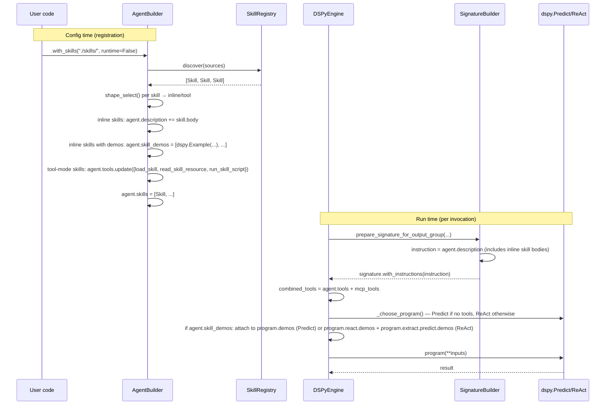
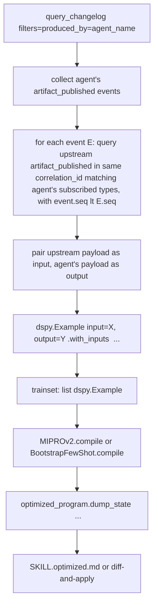

# Agent Skills for Internal Flock Agents

## Overview

Implement Anthropic-style Agent Skills (SKILL.md + progressive disclosure) as a first-class feature for **internal** Flock agents — those running on `DSPyEngine`, not external `ClaudeCodeRuntime` subprocesses.

Three paths compose into one developer experience:
- **#5 Compile-time signature baking** (primary) — skill body merged into DSPy signature instructions at registration; demos attached to the predictor; scripts auto-exposed as tools.
- **#2 MAF-style runtime tool injection** (fallback) — three tools (`load_skill`, `read_skill_resource`, `run_skill_script`) injected when compile-time doesn't fit (token budget overflow, frontmatter `flock.mode: tool`, caller `runtime=True`).
- **#7 DSPy optimizer over changelog traces** (multiplier) — manual CLI-triggered training loop that rewrites `SKILL.md` bodies against recorded agent runs.

Single public API: `AgentBuilder.with_skills(*sources, runtime=False, token_budget=8000)`.

## Problem Frame

Today, Flock's internal DSPy-based agents cannot use Agent Skills. External engines (ClaudeCodeRuntime) get skills via Claude Code's own runtime, but internal agents — which are the default path and the one that runs on every `flock run` — have no way to consume the team's skill library. This gap forces users to either (a) duplicate skills as inline prompts, (b) route trivial tasks to the heavyweight external engine just to get skills, or (c) skip skills entirely.

The contracts document (`.sfd/contracts.md`, derived from converged surface-first prototype in `docs/surface-prototypes/2026-04-17-skills/`) defines the user-visible behavior. This plan defines how Flock's internal engine stack realizes it.

See origin: `.sfd/contracts.md` §1-§9 (public API, frontmatter schema, types, discovery, compilation, runtime-tool contract, script runners, optimizer, errors).

## Requirements Trace

- **R1.** `agent.with_skills(*sources, runtime=False)` compiles skills into the DSPy signature by default, falling back to runtime tools by shape (see origin §1, §5).
- **R2.** SKILL.md format is Anthropic-standard + optional `flock:` frontmatter namespace — skills written for Claude Code run unchanged (see origin §2).
- **R3.** Discovery precedence: `./skills/` → `~/.flock/skills/` → `./.claude/skills/`, first match wins (see origin §4).
- **R4.** Script execution supports in-process and subprocess sandbox modes; default chosen by discovery path (in-repo → `inprocess` per `Flock(in_repo_sandbox_default=...)`, default `"inprocess"`; installed → `subprocess`); `flock.sandbox` frontmatter overrides, with `inprocess` overrides on installed skills gated by `<project_root>/.flock/trusted-skills.toml` allowlist (see origin §7 + round-2 review amendments).
- **R5.** `flock skills optimize <name>` CLI runs MIPROv2/BootstrapFewShot over changelog traces, shows diff, never silent-overwrites (see origin §8).
- **R6.** Four canonical scenarios from surface-first prototype (`scenario_1_typed_output.py` through `scenario_4_shared_library.py`) run end-to-end after Unit 7 lands.
- **R7.** Zero regression in the existing 2558-test suite.

## Scope Boundaries

- No blackboard-native skill agents (scope cut in ideation; skills enter cascades via the consuming agent's normal publish)
- No SKILL.md → MCP server auto-generation
- No event-triggered signature mutation (ruled out in ideation)
- No per-skill authentication / ACLs (polish; can attach later to any baseline)
- No hot-reload of SKILL.md (DX polish; not architectural)
- No cross-skill composition (`uses:` frontmatter) — deferred
- No skill-writes-to-knowledge-graph pipeline — deferred
- External-engine skills already work via `ClaudeCodeRuntime`; this plan does not change that path

### Deferred to Separate Tasks

- **Per-agent skill glob scopes (`with_skills(["finance/*"])` whitelist/blacklist for access control):** low-effort follow-on once baseline exists; attach as a lightweight predicate filter on `SkillRegistry.discover`.
- **OTel span per skill hop with prompt-diff:** Flock already has OTel; this is automatic instrumentation work after compile-time path ships.
- **Token estimation via `tiktoken`:** start with `len(text) / 4` heuristic; switch to `tiktoken` only if users report bad mode decisions.
- **DSPy 3.0.3 → 3.1.3 upgrade (orthogonal):** verified compatible with this plan's API usage, but worth a separate chore for secondary wins: Python 3.14 / PEP 649 annotation support, ReAct `max_iters` default bump 10 → 20, `Parallel` gains `timeout` + `straggler_limit`, `Module.save`/`load` default `allow_pickle=False` (security), `dspy.configure(allow_tool_async_sync_conversion=True)` flag for async tools in sync contexts, GEPA optimizer more mature at 0.0.26 (potential future Unit 8 extension for textual-feedback optimization). Optional elegance win for Unit 4 once upgraded: `Signature.prepend/append/insert/delete` (now documented in 3.1.3) let us inject skills as a dedicated `<skill_context>` field rather than mutating the instruction string.

## Context & Research

### Relevant Code and Patterns

- `src/flock/core/agent.py:509-1000` — `AgentBuilder` class; `with_skills` goes here between `with_tools` (line ~966) and `with_context` (line ~970). Mirror `with_tools`' iterable-taking pattern; return `AgentBuilder` for fluent chaining.
- `src/flock/core/agent.py:125-149` — `Agent.__init__`; add `self.skills: list[Skill] | None = None` and `self.skill_demos: list[dspy.Example] | None = None` alongside existing `tools`, `utilities`, `engines`, `context_provider` state.
- `src/flock/core/context_provider.py:19-168` — `BaseContextProvider` ABC. **Do not** use this as the primary skills integration seam; `get_artifacts` can only return artifacts, not tools or signature mutations. This was the fatal flaw in the original contracts §6 design.
- `src/flock/engines/dspy_engine.py:201-343` — `DSPyEngine.evaluate` pipeline. Two integration points: (a) `combined_tools = native_tools + mcp_tools` at line 332 — add skill tools via `agent.tools.update({...})` (NB: `agent.tools` is `set[Callable]`, not a list; order is not preserved, so the runtime-tool preamble must sort by skill name for deterministic output); (b) `_choose_program` at lines 531-540 decides Predict vs ReAct based on tool presence — no change needed, it flips automatically.
- `src/flock/engines/dspy/signature_builder.py:318-343` — `prepare_signature_for_output_group` does `signature.with_instructions(...)` using `engine_instructions or agent.description`. Skills inject their body by prepending to `agent.description` at `.with_skills()` time, which flows through automatically.
- `src/flock/components/` and `src/flock/agent/component_lifecycle.py:147-163` — `AgentComponent` pattern with `run_pre_evaluate(agent, ctx, inputs: EvalInputs) -> EvalInputs` chain. Hook fires before `engine.evaluate()` constructs the program — confirmed during review-2026-04-18 that no `program` parameter is available, which is why this plan attaches demos inside `DSPyEngine.evaluate` rather than via an `AgentComponent`.
- `src/flock/models/changelog.py:17-65` — `ChangelogEvent`, `ChangelogEventType` (`artifact_published` / `artifact_consumed` / `agent_snapshot_updated`), `ChangelogFilter`.
- `src/flock/core/store.py:197-218` — `query_changelog(after_seq, limit, filters)` and `get_changelog_bounds`. No skill-name filter — optimizer must reconstruct traces from `produced_by=<agent>` artifact pairs.
- `src/flock/registry.py:19-91` — `TypeRegistry.resolve(name)` returns `type[BaseModel]` for skill-output rehydration. **No `importlib` fallback** for skill type resolution (closed in round-2 P1 #2 to remove the frontmatter code-execution attack vector). Types referenced by `flock.outputs` must be pre-registered via `@flock_type` in the consuming project.
- `src/flock/mcp/config.py:214`, `src/flock/mcp/types/types.py:192, 279` — existing `importlib.import_module` + `getattr` pattern, unwrapped. New `src/flock/skills/resolvers.py` consolidates this.
- `tests/conftest.py:57-73` — `mock_llm` autouse fixture patches `dspy.Predict.__call__`; needs equivalent `mock_react` for tool-mode scenarios (or extend the existing fixture).
- `tests/integration/test_meta_orchestrator_e2e.py`, `tests/integration/test_external_engine_e2e.py` — naming convention for `tests/integration/test_skills_e2e.py`.
- `examples/` — `examples/01-getting-started/`, `examples/02-patterns/` pattern; place skill examples at `examples/13-skills/` (slots 11-openclaw and 12-external-agents are already taken).

### Institutional Learnings

- `docs/retro-sfd-vs-spec-driven.md` — "Surface-first. External agents are just agents with a different engine. Don't build parallel infrastructure if engine-swap suffices." Followed here: no new scheduler, no new registry concept, reuses `AgentBuilder` + `AgentComponent` + `agent.tools` / `agent.description`.
- `docs/guides/context-providers.md` — security boundary for artifact scoping. Skills do **not** bypass this; any future per-skill artifact filtering must flow through an existing or wrapped ContextProvider.
- `docs/guides/dspy-engine.md` — canonical reference for how Flock prompts agents. Three injection surfaces: `agent.description`, `InputField(desc=...)`, `combined_tools`. Skills use (1) and (3); demos attach via `predictor.demos`.
- `docs/guides/meta-orchestrator.md` + `docs/plans/2026-04-16-001-refactor-meta-orchestrator-engine-pattern-plan.md` — engine-pattern consolidation. Reinforces that new capabilities should land on existing engine/component seams, not parallel pipelines.

### External References

- DSPy 3.0.3 `Signature.with_instructions(...)` — non-mutating, returns new class. Use for skill body merge.
- DSPy `Predict.demos` / `ReAct.react.demos` / `ReAct.extract.predict.demos` — list attribute, settable per-instance. ReAct has **two** sub-predictors: `self.react` (a `dspy.Predict` for the thought/action loop — demos go on `program.react.demos`) and `self.extract` (a `dspy.ChainOfThought` for final-answer extraction — demos go on `program.extract.predict.demos` since CoT wraps a Predict at `.predict`). Verified live against DSPy 3.0.3 in round-2 review.
- DSPy `Tool._parse_function` — auto-infers JSON schema from Python type hints; Pydantic BaseModel args use `model_json_schema()`. Skills just pass typed callables.
- DSPy `MIPROv2.compile(student, trainset=[...], auto="light"|"medium"|"heavy")` — extract optimized instructions via `compiled.named_predictors()[0][1].signature.instructions` or `compiled.dump_state()[pred_name]["signature"]["instructions"]`.
- DSPy `BootstrapFewShot.compile(student, trainset=[...])` — populates demos only; instructions unchanged.
- DSPy `UsageTracker` via `dspy.settings.context(track_usage=True)` + `track_usage()` — for post-hoc accounting (not pre-flight budget checks).

### Corrections to Origin Contracts (`.sfd/contracts.md`)

Research surfaced design mistakes in the original contract that this plan supersedes:

1. **§6 `SkillsContextProvider`** — cannot be the primary integration seam. `BaseContextProvider.get_artifacts` returns `list[Artifact]` only; it cannot inject tools or mutate signatures. **Plan corrects (final, post-review-2026-04-18):** two seams, not three: (a) `AgentBuilder.with_skills` mutates `agent.tools` + `agent.description` + stashes demos on `agent.skill_demos` at config time; (b) signature instructions flow via `agent.description` through the existing `signature_builder.py` path; (c) demo attachment is a 5-line patch inside `DSPyEngine.evaluate` after `_choose_program(...)` — no `SkillsComponent` AgentComponent (the first-correction `on_pre_evaluate` proposal was itself wrong: that hook has no `program` parameter and fires before engine evaluation).

2. **§1 return type `Self`** — should be `AgentBuilder` to match `with_tools`/`with_context`/`with_mcps`. `with_skills` lives on `AgentBuilder`, not `FlockAgent`.

3. **§8 `changelog.query(skill_name=..., since=...)`** — that API does not exist. Real API is `query_changelog(after_seq, limit, filters=ChangelogFilter(produced_by={agent_name}))` (set, not list). Skill-specific trace reconstruction happens in `src/flock/skills/optimize/trainset.py` via **publish-to-publish correlation**: for the target agent's `artifact_published` events, identify upstream `artifact_published` events in the same `correlation_id` whose payload type matches the agent's subscribed types and predates the target. Upstream payloads become implicit inputs. The `artifact_consumed` enum value exists but no orchestrator caller emits it today, so input-event-based reconstruction is not viable; publish-to-publish gives a usable signal with documented attribution noise for predicated subscriptions and multi-skill agents.

4. **§5 "auto-upgrade engine from Predict to ReAct"** — implemented by existing `DSPyEngine._choose_program`: presence of any tool in `combined_tools` automatically picks ReAct. No new "auto-upgrade logic" to write.

5. **§11 `tests/skills/unit/` + `tests/skills/integration/`** — Flock convention is flat `tests/test_*.py` with `tests/integration/test_*_e2e.py`. Tests live at `tests/test_skills_*.py` and `tests/integration/test_skills_e2e.py`.

## Key Technical Decisions

- **Two integration seams.** Config-time (`AgentBuilder.with_skills` mutates `agent.tools`, `agent.description`, and stashes demos on `agent.skill_demos`) + signature-time (existing `signature_builder` reads `agent.description`). Demos attach inside `DSPyEngine.evaluate` directly after `_choose_program(...)` returns the program — a 5-line patch in the engine, no `AgentComponent` lifecycle hook involved. **Rationale:** the actual `AgentComponent.on_pre_evaluate(agent, ctx, inputs) -> EvalInputs` signature has no `program` parameter and fires before `evaluate()` constructs the program; routing demo attachment through it would require either a new lifecycle hook (touches every existing component subclass) or engine subclassing (parallel pipeline), both larger than extending the existing config-time mutation pattern that `AgentBuilder` already uses for `agent.tools`/`agent.description`/`agent.utilities`.

- **Skill body merges into `agent.description` at registration, not per-call.** The existing `signature_builder.py:321` does `instruction = engine_instructions or agent.description`. Mutating description once is cheap and correct; per-call mutation would fight the signature builder's existing architecture.

- **Demos stash on `agent.skill_demos` at registration; engine attaches post-`_choose_program`.** `AgentBuilder.with_skills` reads each compiled skill's `demos.jsonl` and stores `list[dspy.Example]` on `agent.skill_demos`. `DSPyEngine.evaluate` checks the attribute right after `_choose_program(...)` and sets `program.demos` (Predict) or `program.react.demos` + `program.extract.predict.demos` (ReAct). One narrow `flock.skills` import in the engine; no new lifecycle hook, no new component class, no `SkillsComponent`. Engine remains a strict consumer of agent state — same shape as how it consumes `agent.tools` today.

- **ReAct demos target `program.react.demos` and `program.extract.predict.demos`.** Verified live against DSPy 3.0.3 (round-2 review 2026-04-18): `dspy.ReAct.__init__` does `self.react = dspy.Predict(react_signature)` (so `self.react` IS the inner thought-loop Predict — has `.demos` directly, no further nesting) and `self.extract = dspy.ChainOfThought(fallback_signature)` (so `.extract` is a CoT wrapping a Predict at `.predict` — demos attach to `.extract.predict.demos`). Earlier rounds of this plan documented `.react.react.demos` and `.react.extract.demos`; both raise `AttributeError` and were corrected after live REPL verification. Plan carries the corrected paths explicitly in the `DSPyEngine` patch (Unit 6).

- **Script sandboxing defaults by discovery path + configurable per Flock instance.** `Flock(in_repo_sandbox_default="inprocess" | "subprocess")` controls the default for in-repo skills (`./skills/`, project-relative paths). Default `inprocess` matches the early-adopter solo-dev shape (no per-call subprocess tax during iteration); team repos with hostile-contributor concerns flip to `subprocess` in one line. Installed skills (`~/.flock/skills/`, `./.claude/skills/`, anything outside `project_root`) always default to `subprocess` (third-party trust boundary). Frontmatter `flock.sandbox: inprocess|subprocess` overrides — but `inprocess` overrides for installed skills are gated by `<project_root>/.flock/trusted-skills.toml` (allowlist of `(name, content_hash)` pairs the user has explicitly trusted). `subprocess` overrides (downgrades to safer mode) are always honored. **Rationale:** path-based default reconciles R2 (Claude Code SKILL.md interop = shareable skills) with the sandbox default (in-process trust = local-author code), the kwarg gives team repos a one-line escape hatch, and the allowlist prevents malicious skill packs from defeating the default by simply declaring `flock.sandbox: inprocess` in their frontmatter.

- **Token budget uses `len(text) / 4` heuristic initially.** Adding `tiktoken` is a runtime dep for a budget heuristic — not worth it until we see users with badly-sized skills. If/when needed, promote to `tiktoken.encoding_for_model(...)` with a fallback.

- **Optimizer trainset reconstruction uses publish-to-publish correlation.** Without a dedicated `skill_invoked` changelog event (and without `artifact_consumed` events, which the changelog enum declares but no caller emits), we reconstruct per-skill traces from `artifact_published` events alone: for an agent's published artifact, we identify upstream `artifact_published` events in the same `correlation_id` whose types match the agent's subscribed types and predate the target event. Those upstream payloads become the implicit inputs. **Limitations:** (a) for agents with `where=` predicate filters, we attribute to the superset of upstream candidates rather than the specific consumed instance, producing slightly noisier examples; (b) for multi-skill agents, output quality is attributed to all attached skills (no way to discriminate which skill drove the outcome). Both limitations are documented per-trace in `OptimizationResult.notes`.

- **No new top-level exports in `flock/__init__.py`.** Skills are discoverable via `from flock.skills import Skill, FlockSkillMetadata, SkillRegistry`. Follows the existing `flock.mcp`, `flock.semantic` pattern.

- **Error hierarchy roots at `FlockError`** (verify import path at Unit 1 start; codebase grep showed no `class FlockError` — likely needs to be introduced under `src/flock/core/errors.py` or `SkillError(Exception)` directly). `SkillError(FlockError)` plus 8 subclasses: 7 from origin §9 minus `SkillTokenBudgetError` (zero raise sites — round-1 P2 #16) plus `SkillEngineModeError` (round-2 P1 #6 — raised inside `DSPyEngine.evaluate` when `_choose_program` silently degrades a tool-mode skill agent to Predict) plus `SkillTrainsetTooThinError` (round-2 P1 #5 — raised by `optimize.trainset.build_from_changelog` when no-upstream drop ratio exceeds threshold). Net: 8 subclasses with concrete raise sites each.

## Open Questions

### Resolved During Planning

- **DSPy runtime signature mutation API** — `Signature.with_instructions(...)` (classmethod, returns new class, non-mutating). Existing `signature_builder.py:343` already uses it; skills only need to ensure `agent.description` or `engine_instructions` contains the skill body before that line runs.
- **Per-call demo attachment** — `predictor.demos = [...]` (plain list attribute). For `dspy.ReAct`, set `program.react.demos` (inner thought-loop Predict) and `program.extract.predict.demos` (the Predict inside the ChainOfThought extractor).
- **Tool JSON schema generation** — `dspy.adapters.types.tool.Tool._parse_function` auto-infers from type hints. Pydantic BaseModels work natively via `.model_json_schema()`. Skills just pass typed Python callables.
- **Signature.with_instructions vs setting `__doc__`** — `.with_instructions(...)` is the canonical path. Setting `__doc__` post-construction does nothing (`SignatureMeta` reads it only at class creation).
- **Module layout** — `src/flock/skills/` matches the `src/flock/mcp/` pattern (feature spanning agents + engines + serialization).
- **Integration seam (corrected twice)** — see Key Technical Decisions above. Origin contracts §6 named `SkillsContextProvider` as the seam (cannot inject tools or signature mutations); first correction proposed three seams (config + per-invocation `SkillsComponent` + signature-time); review-2026-04-18 falsified the per-invocation seam (`AgentComponent.on_pre_evaluate` has no `program` parameter and fires before engine evaluation). Final design is two seams — config-time mutation + signature-time read — with demo attachment as a 5-line patch inside `DSPyEngine.evaluate` after `_choose_program`.
- **Changelog query shape** — `query_changelog(filters=ChangelogFilter(produced_by=[...]))`; no per-skill event type; trace reconstruction is best-effort.

### Deferred to Implementation

- **Exact `FlockError` import path** — needs verification at Unit 1 start (likely `src/flock/core/errors.py` or similar).
- **`DSPyEngine.evaluate` insertion point for the demo-attachment block** — line 343 (`program = self._choose_program(...)`) is the canonical point per current source; verify the line number is still correct at Unit 6 implementation time. The block is engine-internal (no new public hook) so refactor risk is low.
- **CLI framework choice for `flock skills optimize`** — does Flock already use Click/Typer for its CLI? Unit 8 adopts whatever `src/flock/api/cli.py` or equivalent already uses.
- **Default discovery root for `~/.flock/skills/`** — may need first-time-user creation with friendly empty-state handling. Deferred to Unit 2 implementation.
- **MIPROv2 metric function for skill optimization** — custom metric that scores "did the typed artifact publish without downstream errors in the cascade?" Exact implementation depends on how cleanly we can correlate artifacts to cascade outcomes from changelog alone.

## Output Structure

```
src/flock/skills/
├── __init__.py                  # Public API: Skill, FlockSkillMetadata, SkillRegistry, SkillEngineModeError
├── types.py                     # Skill (frozen dataclass with nested flock_meta: FlockSkillMetadata field), FlockSkillMetadata + ScriptSpec (Pydantic, defined in same module)
├── errors.py                    # SkillError hierarchy (8 exception classes — drop SkillTokenBudgetError per round-1 P2 #16, add SkillEngineModeError + SkillTrainsetTooThinError per round-2 P1)
├── frontmatter.py               # YAML parser: Anthropic + flock: namespace
├── resolvers.py                 # resolve_pydantic_class(dotted: str) -> type[BaseModel]
├── registry.py                  # SkillRegistry: discovery, precedence, caching
├── compilation.py               # shape_select, compile_inline_skills, load_demos_for_skill, validate_outputs_compatibility, estimate_tokens (demo *attachment* lives in DSPyEngine.evaluate, Unit 6)
├── tools.py                     # load_skill, read_skill_resource, run_skill_script callables + preamble builder
├── scripts.py                   # ScriptRunner ABC, InProcessRunner, SubprocessRunner, resolve_sandbox()
└── optimize/
    ├── __init__.py              # Public: optimize_skill()
    ├── cli.py                   # `flock skills optimize` subcommand
    ├── trust_cli.py             # `flock skills trust` subcommand — manages .flock/trusted-skills.toml
    ├── trainset.py              # Changelog → dspy.Example list reconstruction (store-fetched payloads, no-upstream drop threshold)
    ├── runner.py                # MIPROv2 / BootstrapFewShot drivers
    └── history.py               # .flock/skills/optimization-history/*.json — redacted by default; --include-trainset opt-in for raw payloads

tests/
├── test_skills_frontmatter.py
├── test_skills_registry.py
├── test_skills_scripts.py
├── test_skills_compilation.py
├── test_skills_tools.py
├── test_skills_agent_integration.py
├── test_skills_optimize.py
└── integration/
    └── test_skills_e2e.py       # 4 canonical scenarios end-to-end

examples/13-skills/
├── README.md
├── scenario_1_typed_output.py
├── scenario_2_pure_prose.py
├── scenario_3_script_heavy.py
├── scenario_4_shared_library.py
└── skills/
    ├── invoice-extractor/SKILL.md
    ├── dhh-rails-style/SKILL.md
    ├── pdf-extract/SKILL.md
    └── security-review/SKILL.md
```

This tree is a scope declaration showing the expected output shape. Implementer may adjust specific filenames or introduce one-off helpers if implementation reveals a better layout.

## High-Level Technical Design

> *This illustrates the intended approach and is directional guidance for review, not implementation specification. The implementing agent should treat it as context, not code to reproduce.*

### Lifecycle: SKILL.md → running DSPy call



### Mode selection decision table

| Skill declares | Caller runtime= | Result mode | Where body lands | Tool exposure |
|---|---|---|---|---|
| (nothing, default) | False | inline | signature.instructions | none |
| (nothing, default) | True | tool | n/a | load_skill / read_skill_resource / run_skill_script |
| `flock.mode: inline` | False | inline | signature.instructions | none |
| `flock.mode: inline` | True | tool | n/a | 3 tools (caller `runtime=True` overrides frontmatter preference) |
| `flock.mode: tool` | (any) | tool | n/a | 3 tools (frontmatter is a hard force) |
| scripts present | False | inline + scripts as tools | signature.instructions | per-script tool + possibly `run_skill_script` |
| budget exceeded | False | tool (fallback) | n/a | 3 tools |

**Precedence rule** (clarifies asymmetry above): `flock.mode: tool` is a hard force — caller cannot override (skill author has determined the skill genuinely cannot work inline). `flock.mode: inline` is a preference — caller `runtime=True` wins (caller knows total token budget and agent shape; skill author's preference is honored when caller doesn't ask otherwise). `flock.mode: auto` (default) lets the caller decide.

### Trainset reconstruction (Unit 8) — publish-to-publish correlation



**Note:** `artifact_consumed` events exist in `ChangelogEventType` but no orchestrator caller emits them today. Reconstruction therefore uses upstream `artifact_published` events as implicit inputs. This is precise for unfiltered subscriptions; for predicated (`where=`) subscriptions, attribution is to the superset of upstream candidates.

## Implementation Units

- [ ] **Unit 1: Frontmatter schema + YAML parser + resolvers + error types**

**Goal:** Parse SKILL.md frontmatter (Anthropic standard + optional `flock:` block) into typed Python objects. Provide dotted-path → Pydantic class resolution.

**Requirements:** R2.

**Dependencies:** None (foundational).

**Files:**
- Create: `src/flock/skills/__init__.py`
- Create: `src/flock/skills/frontmatter.py`
- Create: `src/flock/skills/types.py` (complete — `Skill` frozen dataclass with nested `flock_meta: FlockSkillMetadata | None` Pydantic field; `FlockSkillMetadata` and `ScriptSpec` defined as nested types within the same file)
- Create: `src/flock/skills/resolvers.py`
- Create: `src/flock/skills/errors.py`
- Test: `tests/test_skills_frontmatter.py`

**Approach:**
- `Skill` frozen dataclass (per origin §3) with fields: `name`, `description`, `body`, `directory`, `flock_meta: FlockSkillMetadata | None`, `anthropic_meta: AnthropicMeta`, `outputs_model: type[BaseModel] | None`, `demos: list[dict]`, `resources: dict[str, Path]`, `content_hash`. `FlockSkillMetadata(BaseModel)` and `ScriptSpec(BaseModel)` defined in the same module as nested types — exported for IDE intellisense but not peer-level concerns. Skill is the user-facing object; `flock_meta` is data hung on it.
- `parse_skill_frontmatter(markdown: str) -> tuple[AnthropicMeta, FlockSkillMetadata, body: str]` — split YAML header from body using `yaml.safe_load()` (never `yaml.load` — prevents `!!python/object/apply:...` tag-based code execution from hostile SKILL.md); validate Anthropic required fields loosely, parse `flock:` block strictly with Pydantic
- `resolve_pydantic_class(dotted: str) -> type[BaseModel]` — **TypeRegistry-only**: call `type_registry.resolve(dotted)` directly (NOT `resolve_name`, which returns a canonical `str`, not the class — verified in `src/flock/registry.py:48-83`). On `RegistryError`, wrap as `SkillSchemaResolutionError("flock.outputs references unregistered type X — types referenced by skills must be decorated with @flock_type in the importing project")`. **No `importlib` fallback.** This closes the frontmatter code-execution attack vector (`flock.outputs: os.system` → arbitrary import-time module execution): types must be pre-registered, no arbitrary dotted paths resolve. Skill authors who want a custom output type must `@flock_type` it somewhere in their consuming project before any skill references it. The friction is the right friction for shareable skills.
- Error hierarchy: `SkillError(FlockError)` root + 8 subclasses per origin §9 (drop `SkillTokenBudgetError` per round-1 P2 #16 — zero raise sites; add `SkillEngineModeError` per round-2 P1 #6 — raised when a tool-mode skill agent is silently degraded to Predict by `_choose_program` exception fallback)

**Execution note:** Test-first — write fixture SKILL.md files under `tests/fixtures/skills/` covering minimal / full / malformed / missing-required / invalid-flock-mode cases, then implement parsing to make tests green.

**Patterns to follow:**
- `src/flock/mcp/config.py:214` and `src/flock/mcp/types/types.py:192, 279` — existing `importlib`+`getattr` pattern in the codebase. **Skills do NOT follow this pattern** (round-2 P1 #2): `resolvers.py` is TypeRegistry-only with no `importlib` fallback, to close the frontmatter code-execution attack vector. The MCP-style pattern remains valid for MCP's own use case (where dotted paths come from trusted local config, not from arbitrary frontmatter).
- Pydantic v2 `ConfigDict(extra="forbid")` on `FlockSkillMetadata` for strict validation
- `src/flock/registry.py:19-91` — `TypeRegistry.resolve(name)` returns `type[BaseModel]`; `TypeRegistry.resolve_name(name)` returns canonical `str` only. Use `.resolve()` for skill-output rehydration.

**Test scenarios:**
- Happy path: minimal SKILL.md (name + description only) parses with empty FlockSkillMetadata defaults
- Happy path: full SKILL.md with all flock: fields parses correctly
- Happy path: `flock.outputs: InvoiceExtracted` resolves via TypeRegistry when `InvoiceExtracted` is decorated with `@flock_type` in the importing project
- Edge case: SKILL.md with no frontmatter raises `SkillParseError`
- Edge case: unknown `flock.mode` value raises `SkillParseError` (Pydantic Literal validation)
- Edge case: `flock:` block with extra unknown keys raises `SkillParseError` (strict mode)
- Security: SKILL.md frontmatter containing `!!python/object/apply:os.system [...]` raises `SkillParseError` (safe_load rejects the tag) and never executes the command
- Security: `resolve_pydantic_class("os.system")` raises `SkillSchemaResolutionError` WITHOUT calling `importlib.import_module` (no module-level code executes). Verify by patching `importlib.import_module` to fail loudly if invoked — must never be called.
- Security: `resolve_pydantic_class("subprocess.Popen")` raises `SkillSchemaResolutionError` (registered-types-only enforcement)
- Error path: `resolve_pydantic_class("no.such.type")` raises `SkillSchemaResolutionError` with helpful message ("type not registered; decorate with @flock_type in your project")
- Error path: malformed YAML frontmatter raises `SkillParseError` with line number
- Happy path: resolver hits TypeRegistry only — no `importlib` fallback path exists in code (assert via test that the resolver function body does not reference `importlib`)

**Verification:**
- All test scenarios above pass
- `FlockSkillMetadata.model_json_schema()` is stable (emitted snapshot matches fixture)
- No regressions in existing suite

---

- [ ] **Unit 2: `Skill` dataclass + `SkillRegistry` + discovery algorithm**

**Goal:** Load SKILL.md files from filesystem with precedence-based deduplication. Cache parsed skills by content hash.

**Requirements:** R2, R3.

**Dependencies:** Unit 1.

**Files:**
- Modify: `src/flock/skills/types.py` (add module-level `SKILL_FILENAME = "SKILL.md"` constant only; `Skill` dataclass already lives here from Unit 1)
- Create: `src/flock/skills/registry.py`
- Test: `tests/test_skills_registry.py`

**Approach:**
- `Skill` dataclass already defined in Unit 1's `types.py` — Unit 2 only adds the loader path (`SkillRegistry.discover` constructs `Skill` instances from filesystem)
- `SkillRegistry.__init__(flock)` holds a `dict[content_hash, Skill]` cache + `dict[name, Skill]` resolution index
- `SkillRegistry.discover(*sources, use_defaults=False) -> list[Skill]` implements the algorithm from origin §4
- `load_demos(path: Path) -> list[dict]` reads JSONL one line at a time, yields parsed `dspy.Example`-compatible dicts
- `load_resources(dir: Path) -> dict[str, Path]` scans `references/` and returns a name → Path map (lazy; don't read file content yet)
- Registry logs DEBUG when a later-precedence skill is shadowed by an earlier one

**Execution note:** Test-first — start by asserting precedence resolution on a three-directory fixture tree.

**Patterns to follow:**
- Frozen dataclass style: existing `src/flock/models/` pattern (check `ArtifactMeta`, `AgentIdentity`)
- `pathlib.Path.glob` / `Path.rglob` for recursive discovery; alphabetical sort for stable ordering
- Cache-by-content-hash pattern from `src/flock/storage/sqlite_store.py` if applicable (else simple `hashlib.sha256`)

**Test scenarios:**
- Happy path: single SKILL.md file path loads and caches
- Happy path: directory with 3 nested SKILL.md files returns 3 Skills in alphabetical directory order
- Happy path: glob pattern `~/.flock/skills/finance/*` expands to matching SKILL.md subdirectories
- Happy path: `use_defaults=True` with sources=`[]` checks `./skills/` → `~/.flock/skills/` → `./.claude/skills/` in that order
- Precedence: two directories both defining a skill named `invoice-extractor` → first wins, second logged as shadowed at DEBUG
- Error path: source path doesn't exist raises `SkillNotFoundError` with the unresolved source in the message
- Error path: `SkillConflictError` raised only on explicit-source conflicts (not precedence), e.g., two explicit paths with same skill name
- Edge case: empty directory yields empty list (not error)
- Edge case: directory with malformed SKILL.md yields partial result + raises `SkillParseError` at load time
- Cache: second `discover(same_path)` call returns cached Skill objects (assert identity)

**Verification:**
- All test scenarios above pass
- Registry correctly exposes `by_name(name)` and `invalidate(path)`
- Manual smoke test: point registry at `docs/surface-prototypes/2026-04-17-skills/example_skills/` and confirm 4 skills loaded

---

- [ ] **Unit 3: Script runners (InProcess + Subprocess)**

**Goal:** Execute skill scripts declared in frontmatter. Support in-process and subprocess sandbox modes; choose default per discovery path + `Flock(in_repo_sandbox_default=...)` kwarg + `<project_root>/.flock/trusted-skills.toml` allowlist (gates `inprocess` overrides for installed skills). Validate args/returns against declared schemas.

**Requirements:** R4.

**Dependencies:** Unit 1 (ScriptSpec, resolvers).

**Files:**
- Create: `src/flock/skills/scripts.py`
- Test: `tests/test_skills_scripts.py`
- Test: fixture scripts under `tests/fixtures/skills/script_fixtures/` (one Python file per test case)

**Approach:**
- `ScriptRunner(Protocol)` with `async def run(skill, script_name, args) -> dict`
- `InProcessRunner`: `importlib.import_module(skill.directory / script.run.split()[-1])`; call `main(args: schema) -> returns` coroutine or sync fn; honor `timeout_seconds` via `asyncio.wait_for`
- `SubprocessRunner`: `asyncio.create_subprocess_exec(*shlex.split(script.run), stdin=PIPE, stdout=PIPE, stderr=PIPE, cwd=skill.directory)`; write JSON args to stdin; read JSON from stdout; on timeout, `process.kill()`; honor `timeout_seconds`
- Both runners validate args against `script.schema` (if declared) before invocation; raise `SkillScriptError` with stderr + exit code + elapsed time on any failure
- `resolve_sandbox(skill, flock) -> Literal["inprocess", "subprocess"]` — ordered precedence list (first match wins). All paths are canonicalized via `Path.resolve()` (follows symlinks) before comparison. Reads `flock.project_root`, `flock.in_repo_sandbox_default`, and `flock.trusted_skills_allowlist`:
  1. **Explicit frontmatter wins (with allowlist gate for installed skills).** If `skill.flock_meta.sandbox` is set:
     - Honor unconditionally if the skill is under `flock.project_root` (in-repo — the developer controls these files).
     - For skills outside `flock.project_root` (installed): only honor `flock.sandbox: inprocess` if the `(skill.name, skill.content_hash)` pair appears in `flock.trusted_skills_allowlist` (loaded from `<project_root>/.flock/trusted-skills.toml` at `Flock.__init__`). Otherwise log WARNING ("skill X requested inprocess but is not in trusted-skills.toml; defaulting to subprocess") and continue to rule 2-4. Honor `flock.sandbox: subprocess` overrides unconditionally (downgrading to safer mode is always allowed).
  2. **Managed/shared skill roots → `subprocess`.** If `skill.directory.resolve()` lives under `~/.flock/skills/` (resolved) OR `<flock.project_root> / ".claude" / "skills"` (resolved), return `"subprocess"`. These are the third-party / Claude-Code-shared roots regardless of where they happen to sit on disk.
  3. **In-repo → `flock.in_repo_sandbox_default`.** Else if `skill.directory.resolve()` is under `flock.project_root.resolve()`, return the configured in-repo default (`"inprocess"` for solo-dev convenience, `"subprocess"` for team-repo paranoia).
  4. **Default → `"subprocess"`.** Anywhere else (random absolute path, unfamiliar location), return `"subprocess"` (fail closed).
- `Flock.__init__` gains two new kwargs:
  - `in_repo_sandbox_default: Literal["inprocess", "subprocess"] = "inprocess"` — controls rule 3 above. Solo developers get inprocess (no per-call subprocess tax during iteration); team repos with hostile-contributor concerns flip to `"subprocess"` in one line.
  - `trusted_skills_allowlist: Path | str | None = None` — explicit path to the TOML allowlist; defaults to `<project_root>/.flock/trusted-skills.toml`. File format: `[[trusted]] name = "<skill-name>" content_hash = "<sha256>"` entries. Loaded once at init; validates via Pydantic. If file is missing, allowlist is empty (no installed-skill inprocess overrides honored).
- `flock.project_root` captured **once at `Flock.__init__`** by walking up from `Path.cwd()` to find a `pyproject.toml`, `flock.yaml`, or `.git` marker. Falls back to `Path.cwd()` if no marker found, with a WARNING. Stored as immutable on the `Flock` instance — eliminates `chdir()` race conditions between init and discovery.
- The `flock skills trust <name>` CLI command (defined in Unit 8 alongside `optimize`) computes the skill's current content hash and appends an entry to `<project_root>/.flock/trusted-skills.toml`. Auto-creates the file on first use; records who added the entry + timestamp for audit. Unit 3 only needs to read the allowlist via `Flock.__init__`; the CLI lives in Unit 8.
- Factory function `get_runner(skill: Skill, flock: Flock) -> ScriptRunner` returns the runner picked by `resolve_sandbox(skill, flock)`.

**Patterns to follow:**
- Async subprocess pattern from `src/flock/integrations/external/adapters/claude_code.py` (ClaudeCodeRuntime spawns subprocesses; mirror its timeout + stderr-capture pattern)
- `asyncio.wait_for` with explicit `TimeoutError` handling

**Test scenarios:**
- Happy path (in-process): fixture script with `main(args) -> dict` returns expected value
- Happy path (subprocess): fixture script reads JSON from stdin, writes JSON to stdout, returns parsed result
- Error path: script raises exception (in-process) → `SkillScriptError` with traceback
- Error path: subprocess exits non-zero → `SkillScriptError` with stderr and exit code
- Error path: subprocess timeout → process SIGKILLed, `SkillScriptError` raised
- Error path: in-process timeout → `SkillScriptError` with elapsed time
- Edge case: script declares schema, receives args missing required field → `SkillScriptError` (Pydantic validation) before invocation
- Edge case: script declares `returns` schema, returns incompatible dict → `SkillScriptError` (Pydantic validation) after invocation
- Edge case: subprocess script emits stderr but exits 0 → stderr logged at WARNING, result returned normally
- Sandbox resolution: skill loaded from `./skills/foo/` (in-repo, not under managed roots) → `InProcessRunner` when `flock.in_repo_sandbox_default == "inprocess"` (default); `SubprocessRunner` when set to `"subprocess"` (team-repo mode)
- Sandbox resolution: skill loaded from `~/.flock/skills/foo/` → `SubprocessRunner` (rule 2 — managed root, even if cwd is `~`)
- Sandbox resolution: skill loaded from `<project_root>/.claude/skills/foo/` → `SubprocessRunner` (rule 2 — managed root precedence over rule 3 in-repo, even though path is technically under project_root)
- Sandbox resolution: symlink under `./skills/` pointing to `~/Downloads/external-pack/` → `SubprocessRunner` (rule 4 default — resolved path is outside project_root and not under any managed root)
- Sandbox resolution: in-repo skill with `flock.sandbox: inprocess` frontmatter → `InProcessRunner` (rule 1, in-repo path → unconditional honor)
- Sandbox resolution: any skill with `flock.sandbox: subprocess` frontmatter → `SubprocessRunner` regardless of path (rule 1, downgrade always honored)
- Sandbox resolution (NEW — allowlist gate): installed skill (`~/.flock/skills/risky-pack/`) with `flock.sandbox: inprocess` frontmatter, NOT in `trusted-skills.toml` → `SubprocessRunner` (override silently rejected; WARNING logged)
- Sandbox resolution (NEW — allowlist gate): installed skill with `flock.sandbox: inprocess` frontmatter AND `(name, content_hash)` in `trusted-skills.toml` → `InProcessRunner` (override honored)
- Sandbox resolution (NEW — allowlist gate): installed skill with `flock.sandbox: inprocess` AND `(name, WRONG_content_hash)` in `trusted-skills.toml` → `SubprocessRunner` (content hash mismatch — likely the skill was updated after trust was granted; user must re-trust)
- Sandbox resolution (NEW — team-repo mode): `Flock(in_repo_sandbox_default="subprocess")` + skill in `./skills/foo/` → `SubprocessRunner` (rule 3 returns subprocess in team mode)
- Project-root capture: `Flock()` walks up from `Path.cwd()` to find `pyproject.toml`/`flock.yaml`/`.git`; resolves to that ancestor. If no marker found, falls back to `Path.cwd()` and emits a WARNING.
- Project-root stability: `os.chdir()` between `Flock.__init__` and `with_skills()` does NOT change the resolved sandbox classification (project_root is captured once at init time).
- Allowlist file load: `Flock()` reads `<project_root>/.flock/trusted-skills.toml` if present; missing file → empty allowlist (no installed-skill inprocess overrides honored).
- Allowlist explicit path: `Flock(trusted_skills_allowlist=Path("/custom/allowlist.toml"))` reads from the specified path instead of the default.
- `flock skills trust <name>` CLI: computes current content hash, appends to allowlist file, auto-creates file on first use.

**Verification:**
- All test scenarios above pass
- Smoke test: pdf-extract fixture's `detect_scanned.py` runs in both modes, returns same result

---

- [ ] **Unit 4: Compilation — shape_select + signature instruction merge + demo loading**

**Goal:** Decide per-skill whether to compile inline or as tool. For inline skills, merge body into the instruction stream. For skills with demos, load them into a predictor-attachable form.

**Requirements:** R1, R2.

**Dependencies:** Units 1, 2.

**Files:**
- Create: `src/flock/skills/compilation.py`
- Test: `tests/test_skills_compilation.py`

**Approach:**
- `shape_select(skill, caller_runtime_override, running_token_total, token_budget) -> Literal["inline", "tool"]` per origin §5 decision logic
- `compile_inline_skills(skills: list[Skill]) -> str` — concatenates bodies with `## --- <skill_name> ---` separators; returns one string to prepend to `agent.description`
- `load_demos_for_skill(skill: Skill) -> list[dspy.Example]` — reads JSONL, constructs `dspy.Example(**demo).with_inputs(*input_keys)` based on skill's declared `outputs_model` signature
- `validate_outputs_compatibility(skill, agent_output_types: set[type[BaseModel]]) -> None` — raises `SkillOutputMismatchError` if skill declares `outputs_model` but `agent_output_types` doesn't include it (or a subclass). Caller derives the type-set from `agent.outputs` (the `list[AgentOutput]` runtime state on `Agent`, populated by the `.publishes(*types)` builder method): `agent_output_types = {out.artifact_type for out in agent.outputs}`. (Note: `Agent` has no `agent.publishes` set attribute — `publishes` is a builder method; the runtime state is `agent.outputs`.)
- `estimate_tokens(text: str) -> int` — `len(text) // 4` heuristic; documented as approximate

**Execution note:** Test-first on `shape_select` truth table; implement the rest in-order.

**Patterns to follow:**
- `dspy.Example` construction idioms from DSPy docs/source
- Pydantic class introspection for input-field-name extraction

**Test scenarios:**
- `shape_select`: (frontmatter auto, caller runtime=False, under budget) → "inline"
- `shape_select`: (frontmatter auto, caller runtime=True, under budget) → "tool"
- `shape_select`: (frontmatter tool, caller runtime=False) → "tool" (`flock.mode: tool` is a hard force; caller cannot override down to inline)
- `shape_select`: (frontmatter tool, caller runtime=True) → "tool" (force already aligned with caller intent)
- `shape_select`: (frontmatter inline, caller runtime=False) → "inline" (preference honored)
- `shape_select`: (frontmatter inline, caller runtime=True) → "tool" (caller `runtime=True` overrides frontmatter `inline` preference; `flock.mode: inline` is non-forcing — only `flock.mode: tool` is a hard force, see decision table for the asymmetry)
- `shape_select`: budget overflow → "tool"
- `compile_inline_skills`: two skills produce `## --- skill1 ---\n<body1>\n## --- skill2 ---\n<body2>`
- `compile_inline_skills`: empty list returns empty string
- `load_demos_for_skill`: valid JSONL produces `list[dspy.Example]` with `.inputs` set correctly
- `load_demos_for_skill`: malformed JSONL line raises `SkillParseError` with file + line number
- `validate_outputs_compatibility`: agent publishes `InvoiceExtracted`, skill declares `outputs_model=InvoiceExtracted` → no raise
- `validate_outputs_compatibility`: agent publishes `Foo`, skill declares `outputs_model=Bar` (unrelated) → raises `SkillOutputMismatchError`
- `validate_outputs_compatibility`: agent publishes `(Foo, Bar)`, skill declares `outputs_model=Foo` → no raise (subset match)

**Verification:**
- All test scenarios above pass
- Truth table for `shape_select` matches decision table in High-Level Technical Design

---

- [ ] **Unit 5: Runtime tool injection — 3 tools + system prompt preamble**

**Goal:** Implement the three MAF-style tools (`load_skill`, `read_skill_resource`, `run_skill_script`) that agents can call when skills are in tool mode. Build the system-prompt preamble that advertises available skills.

**Requirements:** R1.

**Dependencies:** Units 1, 2, 3.

**Files:**
- Create: `src/flock/skills/tools.py`
- Test: `tests/test_skills_tools.py`

**Approach:**
- Callables are closures over a `SkillRegistry` + allowed skill names:
  - `make_load_skill(registry, allowed_names) -> Callable[[str], str]` returns a function that validates name is in allowed_names, raises `SkillNotFoundError` otherwise, returns skill body
  - `make_read_skill_resource(registry, allowed_names) -> Callable[[str, str], str]` reads a file from the skill's `references/` dir; raises `SkillNotFoundError` for missing skill or resource
  - `make_run_skill_script(registry, runners, allowed_names) -> Callable[[str, str, dict], dict]` delegates to the skill's script runner; validates args; returns result
- Each returned callable carries a descriptive docstring + type hints so DSPy's `Tool._parse_function` produces clean schemas
- `build_skill_preamble(skills_in_tool_mode: list[Skill]) -> str` emits the markdown-table preamble: one row per skill with name + description + token cost estimate
- Tool names namespaced `<skill_name>__<script_name>` for per-skill scripts exposed directly (vs. via `run_skill_script`)

**Patterns to follow:**
- Closure-returning-tool pattern: see how MCP wraps its tools with context (e.g., `src/flock/mcp/` tool wrappers)
- Type hints on all tool callables for DSPy schema inference

**Test scenarios:**
- Happy path: `load_skill("invoice-extractor")` returns skill body string
- Error path: `load_skill("not-attached")` raises `SkillNotFoundError` even if skill exists in registry (must be in allowed list)
- Happy path: `read_skill_resource("pdf-extract", "pdfplumber-cheatsheet.md")` returns file content
- Error path: `read_skill_resource` with unknown skill name → `SkillNotFoundError`
- Error path: `read_skill_resource` with unknown resource name → `SkillNotFoundError`
- Happy path: `run_skill_script("pdf-extract", "detect_scanned", {"path": "..."})` delegates to InProcessRunner
- Error path: `run_skill_script` with unknown script → `SkillNotFoundError`
- Preamble: builds correct markdown table for 3 skills with distinct descriptions
- Preamble: omits skills without tool-mode attachment
- Tool schema: `load_skill`'s inferred DSPy schema has one required string parameter `name` with non-empty description

**Verification:**
- All test scenarios above pass
- `dspy.adapters.types.tool.Tool(load_skill)` produces a non-empty JSON schema

---

- [ ] **Unit 6: `AgentBuilder.with_skills()` + `DSPyEngine` demo-attachment patch**

**Goal:** Public API method `.with_skills(*sources, runtime=False, token_budget=8000)` on `AgentBuilder` mutates agent state at config time (tools, description, skill_demos). `DSPyEngine.evaluate` patched to attach `agent.skill_demos` to the program after `_choose_program(...)`. Two integration seams (config-time mutation + signature-time read); no `SkillsComponent`, no new lifecycle hook.

**Requirements:** R1, R2, R3.

**Dependencies:** Units 4, 5.

**Files:**
- Modify: `src/flock/core/agent.py` (add `self.skills: list[Skill] | None = None` and `self.skill_demos: list["dspy.Example"] | None = None` to `Agent.__init__`; quote the `dspy.Example` annotation and import `dspy` only under `if TYPE_CHECKING:` to keep `flock.core.agent` import-light — the file currently has zero `dspy` imports; add `with_skills` method to `AgentBuilder`)
- Modify: `src/flock/engines/dspy_engine.py` (add ~5-line skill-demo attachment block after `program = self._choose_program(...)` at line 343, before `program(**inputs)`)
- Test: `tests/test_skills_agent_integration.py`

**Approach:**
- `AgentBuilder.with_skills(*sources, runtime=False, token_budget=8000) -> AgentBuilder`:
  1. If `self._agent.skills` is already populated, raise or merge (decide at impl time — likely merge)
  2. Build `SkillRegistry` (lazy — reuse `flock._skill_registry` if present, else create)
  3. `registry.discover(*sources, use_defaults=(len(sources) == 0))`
  4. Validate each skill's `outputs_model` against `{out.artifact_type for out in self._agent.outputs}` via `validate_outputs_compatibility` (note: `agent.outputs: list[AgentOutput]` is the runtime state populated by the `.publishes(*types)` builder method — there is no `agent.publishes` attribute)
  5. Partition skills by `shape_select(...)` into inline vs tool
  6. Inline skills: concatenate bodies via `compile_inline_skills`, prepend to `self._agent.description`
  7. Inline skills with scripts: wrap script callables and `self._agent.tools.update({...})` (set, not list)
  8. Tool-mode skills: `self._agent.tools.update({make_load_skill(...), make_read_skill_resource(...), make_run_skill_script(...)})` (closures over the allowed skill set)
  9. Stash demos: `self._agent.skill_demos = [dspy.Example(**demo).with_inputs(*input_keys) for skill in compiled_skills for demo in load_demos_for_skill(skill)]` — `None` if no skills have demos
  10. `self._agent.skills = list(all_skills)` (bookkeeping for introspection / optimizer)
  11. Return `self`
- `DSPyEngine.evaluate` patch (after `program = self._choose_program(dspy_mod, signature, combined_tools)` at line 343). **Note:** DSPyEngine imports DSPy lazily as `dspy_mod = self._import_dspy()` (line 253); there is no module-level `import dspy`. The patch must use `dspy_mod.ReAct`, not `dspy.ReAct`:
  ```python
  from flock.skills.errors import SkillEngineModeError

  # Guard: tool-mode skill agents MUST resolve to ReAct. _choose_program (line 531)
  # silently catches exceptions and returns Predict(signature) on failure — for a
  # tool-mode skill agent that means tools are lost AND the agent silently runs
  # degraded. Fail loud instead of attaching demos to a broken Predict.
  has_tool_mode_skills = any(
      getattr(s, "_resolved_mode", None) == "tool"
      for s in (getattr(agent, "skills", None) or [])
  )
  if has_tool_mode_skills and not isinstance(program, dspy_mod.ReAct):
      raise SkillEngineModeError(
          f"Agent {agent.name!r} has tool-mode skills attached but _choose_program "
          f"returned {type(program).__name__} instead of dspy.ReAct. This usually "
          f"means tool registration failed (check tool schemas, DSPy version compat). "
          f"Fix the underlying tool-construction error rather than running degraded."
      )

  skill_demos = getattr(agent, "skill_demos", None)
  if skill_demos:
      if isinstance(program, dspy_mod.ReAct):
          # Verified live against DSPy 3.0.3:
          #   program.react           is dspy.Predict (inner thought-loop) — demos here
          #   program.extract         is dspy.ChainOfThought (final-answer extraction)
          #   program.extract.predict is the inner Predict of the CoT — demos here
          program.react.demos = list(skill_demos)
          program.extract.predict.demos = list(skill_demos)
      else:
          program.demos = list(skill_demos)
  ```
  Three safety properties: (a) `getattr` defensive read covers Agent instances constructed via non-`__init__` paths (deepcopy, custom `__reduce__`, future YAML deserialization); (b) `SkillEngineModeError` fails loud when a tool-mode skill agent gets degraded to Predict — silent degradation with attached demos is the worst possible failure mode (looks successful, lost all tools); (c) the lazy `dspy_mod` binding (already in scope from the engine's existing `_import_dspy()` call) avoids adding a top-level DSPy import to the engine. Engine imports `SkillEngineModeError` from `flock.skills.errors` (one narrow skills import in the engine; acceptable per the two-seam decision).
  `_resolved_mode` is set on each `Skill` instance by `compilation.shape_select(...)` at `with_skills()` time — values: `"inline"` or `"tool"`. The guard checks per-skill mode rather than re-running `shape_select`, since the partition is already decided at registration.

**Execution note:** Integration-test-first. Before wiring anything, write a failing integration test that asserts scenario 1 runs end-to-end (parse SKILL.md → agent gets instructions with skill body → Predict call uses those instructions, demos attached). Then fill in the glue.

**Patterns to follow:**
- `AgentBuilder.with_tools` (line ~966) — iterable parameter, mutates `self._agent.tools`, returns `self`
- `AgentBuilder.with_mcps` (line ~1003) — similar shape, adds a `MCPManager` to agent
- `DSPyEngine` already reads multiple attributes off `agent` (`agent.tools`, `agent.description`, `agent.engines`, etc.); `agent.skill_demos` follows the same pattern

**Test scenarios:**
- Happy path: `agent.with_skills("./example_skills/invoice-extractor/")` mutates `agent.description` to include skill body and stashes demos on `agent.skill_demos`
- Happy path: `agent.with_skills(runtime=True)` skips inline merge entirely, adds 3 tools to `agent.tools`, `agent.description` unchanged, `agent.skill_demos` is `None`
- Happy path: `agent.with_skills()` (no args) uses default discovery precedence
- Happy path: `with_skills(directory)` finds 4 skills, partitions them — 3 inline (small prose), 1 tool (`flock.mode: tool` forced)
- Happy path: mixed-mode agent has both instruction additions AND tool injections (partition result respected)
- Edge case: glob pattern expands to matching SKILL.md dirs
- Edge case: `agent.skill_demos` is `None` for skills without `demos.jsonl`
- Error path: skill's `outputs_model` incompatible with agent's `publishes` raises `SkillOutputMismatchError` at `.with_skills()` time
- Error path: source path doesn't exist raises `SkillNotFoundError`
- Integration: `DSPyEngine.evaluate` sets `program.demos` from `agent.skill_demos` for `dspy.Predict` — assert via spy on `program.demos` length
- Integration: `DSPyEngine.evaluate` sets `program.react.demos` AND `program.extract.predict.demos` from `agent.skill_demos` for `dspy.ReAct`
- Integration: agent without skills has `agent.skill_demos == None`; engine evaluate skips the attachment block — no regressions in non-skill agents
- Integration: re-calling `with_skills` twice on same builder — decide: merge (attach both) vs raise (last wins). Test whichever behavior we pick.

**Verification:**
- All test scenarios above pass
- `scenario_1_typed_output.py` runs (with mocked LLM) to completion and publishes `InvoiceExtracted`
- `agent.description` contains skill body text after `.with_skills()` (substring assertion)
- `agent.skill_demos` length matches sum of demo counts across compiled skills
- DSPyEngine ReAct path: `program.react.demos` AND `program.extract.predict.demos` are non-empty after `_choose_program` returns + skill-demo block executes
- No regressions in existing agent/engine tests (priority-flag any test that touches `Agent.__init__` or `DSPyEngine.evaluate`)

---

- [ ] **Unit 7: Scenario-based integration tests + examples migration**

**Goal:** Promote the SFD surface prototype into real runnable examples. Prove all 4 canonical scenarios work end-to-end against a mocked LLM. This unit closes SFD Gate 4 (Hardening Complete) for the baseline scope.

**Requirements:** R6, R7.

**Dependencies:** Unit 6.

**Files:**
- Create: `examples/13-skills/README.md`
- Create: `examples/13-skills/scenario_1_typed_output.py` (migrated from `docs/surface-prototypes/.../scenario_1_typed_output.py`, wired to real Flock API)
- Create: `examples/13-skills/scenario_2_pure_prose.py`
- Create: `examples/13-skills/scenario_3_script_heavy.py`
- Create: `examples/13-skills/scenario_4_shared_library.py`
- Create: `examples/13-skills/skills/invoice-extractor/SKILL.md` (+ `demos.jsonl`)
- Create: `examples/13-skills/skills/dhh-rails-style/SKILL.md`
- Create: `examples/13-skills/skills/pdf-extract/SKILL.md` (+ `scripts/*.py`, `references/*.md`)
- Create: `examples/13-skills/skills/security-review/SKILL.md`
- Create: `tests/integration/test_skills_e2e.py`

**Approach:**
- Each scenario Python file is directly executable with `uv run python examples/13-skills/scenario_N.py`
- Each scenario-module's `main()` is also callable from `tests/integration/test_skills_e2e.py` under a mocked LLM fixture
- Create Pydantic schema classes referenced in `flock.outputs` frontmatter — place under `flock.examples.schemas` (or equivalent based on where examples currently live)
- Scripts in `pdf-extract/scripts/` implement real PDF detection/extraction (cheap libs — `pdfplumber` already likely a dep; check `pyproject.toml`)

**Execution note:** Integration-test-first — each scenario gets a failing test before the example code is moved.

**Patterns to follow:**
- `examples/01-getting-started/` README shape and numbering convention
- `tests/integration/test_meta_orchestrator_e2e.py` fixture style for multi-agent E2E setups
- `tests/conftest.py:57-73` `mock_llm` pattern for Predict; extend for ReAct

**Test scenarios:**
- Integration: scenario_1 publishes one `InvoiceExtracted` artifact with typed fields
- Integration: scenario_2 publishes `RailsCode` with multi-file structure
- Integration: scenario_3 uses ReAct engine (scripts present), invokes `pdf-extract__detect_scanned`, then `pdf-extract__extract_text`
- Integration: scenario_4 agent 2 emits 3 tools (load_skill/read_skill_resource/run_skill_script) because `runtime=True`
- Integration: scenario_4 agent 3 (default discovery) picks up skills from all 3 precedence roots
- Integration: cascade fires — scenario_1's `InvoiceExtracted` publish triggers a dummy downstream subscriber (prove skills participate in blackboard)
- Regression: full existing test suite (2558 tests) still green

**Verification:**
- All 4 scenarios pass as integration tests
- Each scenario runs as `uv run python examples/13-skills/scenario_N.py` against real LLM (manual verification — documented in example README)
- `pytest tests/integration/test_skills_e2e.py` green
- Full suite regression-free

---

- [ ] **Unit 8: Optimizer CLI + Python API + `trust` subcommand (`#7`)**

**Goal:** `flock skills optimize <name>` CLI that queries changelog traces, builds a trainset (with store-fetched payloads, no-upstream drop threshold, redacted history by default), runs MIPROv2/BootstrapFewShot, emits a diff or applies the optimized body. Also `flock skills trust <name>` CLI to manage the `<project_root>/.flock/trusted-skills.toml` allowlist consumed by Unit 3's `resolve_sandbox`.

**Requirements:** R5.

**Dependencies:** Units 1-7.

**Files:**
- Create: `src/flock/skills/optimize/__init__.py`
- Create: `src/flock/skills/optimize/cli.py`
- Create: `src/flock/skills/optimize/trainset.py`
- Create: `src/flock/skills/optimize/runner.py`
- Create: `src/flock/skills/optimize/history.py`
- Modify: `src/flock/cli.py` (the Typer app) to register the `skills` subapp via `skills_app = typer.Typer(); app.add_typer(skills_app, name="skills")` and attach both `optimize` and `trust` subcommands
- Create: `src/flock/skills/optimize/trust_cli.py` — `trust` subcommand: computes skill content hash, appends `(name, content_hash, added_by, added_at)` entry to `<project_root>/.flock/trusted-skills.toml` (auto-creates file). Also supports `flock skills trust --list` and `flock skills trust --revoke <name>`.
- Test: `tests/test_skills_optimize.py`

**Approach:**
- `trainset.build_from_changelog(flock, skill_name, since, success_signal, drop_threshold=0.8) -> TrainsetResult`:
  1. Identify agents that have this skill attached (introspect `flock.agents` for `agent.skills` containing the named skill)
  2. `query_changelog(after_seq=cursor, limit=1000, filters=ChangelogFilter(produced_by={a.name for a in agents}))` — page via `after_seq` in batches of `limit`, iterating `result.events` until `result.latest_seq` is reached. The store exposes no time-based filter, so apply `since` client-side by filtering `event.timestamp >= since` during the page loop. Note: `ChangelogFilter.produced_by` expects a `set[str]`, not a list. Collect only `artifact_published` events (the `artifact_consumed` enum value exists but no orchestrator caller emits it today).
  3. For each target-agent `artifact_published` event E, query upstream `artifact_published` events in the same `correlation_id` whose `event.artifact_type` is in the agent's `subscription.type_names` (introspectable via `agent.subscriptions`) and whose `event.seq < E.seq`. Those are the implicit inputs. Note: `__flock_type__` is a class attribute on the registered Pydantic model (set by `flock.registry`), not a key in event data — the matching field on `ChangelogEvent` is `artifact_type: str | None`, populated from `artifact.type` at publish time.
  4. **Rehydrate full payloads via store fetch** (since `ChangelogEvent.payload_summary` is not the full payload). For each event in the candidate set, call `await flock.store.get(event.artifact_id)` (verified method on `BlackboardStore` — `src/flock/core/store.py:97`; overrides exist on `InMemoryBlackboardStore` and the SQLite store). The returned `Artifact` wrapper carries the dict payload at `.payload`; rehydrate to the typed Pydantic instance via `type_registry.resolve(event.artifact_type)(**artifact.payload)`. Cache results in a `dict[UUID, BaseModel]` keyed by `artifact_id` to avoid re-fetching + re-rehydrating the same artifact when it appears in multiple correlation pairs.
  5. Pair: upstream payload(s) → `input_field`, target agent's published payload → `output_field`. Construct `dspy.Example(input_field=upstream.payload, output_field=target.payload).with_inputs(*input_keys)`. For multi-input agents (multiple subscribed types), merge upstream payloads into one `dspy.Example` keyed by the agent's input field names.
  6. **No-upstream handling.** Track `dropped_no_upstream` count: for any target-agent event whose `correlation_id` has zero matching upstream events (cascade-starting agents — CLI-triggered, scheduled, external publishes), drop the trace and increment the counter. After the candidate-set sweep, if `dropped_no_upstream / candidate_count > drop_threshold` (default 0.8 = 80%), raise `SkillTrainsetTooThinError` with a clear message: "Of N candidate traces, M were dropped because the target agent had no upstream artifacts in correlation. Pass `--allow-thin-trainset` to optimize anyway, or use `--seed-inputs path/to/seeds.jsonl` (deferred follow-on) to supply training inputs explicitly."
  7. Apply `success_signal` predicate to filter the surviving traces: `"downstream-cascade-completed"` checks for no error events + at least one downstream publish in the same correlation; `"no-errors"` checks only for absence of error events; custom callables pass through.
  8. Return `TrainsetResult(examples: list[dspy.Example], dropped_no_upstream: int, total_candidates: int, attribution_caveats: list[str])`. Caveats include: target agent has `where=` predicate filters → "attribution is to upstream superset"; target agent attaches multiple skills → "output quality cannot be discriminated per-skill".
- `runner.run_optimization(skill, trainset_result, optimizer_name) -> OptimizationResult` — instantiate MIPROv2 or BootstrapFewShot, compile a one-predictor program against the skill's signature, extract `optimized_program.named_predictors()[0][1].signature.instructions` and `.demos`. `OptimizationResult.notes` carries `trainset_result.attribution_caveats` + dropped-trace summary so users see the data-quality context alongside the diff.
- `cli.optimize_cmd(skill_name, since, success_signal, optimizer, apply, save_as_candidate, output, include_trainset, allow_thin_trainset)` — Click/Typer command; default behavior: build diff, present to stdout, prompt `[y/n/d(iff)/s(ave-as-candidate)]`. New flags: `--include-trainset` opts into writing raw `dspy.Example` data into history (default: history records only score deltas + SKILL.md diff + config); `--allow-thin-trainset` bypasses the no-upstream `drop_threshold` check.
- `history.record(skill_name, result, config, *, include_trainset=False)` — writes `.flock/skills/optimization-history/{skill}-{timestamp}.json`. **Default redacted:** records only `score_delta`, `optimizer_config`, `skill_md_diff` (unified diff between original and optimized SKILL.md body), `attribution_caveats`, `dropped_no_upstream_count`, `total_candidates`. The raw `dspy.Example` trainset (which carries full artifact payloads — potentially PII / credentials / financial data) is written only when `include_trainset=True`. On first invocation, also appends `.flock/` to the project's `.gitignore` if not already present (idempotent), preventing accidental commit of optimization artifacts.
- `optimize_skill(skill_name, flock, since, success_signal, optimizer, *, include_trainset=False, allow_thin_trainset=False) -> OptimizationResult` — Python API symmetric to CLI.

**Patterns to follow:**
- Existing Flock CLI entry in `src/flock/cli.py` (Typer app with nested subcommands via `app.add_typer`)
- `src/flock/storage/sqlite_store.py:982` — `query_changelog` usage pattern
- Diff generation: Python `difflib.unified_diff`

**Test scenarios:**
- Happy path: trainset built from seeded changelog events produces expected number of `dspy.Example` objects (with full payloads via store rehydration, not truncated `payload_summary`)
- Happy path: MIPROv2 runner returns `OptimizationResult(before_score, after_score, diff, optimized_body, notes)` (may use mock optimizer for CI speed)
- Happy path: `--save-as-candidate` writes `SKILL.optimized.md` and leaves `SKILL.md` untouched
- Happy path: `--apply` writes `SKILL.md` and appends redacted audit entry to `.flock/skills/optimization-history/`
- Rehydration: store fetch cache prevents re-fetch — assert `store.get` is called once per unique `artifact_id` even when the same artifact appears in multiple correlation pairs; assert `type_registry.resolve(artifact_type)(**payload)` produces the typed Pydantic instance
- No-upstream threshold: 90% of traces have no upstream events + `drop_threshold=0.8` → raises `SkillTrainsetTooThinError` with message naming both counts and the `--allow-thin-trainset` escape hatch
- No-upstream override: same scenario with `--allow-thin-trainset` → optimizer runs on the surviving 10%; `OptimizationResult.notes` carries the dropped-count caveat
- No-upstream zero: 100% of candidates dropped → raises clearly with "0 usable traces" message even with `--allow-thin-trainset`
- History redaction (default): JSON output contains `score_delta`, `optimizer_config`, `skill_md_diff`, `attribution_caveats`, `dropped_no_upstream_count`, `total_candidates`. Asserts NO field named `trainset` or containing raw `dspy.Example` payloads.
- History opt-in: `--include-trainset` flag → JSON output additionally contains the raw `dspy.Example` list under `trainset` key
- Gitignore creation: first run on a project with no `.gitignore` creates one containing `.flock/`; first run on a project with an existing `.gitignore` that already contains `.flock/` is a no-op; first run on a project with a `.gitignore` lacking `.flock/` appends the line
- Edge case: empty changelog → clear error message, no write, no `.gitignore` mutation
- Edge case: no agents currently attach the skill → error message pointing user to `.with_skills()` usage
- Edge case: `success_signal` filters out all surviving traces → error suggesting different signal
- Integration: Python API `optimize_skill(...)` returns equivalent result to CLI with same args (including `include_trainset` and `allow_thin_trainset` kwargs)
- Multi-skill caveat: traces from agent attaching multiple skills carry attribution caveat in `OptimizationResult.notes`
- Predicated subscription caveat: agent with `where=` filter carries "attribution to upstream superset" caveat

**Verification:**
- All test scenarios above pass
- Manual smoke test: run `flock skills optimize invoice-extractor --from-changelog=last-30d --optimizer=BootstrapFewShot` against a seeded changelog, confirm diff is non-trivial and history file is redacted by default
- CLI help text is discoverable (`flock skills --help` lists `optimize` and `trust`)
- `.gitignore` integration: confirm `.flock/` lands in `.gitignore` after first optimize run

## System-Wide Impact

- **Interaction graph:** `AgentBuilder.with_skills` touches `agent.tools` (same surface as `with_tools` and `with_mcps`), `agent.description` (new — previously only set at `.description(text)`), `agent.skills` (new attribute, list of attached `Skill` objects, each carrying `_resolved_mode: Literal["inline", "tool"]`), and `agent.skill_demos` (new attribute, list of `dspy.Example` for predictor attachment). `agent.utilities` is **not** touched — earlier drafts proposed a `SkillsComponent` utility, but final design replaces it with a guarded block inside `DSPyEngine.evaluate` after `_choose_program`. Downstream: `DSPyEngine._choose_program` auto-picks ReAct when skill tools are present (existing behavior, no change); the new demo-attachment block runs after `_choose_program` returns and includes a `SkillEngineModeError` guard that raises when a tool-mode skill agent gets degraded to Predict by the `_choose_program` exception fallback (silent degradation with attached demos is the worst possible failure mode).
- **`Flock.__init__` gains two new kwargs:** `in_repo_sandbox_default: Literal["inprocess", "subprocess"] = "inprocess"` (default for in-repo skills; team repos flip to `"subprocess"` for stricter posture) and `trusted_skills_allowlist: Path | str | None = None` (path to TOML allowlist of `(name, content_hash)` pairs that may opt into `inprocess` from installed paths; defaults to `<project_root>/.flock/trusted-skills.toml`). Both are read by `resolve_sandbox` in Unit 3. Stored as immutable on the Flock instance alongside `project_root` (also captured at init).
- **Error propagation:** Skill errors raise at `.with_skills()` time (fail fast for config errors like missing paths, schema mismatches) vs. at invocation time (script failures flow through as tool errors — existing engine handling). `SkillEngineModeError` raises inside `DSPyEngine.evaluate` for the tool-mode-degraded-to-Predict case. `SkillTrainsetTooThinError` raises from `optimize.trainset.build_from_changelog` when the no-upstream drop ratio exceeds the threshold. Compile-time errors are not recoverable; runtime script errors are retriable by the agent.
- **State lifecycle risks:** Cached `Skill` objects (keyed by content hash) can go stale if SKILL.md edits happen in-process. Invalidation via `registry.invalidate(path)` is manual for now — hot-reload is out of scope. Document in README.
- **API surface parity:** `with_skills` mirrors `with_tools`/`with_mcps` but adds `runtime=` and `token_budget=` kwargs. No parity change to `with_tools` itself. Skills do **not** reach external engines (`ClaudeCodeRuntime`/`OpenClawEngine`) — they already handle skills natively via their own runtime; attempting `.with_skills()` on a non-DSPy-engine agent should log a WARNING or raise — decide at Unit 6 impl time.
- **Integration coverage:** Scenario 1-4 integration tests prove cross-layer correctness (frontmatter parse → registry → compilation → agent state → engine evaluation → blackboard publish → cascade). Unit tests alone would not catch e.g. the ReAct sub-predictor path footgun (correct paths: `program.react.demos` + `program.extract.predict.demos`; the earlier `react.react.demos`/`react.extract.demos` claim was wrong and would `AttributeError`).
- **Unchanged invariants:** `FlockAgent` constructor signature, `AgentBuilder.with_tools` / `.with_mcps` / `.with_context`, `DSPyEngine.evaluate` pipeline (signature-build → tool-merge → program-choose → call), `BaseContextProvider.get_artifacts` interface, changelog schema. `SkillsContextProvider` is **not** added — this plan explicitly does not touch the context-provider composition story.

## Risks & Dependencies

| Risk | Likelihood | Impact | Mitigation |
|---|---|---|---|
| DSPy ReAct sub-predictor demo attachment doesn't propagate demos correctly at runtime | Medium | High | Write an explicit integration test (Unit 6) that runs a ReAct agent through `DSPyEngine.evaluate` with hand-crafted `agent.skill_demos` and asserts the demo examples appear in the formatted prompt. Verified live against DSPy 3.0.3 that the paths are `program.react.demos` (inner Predict) and `program.extract.predict.demos` (Predict inside CoT extractor). Add a smoke test asserting both attributes are settable before relying on them in production. |
| Token budget heuristic (`len/4`) miscalculates for skill-heavy agents, causing surprise mode switches | Medium | Medium | Document heuristic + `flock.token_cost_estimate` override explicitly. Add a WARNING log when a skill is mode-switched due to budget overflow. Add `tiktoken` as a dep only if user reports surface. |
| Trainset reconstruction noisier for predicated subscriptions and multi-skill agents | High | Medium | Use `artifact_published`-only correlation (no dependency on `artifact_consumed` events, which the codebase doesn't emit). Document limitations in `OptimizationResult.notes` per-trace. Flag in CLI output when target agent has `where=` predicates or attaches multiple skills. Future: dedicated `skill_invoked` event type (deferred). |
| Script sandboxing default could let malicious skills execute in-process if path-based default is misclassified | Low | High | Three-layer defense: (1) path-based default (in-repo `inprocess`, installed `subprocess`); (2) `Flock(in_repo_sandbox_default="subprocess")` for team-repo paranoia; (3) frontmatter `inprocess` override on installed skills gated by `.flock/trusted-skills.toml` allowlist (name + content_hash). Symlinks resolved via `Path.resolve()` before classification. `subprocess` overrides always honored (downgrade is safe). |
| Circular imports between `src/flock/skills/*` and `src/flock/core/agent.py` | Medium | Low | Keep `Skill` / `FlockSkillMetadata` import-light (stdlib + pydantic only). `AgentBuilder.with_skills` imports from `flock.skills` lazily inside the method body if needed. |
| Existing 2558-test suite flakes under new Agent state additions or `DSPyEngine.evaluate` patch | Low | Medium | Run `uv run pytest` after every unit lands. Priority-flag any test that touches `Agent.__init__`, `AgentBuilder` internals, or `DSPyEngine.evaluate` (the demo-attachment block must be guard-clauseed on `agent.skill_demos` so non-skill agents are unaffected). |
| `Signature.with_instructions` behavior changes in future DSPy version | Low | Medium | Pin DSPy version in `pyproject.toml` (already at 3.0.3). Verified 2026-04-17 + corrected 2026-04-18 (round-2 review): every API this plan relies on (`with_instructions`, `make_signature(dict, instructions)`, `predictor.demos`, `program.react.demos`, `program.extract.predict.demos`, `Tool._parse_function`, `MIPROv2.compile`, `dump_state`) is byte-compatible through the current DSPy 3.1.3 release. The earlier `react.react.demos` / `react.extract.demos` claim was wrong; corrected paths now reflect live DSPy 3.0.3 source. Add integration test that asserts `signature.instructions` contains skill body text after compilation, plus a smoke test that asserts ReAct demo paths are settable. |

## Phased Delivery

### Phase 1 — Baseline Skills Primitive (Units 1-7)
All 4 SFD scenarios run end-to-end. `.with_skills()` works. Internal DSPy agents get skills. Gate 4 closed for baseline. This is the shippable MVP.

**Exit criteria:**
- All unit tests green
- Integration tests for scenarios 1-4 green
- No regressions in existing 2558-test suite
- `examples/13-skills/` README documents usage patterns

### Phase 2 — Optimizer (Unit 8)
`flock skills optimize <name>` works against seeded changelog traces. Best-effort trainset reconstruction documented. #7 is a force multiplier on Phase 1 — not required for baseline usefulness.

**Exit criteria:**
- Unit 8 test suite green
- Manual smoke test shows non-trivial diff on seeded skill
- CLI help discoverable

## Documentation / Operational Notes

- Add `docs/guides/agent-skills.md` after Unit 7 lands — user-facing guide covering: authoring SKILL.md, `.with_skills()` patterns, discovery precedence, tool vs inline modes, script sandbox choices.
- Update `ROADMAP.md` — mark "agent skills for internal agents" as shipped.
- Add `docs/guides/skill-optimization.md` after Unit 8 lands — optimizer CLI usage, changelog signal interpretation, known limitations.
- Update `README.md` if the skills feature is promotion-worthy for project-level visibility (defer to Andre).
- No migration / rollout complexity — new API surface, additive.
- No monitoring required beyond existing OTel tracing (skill calls automatically appear as DSPy-engine-level spans).

## Sources & References

- **Origin document:** `.sfd/contracts.md`
- **Converged surface prototype:** `docs/surface-prototypes/2026-04-17-skills/WALKTHROUGH.md`
- **Ideation document:** `docs/ideation/2026-04-17-agent-skills-for-flock-ideation.md`
- **SFD decision log:** `.sfd/decision-log.md`
- **Related code:**
  - `src/flock/core/agent.py` (AgentBuilder extension point)
  - `src/flock/engines/dspy_engine.py` (signature + tool path)
  - `src/flock/engines/dspy/signature_builder.py` (signature construction)
  - `src/flock/models/changelog.py` + `src/flock/core/store.py` (optimizer trace source)
  - `src/flock/mcp/` (reference pattern for a module spanning agents + engines)
- **External docs:**
  - DSPy 3.0.3 source — `signatures/signature.py`, `predict/predict.py`, `predict/react.py`, `teleprompt/mipro_optimizer_v2.py`, `teleprompt/bootstrap.py`, `adapters/types/tool.py`
  - Anthropic Agent Skills spec: agentskills.io
  - Microsoft Agent Framework SkillsProvider: learn.microsoft.com/en-us/agent-framework/agents/skills
