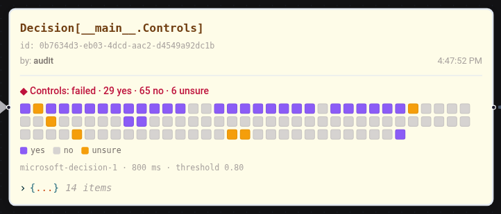
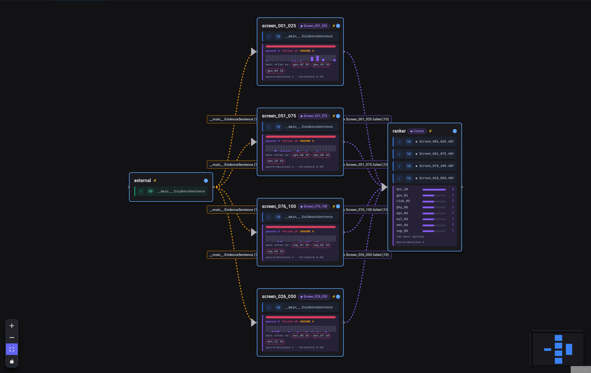

# 15-decisions: Decision Models

Decision models (TypeSafe Jev, Cloudflare Clef, Microsoft-Decision-1, OpenAI Decisions) answer typed questions (one of N options, yes/no, ordered scales) with a probability for every answer, without generating text. Flock uses them to route workflows: one agent decides, other agents subscribe to an option.

Guide: [docs/guides/decisions.md](../../docs/guides/decisions.md)

## 01_ticket_triage.py

Routes support tickets to billing, shipping or tech support. Tickets the decision model is not sure about go to a supervisor.

**Key Concepts:**
- `class Route(Choice)`: options as attributes, the docstring is the question
- `.decides(Route, model=..., threshold=0.8)` on the deciding agent
- `.consumes(Route.billing)` and `.consumes(Route.UNSURE)` downstream; the team agents receive the ticket itself

**Run with Microsoft-Decision-1 on Azure AI Foundry (default):**
```bash
# AZURE_API_BASE and AZURE_API_KEY set (deployment decision-1)
uv run examples/15-decisions/01_ticket_triage.py
```

**Run with another decision model:**
```bash
DEFAULT_DECISION_MODEL=openai/gpt-6-luna uv run examples/15-decisions/01_ticket_triage.py
DEFAULT_DECISION_MODEL=jev/jev-latest uv run examples/15-decisions/01_ticket_triage.py   # JEV_API_KEY

# local Clef model via llama.cpp (separate terminal: llama serve -m Clef-Flash-Q8_0.gguf -b 4096 -ub 4096 -ngl 99)
DEFAULT_DECISION_MODEL=local/clef-flash uv run examples/15-decisions/01_ticket_triage.py
```

The team agents write their replies with `DEFAULT_MODEL`.

**What You'll See:**
```
Charged twice            → billing  [billing 0.97  tech 0.01  shipping 0.01]
Parcel missing           → shipping [shipping 0.99  billing 0.01  tech 0.01]
App crash                → tech     [tech 0.99  billing 0.01  shipping 0.01]
Refund for broken item   → UNSURE   [billing 0.53  shipping 0.31  tech 0.16]
```

## 02_arxiv_race.py

A race on 100 recent arXiv abstracts (`data/arxiv_abstracts.json`, 18 categories, arXiv metadata under CC0): one LLM agent and one decision agent per configured decision model sort every paper into one of nine research fields at the same time. Every agent works one paper at a time. Live progress bars show the race; the report shows total time, time per paper and agreement with arXiv's primary category, plus the papers where anyone disagreed with arXiv.

By default the LLM races Microsoft-Decision-1 on Azure AI Foundry (`AZURE_API_BASE`, `AZURE_API_KEY`). Uncomment more entries in `DECISION_MODELS` to add OpenAI Decisions, Jev or a local Clef model; models without keys or without a reachable server are skipped after a warm-up request.

**Key Concepts:**
- The same `Choice` drives several deciders; each publishes its own `Decision`
- `DSPyEngine(enable_context=False)`: Flock's default context is everything on the blackboard an agent may read, here all papers and every contender's answers so far. The flag keeps the LLM's prompt to the paper it consumes; decision agents decide on their input only

**Run:**
```bash
uv run examples/15-decisions/02_arxiv_race.py
```

**One run with every contender enabled (2026-10-10, local model on an RTX 4090):**

| Contender | Total | Per paper | Agrees with arXiv |
|---|---|---|---|
| LLM openai/gpt-4.1 | 58.3 s | 583 ms | 88/100 |
| Decision local/clef-flash (Q8_0) | 8.5 s | 85 ms | 91/100 |
| Decision openai/gpt-6-luna | 17.2 s | 172 ms | 95/100 |
| Decision azure/decision-1 | 17.8 s | 178 ms | 90/100 |
| Decision jev/jev-latest | 25.0 s | 250 ms | 88/100 |

Hosted latencies include the network round trip from the caller. arXiv's primary category is one label per paper; many disagreements are papers that sit between two fields.

## 03_color_sorter.py

A decision agent sorts generated shapes into color bins by looking at their images. Orange and purple shapes sit between two bins: `gpt-6-luna` returns p = 1.00 for pure colors and 0.85-0.95 for the in-between ones, so a threshold of 0.97 sends those to an `inspector` (UNSURE).

**Key Concepts:**
- `flock.Image` fields (`Image.from_pil`, `Image.from_file`, `Image.from_bytes`)
- An image-capable decision model (`IMAGE_DECISION_MODEL`, default `openai/gpt-6-luna`; Microsoft-Decision-1 and Jev accept text only)
- Bin agents without an LLM; only the decision model is called

**Run:**
```bash
uv run examples/15-decisions/03_color_sorter.py
```

Set `USE_DASHBOARD = True` to watch the decider's option lanes fill with thumbnails, one shape per second.

<p align="center">
  
</p>

## 04_question_types.py

One decider asks three questions about every support ticket in a single request: which team (`Choice`), is it urgent (`YesNo`) and how angry is the customer (`Scale`). Handlers subscribe to the answers they need; they only log, so the decision model is the only model called.

**Key Concepts:**
- `class Urgent(YesNo)` and `class Anger(Scale)` (levels lowest first)
- `.decides(Team, Urgent, Anger)`: one request, one decision per question
- `.consumes(Urgent.yes)` and `.consumes(Anger.angry.or_higher)` (probability-weighted score at least "angry")

**Run:**
```bash
uv run examples/15-decisions/04_question_types.py
```

**What You'll See (Microsoft-Decision-1):**
```
ticket                               Team      Urgent   Anger
Charged twice AGAIN                  billing   yes      furious (3.0)
Dark mode request                    tech      no       calm (0.0)
Can't log in before my demo          tech      yes      UNSURE (1.7)
Invoice address                      billing   no       calm (0.0)
App deleted my notes                 tech      yes      angry (2.0)
Weird charge after the app crashed   billing   yes      UNSURE (0.7)
```

Set `USE_DASHBOARD = True` to watch the decider fill its three questions in the dashboard.

<p align="center">
  
</p>

## 05_compliance_checklist.py

Checks 24 fictional security documents (policies, procedures, audit reports) against 100 controls with one `Checklist`: one request with 100 yes/no questions per document, one decision per document. The data is generated by `data/make_compliance_data.py` (controls written for the example, loosely modelled on ISO/IEC 27001, NIS2 and BSI IT-Grundschutz topics) and comes with ground truth, so the example reports how often the model agrees.

**Key Concepts:**
- `Checklist.from_items("Controls", catalog, question=...)`
- `.consumes(Controls.failed)` (any control "no"), `.consumes(Controls.bcm_06.no)` (one control)
- `.consumes(Controls.ANY, where=...)` for documents with unsure controls

**Run:**
```bash
uv run examples/15-decisions/05_compliance_checklist.py
```

**What You'll See (Microsoft-Decision-1, threshold 0.8):**
```
document                                       outcome   yes   no   ?  agrees  latency
doc_01 Information Security Policy             failed     12   82   6   94/94    995 ms
doc_10 Internal Audit Report: ISMS             failed     29   65   6   90/94    829 ms
doc_16 Backup and Recovery Concept             failed      9   90   1   94/99    554 ms
...
All answers: precision 0.75, recall 1.00 for 'implemented'; 161 answers below the threshold
```

Every document fails some controls: a single policy or procedure never covers the whole catalog.

<p align="center">
  
</p>

## 06_control_mapping_tournament.py

Maps evidence sentences from the compliance documents to the one control they implement, out of 100, in three ways:

1. **`flat`:** one choice question with all 100 controls.
2. **`tournament`:** one node. Groups of 20 go out in one request, the 3 most probable controls of each group survive, then a final question.
3. **A screening network:** four separate `screen_*` nodes check 25 controls each with yes/no checklists, in parallel. The `ranker` waits for all four, receives the sentence and asks a final choice question about the controls that passed.

```
                  ┌── screen_001_025 ──┐
EvidenceSentence ─┼── screen_026_050 ──┼──> ranker ──> Decision[Control]
                  ├── screen_051_075 ──┤
                  └── screen_076_100 ──┘
```

**Key Concepts:**
- `Choice.from_options(...)` and `Checklist.from_items(...)` from a catalog
- `.decides(Control, tournament=Tournament(group_size=20, keep=3))`
- `.consumes(*(screen.ANY for screen in SCREENS))`: wait for every screen's decision about the same sentence
- `.decides(Control, options=passes)`: a final question about the passes only
- `Flock(decision_model=..., decision_rate_limit="100/min")`: one model and one request budget for every decider (eight requests per sentence stay within the deployment's 100 per minute; HTTP 429s from other clients are retried)

**Run:**
```bash
uv run examples/15-decisions/06_control_mapping_tournament.py
```

**What You'll See (Microsoft-Decision-1):**
```
contender      right    median  requests
flat          10/10     182 ms         1
tournament    10/10     388 ms         2
network       10/10     441 ms         5

Right control among the tournament's finalists: 10/10
Right control among the network's passes: 10/10 (median 5 passes per sentence)
```

The default Microsoft-Decision-1 deployment allows 100 requests per minute; this example sends eight per sentence.

<p align="center">
  
</p>
